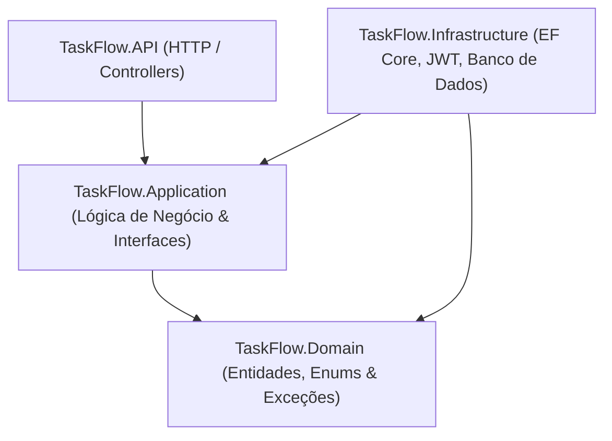

# 🎓 Curso Avançado TaskFlow: Do Zero ao Profissional com .NET 9 e Angular 21 (Clean Architecture)

Seja bem-vindo ao guia teórico e prático de desenvolvimento do **TaskFlow** sob a ótica da **Clean Architecture** (Arquitetura Limpa) utilizando **.NET 9** e **Angular 21**.

Este material foi planejado para capacitar desenvolvedores a estruturar projetos corporativos escaláveis, desacoplados e testáveis. A seguir, abordaremos o setup inicial da solução (Módulo 1), a modelagem de domínio rica (Módulo 2) e a definição dos contratos e estruturas de dados na camada de aplicação (Módulo 3).

---

## 🏗️ MÓDULO 1: Setup Inicial da Solução e Arquitetura Limpa

### 1.1 Entendendo o Fluxo de Dependências da Clean Architecture
A arquitetura de software adotada para o TaskFlow separa as responsabilidades em quatro camadas concêntricas. A regra de ouro é simples: **dependências de código devem sempre apontar para dentro**. Camadas mais internas nunca conhecem detalhes de implementação das camadas externas.



- **TaskFlow.Domain (Núcleo):** Contém as entidades de negócio, regras corporativas essenciais, enums e exceções personalizadas de domínio. É independente de frameworks, ORMs ou bancos de dados.
- **TaskFlow.Application:** Orquestra os casos de uso do sistema. Define os Contratos (Interfaces), Data Transfer Objects (DTOs) e validadores. Ela depende apenas da camada de Domínio.
- **TaskFlow.Infrastructure:** Fornece as implementações concretas de acesso a banco de dados (Entity Framework Core, Repositórios), segurança (Geração de JWT, Criptografia BCrypt) e serviços externos. Ela conhece a Aplicação e o Domínio.
- **TaskFlow.API:** Ponto de entrada do sistema (Web API). Controla o fluxo HTTP, Controllers, Middlewares de tratamento de erros global e injeção de dependências (IoC Container). Ela conhece a Infraestrutura e a Aplicação.

---

### 1.2 Criação Passo a Passo da Solução via dotnet CLI
Abra o terminal de sua preferência (como PowerShell) no diretório onde deseja organizar o projeto e execute a sequência abaixo.

#### Passo 1: Criar a Solução
O comando a seguir cria um arquivo de solução (`.sln`), que agrupa os projetos C# e permite a compilação conjunta.
```powershell
# Cria a pasta raiz do projeto e acessa
mkdir TaskFlow
cd TaskFlow

# Cria a solução .NET
dotnet new sln -n TaskFlow
```

#### Passo 2: Criar os quatro projetos da arquitetura
Organizaremos o código-fonte em uma pasta chamada `src`.
```powershell
# Cria a pasta src
mkdir src

# Cria as bibliotecas de classe (classlib) para Domain, Application e Infrastructure
dotnet new classlib -o src/TaskFlow.Domain
dotnet new classlib -o src/TaskFlow.Application
dotnet new classlib -o src/TaskFlow.Infrastructure

# Cria a API Web (webapi)
dotnet new webapi -o src/TaskFlow.API
```

#### Passo 3: Vincular os projetos à Solução
Associe os arquivos de projeto `.csproj` gerados ao arquivo `.sln`.
```powershell
dotnet sln add src/TaskFlow.Domain/TaskFlow.Domain.csproj
dotnet sln add src/TaskFlow.Application/TaskFlow.Application.csproj
dotnet sln add src/TaskFlow.Infrastructure/TaskFlow.Infrastructure.csproj
dotnet sln add src/TaskFlow.API/TaskFlow.API.csproj
```

#### Passo 4: Configurar as Referências (Dependências) entre as Camadas
Respeitando as regras da Clean Architecture, adicione as referências apropriadas:
```powershell
# 1. A camada Application depende apenas de Domain
dotnet add src/TaskFlow.Application/TaskFlow.Application.csproj reference src/TaskFlow.Domain/TaskFlow.Domain.csproj

# 2. A camada Infrastructure depende de Application (para implementar as interfaces) e de Domain
dotnet add src/TaskFlow.Infrastructure/TaskFlow.Infrastructure.csproj reference src/TaskFlow.Application/TaskFlow.Application.csproj

# 3. A camada API depende de Infrastructure e Application
dotnet add src/TaskFlow.API/TaskFlow.API.csproj reference src/TaskFlow.Infrastructure/TaskFlow.Infrastructure.csproj
```

---

## 🧠 MÓDULO 2: Camada de Domínio (TaskFlow.Domain)

A camada de Domínio representa o coração da aplicação. Ela abriga os objetos de negócio e deve ser mantida o mais pura possível. Não adicionamos dependências externas de infraestrutura aqui.

Abaixo, apresentamos cada arquivo da camada `TaskFlow.Domain` com seu respectivo caminho completo de arquivo, explicação teórica e o código na íntegra.

---

### 2.1 Arquivo de Configuração do Projeto
#### `src/TaskFlow.Domain/TaskFlow.Domain.csproj`
**Por que este arquivo existe?** Este é o arquivo de metadados do projeto do domínio. Ele especifica que estamos utilizando o SDK do .NET 9, ativa o uso implícito de namespaces globais (`ImplicitUsings`) e o suporte a tipos nulos (`Nullable`), ajudando a prevenir erros de `NullReferenceException` em tempo de desenvolvimento.
```xml
<Project Sdk="Microsoft.NET.Sdk">

  <PropertyGroup>
    <TargetFramework>net9.0</TargetFramework>
    <ImplicitUsings>enable</ImplicitUsings>
    <Nullable>enable</Nullable>
  </PropertyGroup>

</Project>
```

---

### 2.2 Enums de Domínio
#### `src/TaskFlow.Domain/Enums/TaskItemStatus.cs`
**Por que este arquivo existe?** Representa os estados possíveis do ciclo de vida de uma tarefa no sistema. Utilizar um `enum` isola a especificação dos estados e garante segurança de tipos, impedindo que tarefas recebam valores numéricos inválidos ou strings arbitrárias.
```csharp
namespace TaskFlow.Domain.Enums;

/// <summary>
/// Lifecycle states a task can be in.
/// </summary>
public enum TaskItemStatus
{
    /// <summary>Task created but not yet started.</summary>
    Pending = 0,
    /// <summary>Task is actively being worked on.</summary>
    InProgress = 1,
    /// <summary>Task has been completed.</summary>
    Done = 2,
    /// <summary>Task was cancelled before completion.</summary>
    Cancelled = 3
}
```

---

### 2.3 Entidades do Domínio
#### `src/TaskFlow.Domain/Entities/User.cs`
**Por que este arquivo existe?** Modela o usuário do sistema. Armazena dados essenciais como Nome, E-mail e o hash da senha (gerada via BCrypt, nunca armazenada em texto aberto por questões óbvias de conformidade e segurança). Possui também a propriedade de navegação de um-para-muitos com suas respectivas tarefas (`Tasks`).
```csharp
namespace TaskFlow.Domain.Entities;

/// <summary>
/// Represents an application user. A user must be linked to one or more tasks.
/// </summary>
public class User
{
    public Guid Id { get; set; } = Guid.NewGuid();
    public string Name { get; set; } = string.Empty;
    public string Email { get; set; } = string.Empty;
    /// <summary>BCrypt hashed password. Never stored in plain text.</summary>
    public string PasswordHash { get; set; } = string.Empty;
    public DateTime CreatedAt { get; set; } = DateTime.UtcNow;
    public DateTime? UpdatedAt { get; set; }

    // Navigation property: a User has MANY TaskItems (one-to-many)
    public ICollection<TaskItem> Tasks { get; set; } = new List<TaskItem>();
}
```

---

#### `src/TaskFlow.Domain/Entities/TaskItem.cs`
**Por que este arquivo existe?** Representa uma tarefa do TaskFlow. Implementa o padrão de **Entidade Rica**, encapsulando lógica de validação e comportamento de negócio dentro do próprio objeto de domínio através dos métodos `AssignTo` e `Update`. Isso previne que a entidade seja exposta em estado inválido ou anêmico. No banco de dados, a relação com o usuário é obrigatória (`UserId` não nulo).
```csharp
using TaskFlow.Domain.Enums;

namespace TaskFlow.Domain.Entities;

/// <summary>
/// Represents a task. A task MUST belong to exactly one User (UserId is non-nullable).
/// The user can be changed (reassigned) via the AssignTo method.
/// </summary>
public class TaskItem
{
    public Guid Id { get; set; } = Guid.NewGuid();
    public string Title { get; set; } = string.Empty;
    public string? Description { get; set; }
    public TaskItemStatus Status { get; set; } = TaskItemStatus.Pending;
    public DateTime DueDate { get; set; }
    public DateTime CreatedAt { get; set; } = DateTime.UtcNow;
    public DateTime? UpdatedAt { get; set; }

    // Foreign Key: non-nullable = task MUST have a user (NOT NULL in DB)
    public Guid UserId { get; set; }
    // Navigation property
    public User User { get; set; } = null!;

    /// <summary>
    /// Business method: reassigns this task to another user.
    /// Encapsulates the rule that UserId must always be valid.
    /// </summary>
    public void AssignTo(Guid newUserId)
    {
        if (newUserId == Guid.Empty)
            throw new ArgumentException("UserId cannot be empty.", nameof(newUserId));
        UserId = newUserId;
        UpdatedAt = DateTime.UtcNow;
    }

    /// <summary>Updates task fields, recording the timestamp.</summary>
    public void Update(string title, string? description, TaskItemStatus status, DateTime dueDate)
    {
        Title = title;
        Description = description;
        Status = status;
        DueDate = dueDate;
        UpdatedAt = DateTime.UtcNow;
    }
}
```

---

#### `src/TaskFlow.Domain/Entities/RefreshToken.cs`
**Por que este arquivo existe?** Utilizado para implementar o fluxo seguro de **Token Rotation** (Rotação de Refresh Tokens). O token de acesso JWT (Access Token) é curto (15 minutos) e o Refresh Token é longo (7 dias). Ele é persistido no banco de dados e associado a um usuário, possibilitando que a API revogue acessos caso identifique comportamentos suspeitos.
```csharp
namespace TaskFlow.Domain.Entities;

/// <summary>
/// Stored refresh token for JWT token rotation.
/// Refresh tokens are long-lived (7 days) but can be revoked.
/// Access tokens are short-lived (15 min) and cannot be revoked before expiry.
/// </summary>
public class RefreshToken
{
    public Guid Id { get; set; } = Guid.NewGuid();
    public string Token { get; set; } = string.Empty;
    public Guid UserId { get; set; }
    public User User { get; set; } = null!;
    public DateTime ExpiresAt { get; set; }
    public bool IsRevoked { get; set; } = false;
    public DateTime CreatedAt { get; set; } = DateTime.UtcNow;
}
```

---

### 2.4 Exceções do Domínio
Centralizar exceções específicas na camada de domínio permite que o manipulador de erros global na API intercepte esses erros de forma unificada e responda com os códigos de status HTTP corretos.

#### `src/TaskFlow.Domain/Exceptions/BusinessException.cs`
**Por que este arquivo existe?** Lançada quando regras de negócios são violadas (como a tentativa de exclusão de um usuário que possui tarefas pendentes associadas). Ela é mapeada na API para retornar o código de erro **HTTP 422 - Unprocessable Entity**.
```csharp
namespace TaskFlow.Domain.Exceptions;

/// <summary>
/// Thrown when a business rule is violated (e.g., deleting a user with active tasks).
/// Maps to HTTP 422 Unprocessable Entity.
/// </summary>
public class BusinessException : Exception
{
    public BusinessException(string message) : base(message) { }
}
```

---

#### `src/TaskFlow.Domain/Exceptions/ConflictException.cs`
**Por que este arquivo existe?** Disparada quando ocorre uma violação de unicidade ou de integridade no sistema (ex: cadastro de e-mail duplicado). Ela é mapeada na API para o código de erro **HTTP 409 - Conflict**.
```csharp
namespace TaskFlow.Domain.Exceptions;

/// <summary>
/// Thrown when a uniqueness constraint is violated (e.g., duplicate email).
/// Maps to HTTP 409 Conflict.
/// </summary>
public class ConflictException : Exception
{
    public ConflictException(string message) : base(message) { }
}
```

---

#### `src/TaskFlow.Domain/Exceptions/NotFoundException.cs`
**Por que este arquivo existe?** Lançada quando um recurso solicitado (tarefa, usuário, token) não existe no banco de dados. É mapeada para o código **HTTP 404 - Not Found**.
```csharp
namespace TaskFlow.Domain.Exceptions;

/// <summary>
/// Thrown when a requested resource does not exist in the database.
/// Maps to HTTP 404 Not Found.
/// </summary>
public class NotFoundException : Exception
{
    public NotFoundException(string resource, object id)
        : base($"{resource} with id '{id}' was not found.") { }

    public NotFoundException(string message) : base(message) { }
}
```

---

## 📂 MÓDULO 3: Camada de Aplicação (TaskFlow.Application) - Contratos e DTOs

A camada de Aplicação contém a lógica de negócios e as regras de fluxo do sistema. Ela expressa exatamente **o que a aplicação faz**. 

Neste módulo, detalharemos os **Contratos (Interfaces)** de repositórios e serviços, que representam as abstrações do sistema, e os **DTOs (Data Transfer Objects)**, que definem a estrutura dos dados trocados entre a API e as camadas internas.

---

### 3.1 Arquivo de Configuração do Projeto
#### `src/TaskFlow.Application/TaskFlow.Application.csproj`
**Por que este arquivo existe?** Contém as referências de pacotes necessárias para a validação de dados (`FluentValidation`) e injeção de dependências. Ele também estabelece a referência direta para a camada `TaskFlow.Domain` (`ProjectReference`), respeitando o fluxo interno da Clean Architecture.
```xml
<Project Sdk="Microsoft.NET.Sdk">

  <ItemGroup>
    <ProjectReference Include="..\TaskFlow.Domain\TaskFlow.Domain.csproj" />
  </ItemGroup>

  <ItemGroup>
    <PackageReference Include="BCrypt.Net-Next" Version="4.0.3" />
    <PackageReference Include="FluentValidation" Version="11.11.0" />
    <PackageReference Include="FluentValidation.DependencyInjectionExtensions" Version="11.5.1" />
    <PackageReference Include="Microsoft.Extensions.DependencyInjection.Abstractions" Version="9.0.5" />
  </ItemGroup>

  <PropertyGroup>
    <TargetFramework>net9.0</TargetFramework>
    <ImplicitUsings>enable</ImplicitUsings>
    <Nullable>enable</Nullable>
  </PropertyGroup>

</Project>
```

---

### 3.2 Data Transfer Objects (DTOs)
DTOs são objetos simples de transferência de dados representados por **C# Records**. Eles são imutáveis e projetados especificamente para expor apenas os dados necessários para o cliente externo da API, evitando vazamento indesejado das propriedades internas das entidades de domínio.

#### 3.2.1 DTOs de Autenticação (Auth)
#### `src/TaskFlow.Application/DTOs/Auth/AuthResponseDto.cs`
**Por que este arquivo existe?** Retornado após o login ou registro bem-sucedido. Envia para o cliente o token JWT de acesso curto, o token de atualização longo, a data de expiração e dados básicos de perfil para serem salvos na sessão da aplicação Angular.
```csharp
namespace TaskFlow.Application.DTOs.Auth;

/// <summary>Returned after successful login/register. Contains JWT tokens.</summary>
public record AuthResponseDto(
    string AccessToken,
    string RefreshToken,
    DateTime ExpiresAt,
    Guid UserId,
    string UserName,
    string Email
);
```

---

#### `src/TaskFlow.Application/DTOs/Auth/LoginDto.cs`
**Por que este arquivo existe?** Define o payload de login enviado pelo cliente contendo as credenciais de e-mail e senha.
```csharp
namespace TaskFlow.Application.DTOs.Auth;

/// <summary>Login credentials.</summary>
public record LoginDto(
    string Email,
    string Password
);
```

---

#### `src/TaskFlow.Application/DTOs/Auth/RefreshTokenDto.cs`
**Por que este arquivo existe?** Objeto utilizado para solicitar um novo par de tokens de acesso a partir de um Refresh Token armazenado localmente pelo frontend.
```csharp
namespace TaskFlow.Application.DTOs.Auth;

/// <summary>Used to request a new access token using a refresh token.</summary>
public record RefreshTokenDto(string RefreshToken);
```

---

#### `src/TaskFlow.Application/DTOs/Auth/RegisterDto.cs`
**Por que este arquivo existe?** Define as informações obrigatórias exigidas para auto-cadastro de novos usuários no sistema.
```csharp
namespace TaskFlow.Application.DTOs.Auth;

/// <summary>Registration payload. Creates a user + returns a JWT.</summary>
public record RegisterDto(
    string Name,
    string Email,
    string Password
);
```

---

#### 3.2.2 DTOs de Tarefas (Task)
#### `src/TaskFlow.Application/DTOs/Task/CreateTaskDto.cs`
**Por que este arquivo existe?** Define a carga de dados necessária para criar uma nova tarefa. Repare que o campo `UserId` é obrigatório, expressando a regra de negócio de que nenhuma tarefa pode existir órfã de dono.
```csharp
namespace TaskFlow.Application.DTOs.Task;

/// <summary>Data sent to create a new task. UserId is required — tasks must have an owner.</summary>
public record CreateTaskDto(
    string Title,
    string? Description,
    DateTime DueDate,
    Guid UserId
);
```

---

#### `src/TaskFlow.Application/DTOs/Task/TaskResponseDto.cs`
**Por que este arquivo existe?** Representa a tarefa formatada para retorno HTTP. Inclui o status mapeado como texto amigável (`StatusLabel`) e o nome do dono da tarefa (`UserName`), evitando que o frontend precise efetuar uma requisição de busca secundária por dados do usuário.
```csharp
using TaskFlow.Domain.Enums;

namespace TaskFlow.Application.DTOs.Task;

/// <summary>Data returned to the client for a task, includes owner info.</summary>
public record TaskResponseDto(
    Guid Id,
    string Title,
    string? Description,
    TaskItemStatus Status,
    string StatusLabel,
    DateTime DueDate,
    DateTime CreatedAt,
    DateTime? UpdatedAt,
    Guid UserId,
    string UserName
);
```

---

#### `src/TaskFlow.Application/DTOs/Task/UpdateTaskDto.cs`
**Por que este arquivo existe?** Define o payload de atualização de uma tarefa. Inclui o `UserId`, permitindo reatribuir a tarefa para outro usuário.
```csharp
using TaskFlow.Domain.Enums;

namespace TaskFlow.Application.DTOs.Task;

/// <summary>Data to update an existing task. UserId can be changed (task reassignment).</summary>
public record UpdateTaskDto(
    string Title,
    string? Description,
    TaskItemStatus Status,
    DateTime DueDate,
    Guid UserId
);
```

---

#### 3.2.3 DTOs de Usuário (User)
#### `src/TaskFlow.Application/DTOs/User/CreateUserDto.cs`
**Por que este arquivo existe?** Utilizado pelo administrador para cadastrar diretamente novos usuários através do painel de controle administrativo.
```csharp
namespace TaskFlow.Application.DTOs.User;

/// <summary>Data sent by the client to create a new user (registration without auth flow).</summary>
public record CreateUserDto(
    string Name,
    string Email,
    string Password
);
```

---

#### `src/TaskFlow.Application/DTOs/User/UpdateUserDto.cs`
**Por que este arquivo existe?** Define os campos passíveis de atualização de dados cadastrais de um usuário.
```csharp
namespace TaskFlow.Application.DTOs.User;

/// <summary>Data sent by the client to update an existing user.</summary>
public record UpdateUserDto(
    string Name,
    string Email
);
```

---

#### `src/TaskFlow.Application/DTOs/User/UserResponseDto.cs`
**Por que este arquivo existe?** Retorna os dados do usuário seguros para exposição pública, incluindo o total de tarefas ativas associadas ao perfil (`TaskCount`). **Nunca** expõe dados sensíveis como o hash da senha do banco.
```csharp
namespace TaskFlow.Application.DTOs.User;

/// <summary>
/// Data returned to the client. Never includes PasswordHash.
/// This is the DTO contract — decoupled from the domain entity.
/// </summary>
public record UserResponseDto(
    Guid Id,
    string Name,
    string Email,
    DateTime CreatedAt,
    int TaskCount
);
```

---

### 3.3 Contratos e Interfaces de Repositórios
Seguindo o **Princípio da Inversão de Dependência (DIP)** do SOLID, as interfaces declaram quais métodos de persistência e acesso a dados a aplicação necessita. A implementação real utilizando Entity Framework Core, SQL Server ou PostgreSQL será feita de forma desacoplada na camada de Infraestrutura.

#### `src/TaskFlow.Application/Interfaces/IUserRepository.cs`
**Por que este arquivo existe?** Define a assinatura dos métodos de persistência do Usuário. Garante que os serviços de negócio possam interagir com a base de dados de forma abstrata.
```csharp
using TaskFlow.Domain.Entities;

namespace TaskFlow.Application.Interfaces;

/// <summary>
/// Contract for user data access. The Application layer defines this interface;
/// the Infrastructure layer implements it. This is the Dependency Inversion Principle.
/// </summary>
public interface IUserRepository
{
    Task<IEnumerable<User>> GetAllAsync(CancellationToken ct = default);
    Task<User?> GetByIdAsync(Guid id, CancellationToken ct = default);
    Task<User?> GetByEmailAsync(string email, CancellationToken ct = default);
    Task<User> CreateAsync(User user, CancellationToken ct = default);
    Task<User> UpdateAsync(User user, CancellationToken ct = default);
    Task DeleteAsync(User user, CancellationToken ct = default);
    Task<bool> ExistsByEmailAsync(string email, CancellationToken ct = default);
    Task<bool> HasActiveTasksAsync(Guid userId, CancellationToken ct = default);
}
```

---

#### `src/TaskFlow.Application/Interfaces/ITaskRepository.cs`
**Por que este arquivo existe?** Define o contrato de persistência das tarefas do sistema.
```csharp
using TaskFlow.Domain.Entities;

namespace TaskFlow.Application.Interfaces;

/// <summary>Contract for task data access.</summary>
public interface ITaskRepository
{
    Task<IEnumerable<TaskItem>> GetAllAsync(CancellationToken ct = default);
    Task<IEnumerable<TaskItem>> GetByUserIdAsync(Guid userId, CancellationToken ct = default);
    Task<TaskItem?> GetByIdAsync(Guid id, CancellationToken ct = default);
    Task<TaskItem> CreateAsync(TaskItem task, CancellationToken ct = default);
    Task<TaskItem> UpdateAsync(TaskItem task, CancellationToken ct = default);
    Task DeleteAsync(TaskItem task, CancellationToken ct = default);
}
```

---

#### `src/TaskFlow.Application/Interfaces/IRefreshTokenRepository.cs`
**Por que este arquivo existe?** Define o contrato de persistência para armazenamento e controle de vida dos Refresh Tokens de segurança.
```csharp
using TaskFlow.Domain.Entities;

namespace TaskFlow.Application.Interfaces;

/// <summary>Manages stored refresh tokens for token rotation.</summary>
public interface IRefreshTokenRepository
{
    Task<RefreshToken?> GetByTokenAsync(string token, CancellationToken ct = default);
    Task CreateAsync(RefreshToken refreshToken, CancellationToken ct = default);
    Task RevokeAsync(string token, CancellationToken ct = default);
    Task RevokeAllByUserAsync(Guid userId, CancellationToken ct = default);
}
```

---

### 3.4 Contratos e Interfaces de Serviços
Essas interfaces definem as regras dos serviços de domínio e de segurança, permitindo o desacoplamento de controladores HTTP.

#### `src/TaskFlow.Application/Interfaces/IAuthService.cs`
**Por que este arquivo existe?** Define as regras para a autenticação no sistema, incluindo o fluxo de registro, login de usuário e renovação de token por rotação (Refresh Token).
```csharp
using TaskFlow.Application.DTOs.Auth;

namespace TaskFlow.Application.Interfaces;

/// <summary>Business logic contract for authentication.</summary>
public interface IAuthService
{
    Task<AuthResponseDto> RegisterAsync(RegisterDto dto, CancellationToken ct = default);
    Task<AuthResponseDto> LoginAsync(LoginDto dto, CancellationToken ct = default);
    Task<AuthResponseDto> RefreshTokenAsync(string refreshToken, CancellationToken ct = default);
}
```

---

#### `src/TaskFlow.Application/Interfaces/ITokenService.cs`
**Por que este arquivo existe?** Modela a interface responsável por criar a representação textual dos tokens (JWT). Isso evita o acoplamento da camada de aplicação com bibliotecas específicas de JWT, tais como `System.IdentityModel.Tokens.Jwt`. A implementação detalhada e configuração de chaves de assinatura residirá na Infraestrutura.
```csharp
using TaskFlow.Domain.Entities;

namespace TaskFlow.Application.Interfaces;

/// <summary>
/// Abstracts JWT generation. Infrastructure implements this, Application uses it.
/// This prevents Application from depending on any specific JWT library.
/// </summary>
public interface ITokenService
{
    string GenerateAccessToken(User user);
    string GenerateRefreshToken();
    Guid? GetUserIdFromToken(string token);
}
```

---

#### `src/TaskFlow.Application/Interfaces/IUserService.cs`
**Por que este arquivo existe?** Abstrai as operações de gerenciamento CRUD do cadastro de usuários.
```csharp
using TaskFlow.Application.DTOs.User;

namespace TaskFlow.Application.Interfaces;

/// <summary>Business logic contract for user operations.</summary>
public interface IUserService
{
    Task<IEnumerable<UserResponseDto>> GetAllAsync(CancellationToken ct = default);
    Task<UserResponseDto> GetByIdAsync(Guid id, CancellationToken ct = default);
    Task<UserResponseDto> CreateAsync(CreateUserDto dto, CancellationToken ct = default);
    Task<UserResponseDto> UpdateAsync(Guid id, UpdateUserDto dto, CancellationToken ct = default);
    Task DeleteAsync(Guid id, CancellationToken ct = default);
}
```

---

#### `src/TaskFlow.Application/Interfaces/ITaskService.cs`
**Por que este arquivo existe?** Abstrai os casos de uso para o gerenciamento de tarefas corporativas, incluindo atribuição, delegação e as atualizações de andamento.
```csharp
using TaskFlow.Application.DTOs.Task;

namespace TaskFlow.Application.Interfaces;

/// <summary>Business logic contract for task operations.</summary>
public interface ITaskService
{
    Task<IEnumerable<TaskResponseDto>> GetAllAsync(Guid? userId = null, CancellationToken ct = default);
    Task<TaskResponseDto> GetByIdAsync(Guid id, CancellationToken ct = default);
    Task<TaskResponseDto> CreateAsync(CreateTaskDto dto, CancellationToken ct = default);
    Task<TaskResponseDto> UpdateAsync(Guid id, UpdateTaskDto dto, CancellationToken ct = default);
    Task DeleteAsync(Guid id, CancellationToken ct = default);
    Task<TaskResponseDto> AssignToUserAsync(Guid taskId, Guid userId, CancellationToken ct = default);
}
```

---

## 🏗️ MÓDULO 4: Camada de Aplicação - Implementação e Validações (TaskFlow.Application)

A camada de Aplicação (`TaskFlow.Application`) é responsável por conter as regras de caso de uso e a lógica de negócio do sistema. Ela funciona como uma ponte entre o Domínio e os detalhes externos (banco de dados, controladores HTTP, etc.). Ela define interfaces para os repositórios e serviços de infraestrutura, garantindo que o núcleo do sistema permaneça independente de tecnologias de banco de dados ou detalhes de rede (Princípio da Inversão de Dependência).

Neste módulo, implementaremos:
- **Dependency Injection**: Registro centralizado dos serviços e validadores.
- **Mapeamentos Manuais**: Conversões eficientes entre Entidades e DTOs, evitando bibliotecas terceiras com problemas de segurança.
- **Serviços de Aplicação**: Casos de uso de autenticação, usuários e tarefas.
- **Validadores de Entrada**: Garantia de integridade com o FluentValidation.

### Decisão Arquitetural: Remoção do AutoMapper
Em projetos C# .NET, o uso do AutoMapper é comum. No entanto, as versões 13 e 14 do AutoMapper contêm vulnerabilidades de segurança documentadas (como a CVE-2024-39187 ou GHSA-rvv3-g6hj-g44x). No TaskFlow, optamos por **métodos de extensão para mapeamento manual** (`MappingExtensions.cs`). 
Essa decisão traz diversos benefícios:
1. **Segurança**: Elimina a dependência de um pacote externo com CVE ativa.
2. **Performance**: O mapeamento manual é feito através de instanciações puras compiladas em C#, sem a necessidade de reflexão (Reflection) em tempo de execução, tornando a inicialização e execução muito mais rápidas.
3. **Segurança de Tipos (Type Safety)**: Se uma propriedade da entidade mudar, o compilador apontará o erro imediatamente no mapeamento, evitando falhas ocultas em produção.

---

### Passo 1: Configuração do Mapeador de Entidades para DTOs
Crie o arquivo abaixo para gerenciar a conversão de objetos de forma explícita e rápida.

#### 📂 Arquivo: `src/TaskFlow.Application/Mappings/MappingExtensions.cs`
```csharp
using TaskFlow.Application.DTOs.Task;
using TaskFlow.Application.DTOs.User;
using TaskFlow.Domain.Entities;

namespace TaskFlow.Application.Mappings;

/// <summary>
/// Manual mapping extension methods — replacing AutoMapper.
/// 
/// Tradeoff decision: AutoMapper 13/14 has a known CVE (GHSA-rvv3-g6hj-g44x).
/// Manual extension methods are explicit, type-safe, and have zero external dependencies.
/// The downside is more boilerplate, but for a CRUD with 2 entities it's perfectly manageable.
/// </summary>
public static class MappingExtensions
{
    // ─── User mappings ──────────────────────────────────────────────────────────

    public static UserResponseDto ToResponseDto(this User user) =>
        new(
            Id: user.Id,
            Name: user.Name,
            Email: user.Email,
            CreatedAt: user.CreatedAt,
            TaskCount: user.Tasks?.Count ?? 0
        );

    public static IEnumerable<UserResponseDto> ToResponseDtoList(this IEnumerable<User> users) =>
        users.Select(u => u.ToResponseDto());

    // ─── Task mappings ──────────────────────────────────────────────────────────

    public static TaskResponseDto ToResponseDto(this TaskItem task) =>
        new(
            Id: task.Id,
            Title: task.Title,
            Description: task.Description,
            Status: task.Status,
            StatusLabel: task.Status.ToString(),
            DueDate: task.DueDate,
            CreatedAt: task.CreatedAt,
            UpdatedAt: task.UpdatedAt,
            UserId: task.UserId,
            UserName: task.User?.Name ?? string.Empty
        );

    public static IEnumerable<TaskResponseDto> ToResponseDtoList(this IEnumerable<TaskItem> tasks) =>
        tasks.Select(t => t.ToResponseDto());
}
```

---

### Passo 2: Implementando Serviços de Negócio
Agora criaremos as regras de negócio de cada módulo (Autenticação, Usuários e Tarefas).

#### 📂 Arquivo: `src/TaskFlow.Application/Services/AuthService.cs`
O serviço de autenticação realiza operações cruciais de registro, login e renovação de tokens (Refresh Token). Ele faz uso do **BCrypt** para hashes seguros de senhas. Cada senha gera um hash único devido à inserção de sal (*salt*) aleatório em tempo de hash, impedindo o uso de tabelas de busca pré-computadas (*Rainbow Tables*).

```csharp
using TaskFlow.Application.DTOs.Auth;
using TaskFlow.Application.Interfaces;
using TaskFlow.Domain.Entities;
using TaskFlow.Domain.Exceptions;

namespace TaskFlow.Application.Services;

/// <summary>
/// Authentication business logic. Handles register, login and token refresh.
/// Uses BCrypt for password hashing — never stores plain text passwords.
/// </summary>
public class AuthService : IAuthService
{
    private readonly IUserRepository _userRepository;
    private readonly IRefreshTokenRepository _refreshTokenRepository;
    private readonly ITokenService _tokenService;

    public AuthService(
        IUserRepository userRepository,
        IRefreshTokenRepository refreshTokenRepository,
        ITokenService tokenService)
    {
        _userRepository = userRepository;
        _refreshTokenRepository = refreshTokenRepository;
        _tokenService = tokenService;
    }

    public async Task<AuthResponseDto> RegisterAsync(RegisterDto dto, CancellationToken ct = default)
    {
        if (await _userRepository.ExistsByEmailAsync(dto.Email, ct))
            throw new ConflictException($"Email '{dto.Email}' is already registered.");

        var user = new User
        {
            Name = dto.Name,
            Email = dto.Email,
            // BCrypt hashes with a random salt — each call produces a different hash for the same password
            PasswordHash = BCrypt.Net.BCrypt.HashPassword(dto.Password)
        };

        var created = await _userRepository.CreateAsync(user, ct);
        return await GenerateAuthResponseAsync(created, ct);
    }

    public async Task<AuthResponseDto> LoginAsync(LoginDto dto, CancellationToken ct = default)
    {
        var user = await _userRepository.GetByEmailAsync(dto.Email, ct);

        // Constant-time comparison via BCrypt.Verify prevents timing attacks
        if (user is null || !BCrypt.Net.BCrypt.Verify(dto.Password, user.PasswordHash))
            throw new BusinessException("Invalid email or password.");

        return await GenerateAuthResponseAsync(user!, ct);
    }

    public async Task<AuthResponseDto> RefreshTokenAsync(string refreshToken, CancellationToken ct = default)
    {
        var storedToken = await _refreshTokenRepository.GetByTokenAsync(refreshToken, ct);

        if (storedToken is null || storedToken.IsRevoked || storedToken.ExpiresAt < DateTime.UtcNow)
            throw new BusinessException("Invalid or expired refresh token.");

        var user = await _userRepository.GetByIdAsync(storedToken.UserId, ct)
            ?? throw new NotFoundException(nameof(User), storedToken.UserId);

        // Token rotation: revoke old refresh token and issue a new one
        await _refreshTokenRepository.RevokeAsync(refreshToken, ct);
        return await GenerateAuthResponseAsync(user, ct);
    }

    private async Task<AuthResponseDto> GenerateAuthResponseAsync(User user, CancellationToken ct)
    {
        var accessToken = _tokenService.GenerateAccessToken(user);
        var rawRefreshToken = _tokenService.GenerateRefreshToken();
        var expiresAt = DateTime.UtcNow.AddMinutes(15);

        var refreshTokenEntity = new RefreshToken
        {
            Token = rawRefreshToken,
            UserId = user.Id,
            ExpiresAt = DateTime.UtcNow.AddDays(7)
        };

        await _refreshTokenRepository.CreateAsync(refreshTokenEntity, ct);

        return new AuthResponseDto(
            AccessToken: accessToken,
            RefreshToken: rawRefreshToken,
            ExpiresAt: expiresAt,
            UserId: user.Id,
            UserName: user.Name,
            Email: user.Email
        );
    }
}
```

#### 📂 Arquivo: `src/TaskFlow.Application/Services/TaskService.cs`
Este serviço centraliza as ações relativas às tarefas. Ele assegura regras fundamentais do domínio, como o vínculo obrigatório a um usuário ativo e a atualização correta do status da tarefa.

```csharp
using TaskFlow.Application.DTOs.Task;
using TaskFlow.Application.Interfaces;
using TaskFlow.Application.Mappings;
using TaskFlow.Domain.Entities;
using TaskFlow.Domain.Exceptions;

namespace TaskFlow.Application.Services;

/// <summary>
/// Implements task business logic.
/// Key rule enforced here: every task must be linked to a valid user.
/// Uses manual mapping extension methods instead of AutoMapper.
/// </summary>
public class TaskService : ITaskService
{
    private readonly ITaskRepository _taskRepository;
    private readonly IUserRepository _userRepository;

    public TaskService(ITaskRepository taskRepository, IUserRepository userRepository)
    {
        _taskRepository = taskRepository;
        _userRepository = userRepository;
    }

    public async Task<IEnumerable<TaskResponseDto>> GetAllAsync(Guid? userId = null, CancellationToken ct = default)
    {
        var tasks = userId.HasValue
            ? await _taskRepository.GetByUserIdAsync(userId.Value, ct)
            : await _taskRepository.GetAllAsync(ct);

        return tasks.ToResponseDtoList();
    }

    public async Task<TaskResponseDto> GetByIdAsync(Guid id, CancellationToken ct = default)
    {
        var task = await _taskRepository.GetByIdAsync(id, ct)
            ?? throw new NotFoundException(nameof(TaskItem), id);
        return task.ToResponseDto();
    }

    public async Task<TaskResponseDto> CreateAsync(CreateTaskDto dto, CancellationToken ct = default)
    {
        // Validate user exists — business rule: task must be linked to a real user
        var userExists = await _userRepository.GetByIdAsync(dto.UserId, ct);
        if (userExists is null)
            throw new NotFoundException(nameof(User), dto.UserId);

        var task = new TaskItem
        {
            Title = dto.Title,
            Description = dto.Description,
            DueDate = dto.DueDate,
            UserId = dto.UserId
        };

        var created = await _taskRepository.CreateAsync(task, ct);
        // Reload with navigation properties (User) populated for response mapping
        var reloaded = await _taskRepository.GetByIdAsync(created.Id, ct);
        return reloaded!.ToResponseDto();
    }

    public async Task<TaskResponseDto> UpdateAsync(Guid id, UpdateTaskDto dto, CancellationToken ct = default)
    {
        var task = await _taskRepository.GetByIdAsync(id, ct)
            ?? throw new NotFoundException(nameof(TaskItem), id);

        // Validate new user exists if changing owner
        if (task.UserId != dto.UserId)
        {
            var userExists = await _userRepository.GetByIdAsync(dto.UserId, ct);
            if (userExists is null)
                throw new NotFoundException(nameof(User), dto.UserId);
        }

        task.Update(dto.Title, dto.Description, dto.Status, dto.DueDate);
        task.UserId = dto.UserId;

        var updated = await _taskRepository.UpdateAsync(task, ct);
        var reloaded = await _taskRepository.GetByIdAsync(updated.Id, ct);
        return reloaded!.ToResponseDto();
    }

    public async Task DeleteAsync(Guid id, CancellationToken ct = default)
    {
        var task = await _taskRepository.GetByIdAsync(id, ct)
            ?? throw new NotFoundException(nameof(TaskItem), id);
        await _taskRepository.DeleteAsync(task, ct);
    }

    public async Task<TaskResponseDto> AssignToUserAsync(Guid taskId, Guid userId, CancellationToken ct = default)
    {
        var task = await _taskRepository.GetByIdAsync(taskId, ct)
            ?? throw new NotFoundException(nameof(TaskItem), taskId);

        _ = await _userRepository.GetByIdAsync(userId, ct)
            ?? throw new NotFoundException(nameof(User), userId);

        // Using domain method — encapsulates the business rule
        task.AssignTo(userId);

        var updated = await _taskRepository.UpdateAsync(task, ct);
        var reloaded = await _taskRepository.GetByIdAsync(updated.Id, ct);
        return reloaded!.ToResponseDto();
    }
}
```

#### 📂 Arquivo: `src/TaskFlow.Application/Services/UserService.cs`
Este serviço gerencia o fluxo de CRUD dos usuários. Note que ele obedece ao princípio da inversão de dependência ao referenciar apenas `IUserRepository` em vez de implementações de repositório focadas no EF Core.

```csharp
using TaskFlow.Application.DTOs.User;
using TaskFlow.Application.Interfaces;
using TaskFlow.Application.Mappings;
using TaskFlow.Domain.Entities;
using TaskFlow.Domain.Exceptions;

namespace TaskFlow.Application.Services;

/// <summary>
/// Implements user business logic. Depends on IUserRepository (interface),
/// never on the concrete EF Core implementation — Dependency Inversion Principle.
/// Uses manual mapping extension methods instead of AutoMapper (avoids CVE dependency).
/// </summary>
public class UserService : IUserService
{
    private readonly IUserRepository _userRepository;

    public UserService(IUserRepository userRepository)
    {
        _userRepository = userRepository;
    }

    public async Task<IEnumerable<UserResponseDto>> GetAllAsync(CancellationToken ct = default)
    {
        var users = await _userRepository.GetAllAsync(ct);
        return users.ToResponseDtoList();
    }

    public async Task<UserResponseDto> GetByIdAsync(Guid id, CancellationToken ct = default)
    {
        var user = await _userRepository.GetByIdAsync(id, ct)
            ?? throw new NotFoundException(nameof(User), id);
        return user.ToResponseDto();
    }

    public async Task<UserResponseDto> CreateAsync(CreateUserDto dto, CancellationToken ct = default)
    {
        if (await _userRepository.ExistsByEmailAsync(dto.Email, ct))
            throw new ConflictException($"Email '{dto.Email}' is already registered.");

        var user = new User
        {
            Name = dto.Name,
            Email = dto.Email,
            PasswordHash = BCrypt.Net.BCrypt.HashPassword(dto.Password)
        };

        var created = await _userRepository.CreateAsync(user, ct);
        return created.ToResponseDto();
    }

    public async Task<UserResponseDto> UpdateAsync(Guid id, UpdateUserDto dto, CancellationToken ct = default)
    {
        var user = await _userRepository.GetByIdAsync(id, ct)
            ?? throw new NotFoundException(nameof(User), id);

        // Check email uniqueness only if it changed
        if (!string.Equals(user.Email, dto.Email, StringComparison.OrdinalIgnoreCase))
        {
            if (await _userRepository.ExistsByEmailAsync(dto.Email, ct))
                throw new ConflictException($"Email '{dto.Email}' is already in use.");
        }

        user.Name = dto.Name;
        user.Email = dto.Email;
        user.UpdatedAt = DateTime.UtcNow;

        var updated = await _userRepository.UpdateAsync(user, ct);
        return updated.ToResponseDto();
    }

    public async Task DeleteAsync(Guid id, CancellationToken ct = default)
    {
        var user = await _userRepository.GetByIdAsync(id, ct)
            ?? throw new NotFoundException(nameof(User), id);

        if (await _userRepository.HasActiveTasksAsync(id, ct))
            throw new BusinessException("Cannot delete a user with active tasks. Reassign or delete their tasks first.");

        await _userRepository.DeleteAsync(user, ct);
    }
}
```

---

### Passo 3: Implementando Validadores FluentValidation
O FluentValidation foi adotado para encapsular as regras de validação longe de DTOs. Isso respeita o Princípio de Responsabilidade Única (SRP), permitindo que alterações nas regras ocorram sem modificar o DTO, e facilitando testes unitários isolados.

#### 📂 Arquivo: `src/TaskFlow.Application/Validators/CreateTaskValidator.cs`
```csharp
using FluentValidation;
using TaskFlow.Application.DTOs.Task;

namespace TaskFlow.Application.Validators;

public class CreateTaskValidator : AbstractValidator<CreateTaskDto>
{
    public CreateTaskValidator()
    {
        RuleFor(x => x.Title)
            .NotEmpty().WithMessage("Title is required.")
            .MinimumLength(3).WithMessage("Title must be at least 3 characters.")
            .MaximumLength(200).WithMessage("Title cannot exceed 200 characters.");

        RuleFor(x => x.DueDate)
            .GreaterThan(DateTime.UtcNow).WithMessage("Due date must be in the future.");

        RuleFor(x => x.UserId)
            .NotEmpty().WithMessage("UserId is required. Every task must have an owner.");
    }
}
```

#### 📂 Arquivo: `src/TaskFlow.Application/Validators/CreateUserValidator.cs`
```csharp
using FluentValidation;
using TaskFlow.Application.DTOs.User;

namespace TaskFlow.Application.Validators;

/// <summary>
/// FluentValidation validator for CreateUserDto.
/// Kept separate from the DTO — Single Responsibility Principle.
/// </summary>
public class CreateUserValidator : AbstractValidator<CreateUserDto>
{
    public CreateUserValidator()
    {
        RuleFor(x => x.Name)
            .NotEmpty().WithMessage("Name is required.")
            .MaximumLength(100).WithMessage("Name cannot exceed 100 characters.");

        RuleFor(x => x.Email)
            .NotEmpty().WithMessage("Email is required.")
            .EmailAddress().WithMessage("Email must be a valid email address.");

        RuleFor(x => x.Password)
            .NotEmpty().WithMessage("Password is required.")
            .MinimumLength(6).WithMessage("Password must be at least 6 characters.")
            .Matches("[A-Z]").WithMessage("Password must contain at least one uppercase letter.")
            .Matches("[0-9]").WithMessage("Password must contain at least one number.");
    }
}
```

#### 📂 Arquivo: `src/TaskFlow.Application/Validators/LoginValidator.cs`
```csharp
using FluentValidation;
using TaskFlow.Application.DTOs.Auth;

namespace TaskFlow.Application.Validators;

public class LoginValidator : AbstractValidator<LoginDto>
{
    public LoginValidator()
    {
        RuleFor(x => x.Email).NotEmpty().EmailAddress();
        RuleFor(x => x.Password).NotEmpty();
    }
}
```

#### 📂 Arquivo: `src/TaskFlow.Application/Validators/RegisterValidator.cs`
```csharp
using FluentValidation;
using TaskFlow.Application.DTOs.Auth;

namespace TaskFlow.Application.Validators;

public class RegisterValidator : AbstractValidator<RegisterDto>
{
    public RegisterValidator()
    {
        RuleFor(x => x.Name).NotEmpty().MaximumLength(100);
        RuleFor(x => x.Email).NotEmpty().EmailAddress();
        RuleFor(x => x.Password)
            .NotEmpty()
            .MinimumLength(6)
            .Matches("[A-Z]").WithMessage("Password must contain at least one uppercase letter.")
            .Matches("[0-9]").WithMessage("Password must contain at least one number.");
    }
}
```

#### 📂 Arquivo: `src/TaskFlow.Application/Validators/UpdateTaskValidator.cs`
```csharp
using FluentValidation;
using TaskFlow.Application.DTOs.Task;

namespace TaskFlow.Application.Validators;

public class UpdateTaskValidator : AbstractValidator<UpdateTaskDto>
{
    public UpdateTaskValidator()
    {
        RuleFor(x => x.Title)
            .NotEmpty().WithMessage("Title is required.")
            .MinimumLength(3).WithMessage("Title must be at least 3 characters.")
            .MaximumLength(200).WithMessage("Title cannot exceed 200 characters.");

        RuleFor(x => x.UserId)
            .NotEmpty().WithMessage("UserId is required.");
    }
}
```

#### 📂 Arquivo: `src/TaskFlow.Application/Validators/UpdateUserValidator.cs`
```csharp
using FluentValidation;
using TaskFlow.Application.DTOs.User;

namespace TaskFlow.Application.Validators;

public class UpdateUserValidator : AbstractValidator<UpdateUserDto>
{
    public UpdateUserValidator()
    {
        RuleFor(x => x.Name)
            .NotEmpty().WithMessage("Name is required.")
            .MaximumLength(100).WithMessage("Name cannot exceed 100 characters.");

        RuleFor(x => x.Email)
            .NotEmpty().WithMessage("Email is required.")
            .EmailAddress().WithMessage("Email must be a valid email address.");
    }
}
```

---

### Passo 4: Registro de Dependências da Aplicação
Criaremos a extensão de registro que centraliza a injeção dos componentes da camada de aplicação no container nativo do .NET Core.

#### 📂 Arquivo: `src/TaskFlow.Application/DependencyInjection.cs`
```csharp
using FluentValidation;
using Microsoft.Extensions.DependencyInjection;
using TaskFlow.Application.Interfaces;
using TaskFlow.Application.Services;
using TaskFlow.Application.Validators;

namespace TaskFlow.Application;

/// <summary>
/// Extension method to register all Application layer dependencies.
/// Called from Program.cs: builder.Services.AddApplication()
/// 
/// Note: AutoMapper was intentionally removed in favor of manual mapping extension methods
/// (MappingExtensions.cs) to eliminate a CVE dependency (GHSA-rvv3-g6hj-g44x).
/// </summary>
public static class DependencyInjection
{
    public static IServiceCollection AddApplication(this IServiceCollection services)
    {
        // FluentValidation: registers all validators in this assembly
        services.AddValidatorsFromAssemblyContaining<CreateUserValidator>();

        // Services — Scoped: one instance per HTTP request
        services.AddScoped<IUserService, UserService>();
        services.AddScoped<ITaskService, TaskService>();
        services.AddScoped<IAuthService, AuthService>();

        return services;
    }
}
```

---

## 🗃️ MÓDULO 5: Camada de Infraestrutura (TaskFlow.Infrastructure)

A camada de Infraestrutura (`TaskFlow.Infrastructure`) implementa as dependências e detalhes tecnológicos exigidos pela aplicação, incluindo a comunicação direta com o banco de dados (através do **Entity Framework Core**), mecanismos de segurança específicos (bibliotecas como `System.IdentityModel.Tokens.Jwt`) e criptografia.

Neste módulo, implementaremos:
- **DbContext**: Configuração da Fluent API do Entity Framework para PostgreSQL.
- **Repositórios**: Acesso concreto aos dados para Refresh Token, Usuários e Tarefas.
- **Serviço de Token**: Implementação de criptografia e geração do Token JWT e Refresh Token.
- **Dependency Injection**: Registro de conexões de BD e injeções de repositórios.

---

### Passo 1: Arquivo de Definição de Projeto (CSPROJ)
Garanta as dependências necessárias para suporte ao banco PostgreSQL, SQLite (usado para testes ou redundâncias locais), autenticação JWT e criptografia de senhas.

#### 📂 Arquivo: `src/TaskFlow.Infrastructure/TaskFlow.Infrastructure.csproj`
```xml
<Project Sdk="Microsoft.NET.Sdk">

  <ItemGroup>
    <ProjectReference Include="..\TaskFlow.Domain\TaskFlow.Domain.csproj" />
    <ProjectReference Include="..\TaskFlow.Application\TaskFlow.Application.csproj" />
  </ItemGroup>

  <ItemGroup>
    <PackageReference Include="BCrypt.Net-Next" Version="4.0.3" />
    <PackageReference Include="Microsoft.AspNetCore.Authentication.JwtBearer" Version="9.0.5" />
    <PackageReference Include="Microsoft.EntityFrameworkCore" Version="9.0.5" />
    <PackageReference Include="Microsoft.EntityFrameworkCore.Design" Version="9.0.5">
      <IncludeAssets>runtime; build; native; contentfiles; analyzers; buildtransitive</IncludeAssets>
      <PrivateAssets>all</PrivateAssets>
    </PackageReference>
    <PackageReference Include="Microsoft.EntityFrameworkCore.Sqlite" Version="9.0.5" />
    <PackageReference Include="Npgsql.EntityFrameworkCore.PostgreSQL" Version="9.0.4" />
  </ItemGroup>

  <PropertyGroup>
    <TargetFramework>net9.0</TargetFramework>
    <ImplicitUsings>enable</ImplicitUsings>
    <Nullable>enable</Nullable>
  </PropertyGroup>

</Project>
```

---

### Passo 2: Contexto de Banco de Dados (AppDbContext)
O `AppDbContext` configura o banco de dados via **Fluent API**. Esse padrão isola a lógica relacional (chaves estrangeiras, índices e restrições) das entidades puras do domínio, que não precisam ter anotações de dados específicas do Entity Framework Core.

#### 📂 Arquivo: `src/TaskFlow.Infrastructure/Data/AppDbContext.cs`
```csharp
using Microsoft.EntityFrameworkCore;
using TaskFlow.Domain.Entities;

namespace TaskFlow.Infrastructure.Data;

/// <summary>
/// Entity Framework Core DbContext. This is the gateway to the database.
/// Using Fluent API (OnModelCreating) instead of Data Annotations to keep entities clean.
/// </summary>
public class AppDbContext : DbContext
{
    public AppDbContext(DbContextOptions<AppDbContext> options) : base(options) { }

    public DbSet<User> Users => Set<User>();
    public DbSet<TaskItem> Tasks => Set<TaskItem>();
    public DbSet<RefreshToken> RefreshTokens => Set<RefreshToken>();

    protected override void OnModelCreating(ModelBuilder modelBuilder)
    {
        base.OnModelCreating(modelBuilder);

        // USER configuration
        modelBuilder.Entity<User>(entity =>
        {
            entity.HasKey(u => u.Id);
            entity.Property(u => u.Name).IsRequired().HasMaxLength(100);
            entity.Property(u => u.Email).IsRequired().HasMaxLength(255);
            // Unique index on email — enforced at DB level, not just application level
            entity.HasIndex(u => u.Email).IsUnique();
            entity.Property(u => u.PasswordHash).IsRequired();

            // One-to-many: User → Tasks
            // DeleteBehavior.Restrict: cannot delete a user who has tasks
            entity.HasMany(u => u.Tasks)
                  .WithOne(t => t.User)
                  .HasForeignKey(t => t.UserId)
                  .OnDelete(DeleteBehavior.Restrict);
        });

        // TASK configuration
        modelBuilder.Entity<TaskItem>(entity =>
        {
            entity.HasKey(t => t.Id);
            entity.Property(t => t.Title).IsRequired().HasMaxLength(200);
            entity.Property(t => t.Description).HasMaxLength(1000);
            // Store enum as string for readability in DB (vs integer)
            entity.Property(t => t.Status).HasConversion<string>();
            // UserId is NOT NULL (non-nullable Guid) — enforced by EF Core
        });

        // REFRESH TOKEN configuration
        modelBuilder.Entity<RefreshToken>(entity =>
        {
            entity.HasKey(rt => rt.Id);
            entity.Property(rt => rt.Token).IsRequired();
            entity.HasIndex(rt => rt.Token).IsUnique();
            entity.HasOne(rt => rt.User)
                  .WithMany()
                  .HasForeignKey(rt => rt.UserId)
                  .OnDelete(DeleteBehavior.Cascade);
        });
    }
}
```

---

### Passo 3: Implementando Padrões de Repositório (Repositories)
Implementaremos os repositórios concretos que gerenciam a persistência.

#### 📂 Arquivo: `src/TaskFlow.Infrastructure/Repositories/RefreshTokenRepository.cs`
```csharp
using Microsoft.EntityFrameworkCore;
using TaskFlow.Application.Interfaces;
using TaskFlow.Domain.Entities;
using TaskFlow.Infrastructure.Data;

namespace TaskFlow.Infrastructure.Repositories;

/// <summary>
/// Concrete EF Core implementation of IRefreshTokenRepository.
/// Uses ExecuteUpdateAsync for bulk revocation to avoid loading all tokens into memory.
/// </summary>
public class RefreshTokenRepository : IRefreshTokenRepository
{
    private readonly AppDbContext _context;

    public RefreshTokenRepository(AppDbContext context)
    {
        _context = context;
    }

    public async Task<RefreshToken?> GetByTokenAsync(string token, CancellationToken ct = default)
    {
        return await _context.RefreshTokens
            .FirstOrDefaultAsync(rt => rt.Token == token, ct);
    }

    public async Task CreateAsync(RefreshToken refreshToken, CancellationToken ct = default)
    {
        _context.RefreshTokens.Add(refreshToken);
        await _context.SaveChangesAsync(ct);
    }

    public async Task RevokeAsync(string token, CancellationToken ct = default)
    {
        var rt = await _context.RefreshTokens.FirstOrDefaultAsync(r => r.Token == token, ct);
        if (rt is not null)
        {
            rt.IsRevoked = true;
            await _context.SaveChangesAsync(ct);
        }
    }

    public async Task RevokeAllByUserAsync(Guid userId, CancellationToken ct = default)
    {
        await _context.RefreshTokens
            .Where(rt => rt.UserId == userId && !rt.IsRevoked)
            .ExecuteUpdateAsync(s => s.SetProperty(rt => rt.IsRevoked, true), ct);
    }
}
```

#### 📂 Arquivo: `src/TaskFlow.Infrastructure/Repositories/TaskRepository.cs`
```csharp
using Microsoft.EntityFrameworkCore;
using TaskFlow.Application.Interfaces;
using TaskFlow.Domain.Entities;
using TaskFlow.Infrastructure.Data;

namespace TaskFlow.Infrastructure.Repositories;

/// <summary>
/// Concrete EF Core implementation of ITaskRepository.
/// Always includes the User navigation property for response mapping.
/// </summary>
public class TaskRepository : ITaskRepository
{
    private readonly AppDbContext _context;

    public TaskRepository(AppDbContext context)
    {
        _context = context;
    }

    public async Task<IEnumerable<TaskItem>> GetAllAsync(CancellationToken ct = default)
    {
        return await _context.Tasks
            .Include(t => t.User)
            .AsNoTracking()
            .OrderByDescending(t => t.CreatedAt)
            .ToListAsync(ct);
    }

    public async Task<IEnumerable<TaskItem>> GetByUserIdAsync(Guid userId, CancellationToken ct = default)
    {
        return await _context.Tasks
            .Include(t => t.User)
            .Where(t => t.UserId == userId)
            .AsNoTracking()
            .OrderByDescending(t => t.CreatedAt)
            .ToListAsync(ct);
    }

    public async Task<TaskItem?> GetByIdAsync(Guid id, CancellationToken ct = default)
    {
        return await _context.Tasks
            .Include(t => t.User)
            .AsNoTracking()
            .FirstOrDefaultAsync(t => t.Id == id, ct);
    }

    public async Task<TaskItem> CreateAsync(TaskItem task, CancellationToken ct = default)
    {
        _context.Tasks.Add(task);
        await _context.SaveChangesAsync(ct);
        return task;
    }

    public async Task<TaskItem> UpdateAsync(TaskItem task, CancellationToken ct = default)
    {
        _context.Tasks.Update(task);
        await _context.SaveChangesAsync(ct);
        return task;
    }

    public async Task DeleteAsync(TaskItem task, CancellationToken ct = default)
    {
        _context.Tasks.Remove(task);
        await _context.SaveChangesAsync(ct);
    }
}
```

#### 📂 Arquivo: `src/TaskFlow.Infrastructure/Repositories/UserRepository.cs`
```csharp
using Microsoft.EntityFrameworkCore;
using TaskFlow.Application.Interfaces;
using TaskFlow.Domain.Entities;
using TaskFlow.Domain.Enums;
using TaskFlow.Infrastructure.Data;

namespace TaskFlow.Infrastructure.Repositories;

/// <summary>
/// Concrete EF Core implementation of IUserRepository.
/// The Application layer never imports this class — only the interface.
/// </summary>
public class UserRepository : IUserRepository
{
    private readonly AppDbContext _context;

    public UserRepository(AppDbContext context)
    {
        _context = context;
    }

    public async Task<IEnumerable<User>> GetAllAsync(CancellationToken ct = default)
    {
        return await _context.Users
            .Include(u => u.Tasks)
            .AsNoTracking()
            .ToListAsync(ct);
    }

    public async Task<User?> GetByIdAsync(Guid id, CancellationToken ct = default)
    {
        return await _context.Users
            .Include(u => u.Tasks)
            .AsNoTracking()
            .FirstOrDefaultAsync(u => u.Id == id, ct);
    }

    public async Task<User?> GetByEmailAsync(string email, CancellationToken ct = default)
    {
        return await _context.Users
            .AsNoTracking()
            .FirstOrDefaultAsync(u => u.Email.ToLower() == email.ToLower(), ct);
    }

    public async Task<bool> ExistsByEmailAsync(string email, CancellationToken ct = default)
    {
        return await _context.Users
            .AnyAsync(u => u.Email.ToLower() == email.ToLower(), ct);
    }

    public async Task<bool> HasActiveTasksAsync(Guid userId, CancellationToken ct = default)
    {
        return await _context.Tasks
            .AnyAsync(t => t.UserId == userId &&
                           t.Status != TaskItemStatus.Done &&
                           t.Status != TaskItemStatus.Cancelled, ct);
    }

    public async Task<User> CreateAsync(User user, CancellationToken ct = default)
    {
        _context.Users.Add(user);
        await _context.SaveChangesAsync(ct);
        return user;
    }

    public async Task<User> UpdateAsync(User user, CancellationToken ct = default)
    {
        _context.Users.Update(user);
        await _context.SaveChangesAsync(ct);
        return user;
    }

    public async Task DeleteAsync(User user, CancellationToken ct = default)
    {
        _context.Users.Remove(user);
        await _context.SaveChangesAsync(ct);
    }
}
```

---

### Passo 4: Serviço de Emissão de Tokens JWT
O serviço de token é responsável por estruturar e criar tokens seguros usando criptografia HMAC e assinaturas com chaves simétricas.

#### 📂 Arquivo: `src/TaskFlow.Infrastructure/Services/TokenService.cs`
```csharp
using System.IdentityModel.Tokens.Jwt;
using System.Security.Claims;
using System.Security.Cryptography;
using System.Text;
using Microsoft.Extensions.Configuration;
using Microsoft.IdentityModel.Tokens;
using TaskFlow.Application.Interfaces;
using TaskFlow.Domain.Entities;

namespace TaskFlow.Infrastructure.Services;

/// <summary>
/// JWT token generator. Lives in Infrastructure because it depends on
/// Microsoft.IdentityModel.Tokens — a library detail, not a business rule.
/// </summary>
public class TokenService : ITokenService
{
    private readonly IConfiguration _configuration;

    public TokenService(IConfiguration configuration)
    {
        _configuration = configuration;
    }

    /// <summary>
    /// Generates a short-lived (15 min) JWT Access Token containing the user's ID and email as claims.
    /// </summary>
    public string GenerateAccessToken(User user)
    {
        var jwtSettings = _configuration.GetSection("Jwt");
        var secretKey = jwtSettings["SecretKey"] ?? throw new InvalidOperationException("JWT SecretKey is not configured.");
        var key = new SymmetricSecurityKey(Encoding.UTF8.GetBytes(secretKey));
        var credentials = new SigningCredentials(key, SecurityAlgorithms.HmacSha256);

        var claims = new[]
        {
            new Claim(JwtRegisteredClaimNames.Sub, user.Id.ToString()),
            new Claim(JwtRegisteredClaimNames.Email, user.Email),
            new Claim("name", user.Name),
            new Claim(JwtRegisteredClaimNames.Jti, Guid.NewGuid().ToString())
        };

        var token = new JwtSecurityToken(
            issuer: jwtSettings["Issuer"],
            audience: jwtSettings["Audience"],
            claims: claims,
            expires: DateTime.UtcNow.AddMinutes(15),
            signingCredentials: credentials
        );

        return new JwtSecurityTokenHandler().WriteToken(token);
    }

    /// <summary>
    /// Generates a cryptographically secure random refresh token (not a JWT).
    /// Stored in the DB and used only to obtain new access tokens.
    /// </summary>
    public string GenerateRefreshToken()
    {
        var randomBytes = new byte[64];
        using var rng = RandomNumberGenerator.Create();
        rng.GetBytes(randomBytes);
        return Convert.ToBase64String(randomBytes);
    }

    /// <summary>
    /// Reads the <c>sub</c> claim from a JWT without validating the signature.
    /// Used when refreshing tokens — the caller must still validate the refresh token via the DB.
    /// </summary>
    public Guid? GetUserIdFromToken(string token)
    {
        try
        {
            var handler = new JwtSecurityTokenHandler();
            var jwtToken = handler.ReadJwtToken(token);
            var sub = jwtToken.Claims.FirstOrDefault(c => c.Type == JwtRegisteredClaimNames.Sub)?.Value;
            return sub is not null ? Guid.Parse(sub) : null;
        }
        catch
        {
            return null;
        }
    }
}
```

---

### Passo 5: Registrando os Componentes de Infraestrutura
Agruparemos a injeção do banco de dados e dos repositórios para facilitação de leitura em `Program.cs`.

#### 📂 Arquivo: `src/TaskFlow.Infrastructure/DependencyInjection.cs`
```csharp
using Microsoft.EntityFrameworkCore;
using Microsoft.Extensions.Configuration;
using Microsoft.Extensions.DependencyInjection;
using TaskFlow.Application.Interfaces;
using TaskFlow.Infrastructure.Data;
using TaskFlow.Infrastructure.Repositories;
using TaskFlow.Infrastructure.Services;

namespace TaskFlow.Infrastructure;

/// <summary>
/// Extension method to register all Infrastructure dependencies.
/// Called from Program.cs: builder.Services.AddInfrastructure(configuration)
/// This pattern keeps Program.cs clean and groups related registrations together.
/// </summary>
public static class DependencyInjection
{
    public static IServiceCollection AddInfrastructure(this IServiceCollection services, IConfiguration configuration)
    {
        // Register EF Core with PostgreSQL
        services.AddDbContext<AppDbContext>(options =>
            options.UseNpgsql(configuration.GetConnectionString("DefaultConnection")));

        // Register repositories — Scoped means one instance per HTTP request
        services.AddScoped<IUserRepository, UserRepository>();
        services.AddScoped<ITaskRepository, TaskRepository>();
        services.AddScoped<IRefreshTokenRepository, RefreshTokenRepository>();

        // Register token service
        services.AddScoped<ITokenService, TokenService>();

        return services;
    }
}
```

---

## 🚦 MÓDULO 6: Camada de Apresentação (TaskFlow.API)

A camada de Apresentação (`TaskFlow.API`) é o ponto de entrada da nossa API REST baseada em controladores HTTP do ASP.NET Core. Ela gerencia o tráfego HTTP, roteamento, autenticação nas pontas e serve como orquestradora global.

Neste módulo, implementaremos:
- **Controllers**: Endpoints HTTP estruturados para Autenticação, Usuários e Tarefas.
- **Middleware**: Tratamento global e resiliente de exceções.
- **Configurações**: Parâmetros de execução de portas e conexão do Docker e banco de dados.
- **Program.cs**: Configuração do Pipeline do ASP.NET Core e migração automática no startup.

### Decisão de Projeto: Sem blocos Try-Catch redundantes em Controllers
No TaskFlow, os controladores são extremamente enxutos e **não possuem blocos try-catch**. Em vez disso, adotamos o padrão de **Middleware de Tratamento de Exceções Global** (`ExceptionHandlerMiddleware.cs`).
Por que fazemos isso?
1. **Limpeza e legibilidade**: Os controllers contêm apenas o mapeamento do endpoint e a delegação do trabalho para a camada de aplicação.
2. **Consistência de Respostas**: Toda e qualquer exceção (de banco, validações de negócio ou erros internos) é capturada e transformada em um JSON formatado com o status HTTP correto, garantindo respostas de erro uniformes.

---

### Passo 1: Arquivo de Projeto API (CSPROJ)
Gerencie as referências e habilite a geração automática do XML de documentação para exibição inteligente no Swagger UI.

#### 📂 Arquivo: `src/TaskFlow.API/TaskFlow.API.csproj`
```xml
<Project Sdk="Microsoft.NET.Sdk.Web">

  <PropertyGroup>
    <TargetFramework>net9.0</TargetFramework>
    <Nullable>enable</Nullable>
    <ImplicitUsings>enable</ImplicitUsings>
    <!-- Generate XML documentation for Swagger UI -->
    <GenerateDocumentationFile>true</GenerateDocumentationFile>
    <!-- Suppress missing XML comment warnings for non-public members -->
    <NoWarn>$(NoWarn);1591</NoWarn>
  </PropertyGroup>

  <ItemGroup>
    <PackageReference Include="FluentValidation.AspNetCore" Version="11.3.0" />
    <PackageReference Include="Microsoft.AspNetCore.Authentication.JwtBearer" Version="9.0.5" />
    <PackageReference Include="Microsoft.AspNetCore.OpenApi" Version="9.0.16" />
    <PackageReference Include="Microsoft.EntityFrameworkCore.Design" Version="9.0.5">
      <IncludeAssets>runtime; build; native; contentfiles; analyzers; buildtransitive</IncludeAssets>
      <PrivateAssets>all</PrivateAssets>
    </PackageReference>
    <PackageReference Include="Swashbuckle.AspNetCore" Version="7.3.1" />
  </ItemGroup>

  <ItemGroup>
    <ProjectReference Include="..\TaskFlow.Application\TaskFlow.Application.csproj" />
    <ProjectReference Include="..\TaskFlow.Infrastructure\TaskFlow.Infrastructure.csproj" />
  </ItemGroup>

</Project>
```

---

### Passo 2: Middlewares e Tratamento de Exceções Global
Crie o middleware global para captura unificada de falhas.

#### 📂 Arquivo: `src/TaskFlow.API/Middleware/ExceptionHandlerMiddleware.cs`
```csharp
using System.Net;
using System.Text.Json;
using TaskFlow.Domain.Exceptions;

namespace TaskFlow.API.Middleware;

/// <summary>
/// Global exception handler middleware.
/// Catches ALL unhandled exceptions and returns a consistent JSON error response.
/// This keeps controllers clean — no try/catch needed anywhere.
///
/// Error response format: { "error": "message", "statusCode": 404 }
/// </summary>
public class ExceptionHandlerMiddleware
{
    private readonly RequestDelegate _next;
    private readonly ILogger<ExceptionHandlerMiddleware> _logger;

    public ExceptionHandlerMiddleware(RequestDelegate next, ILogger<ExceptionHandlerMiddleware> logger)
    {
        _next = next;
        _logger = logger;
    }

    public async Task InvokeAsync(HttpContext context)
    {
        try
        {
            await _next(context);
        }
        catch (Exception ex)
        {
            await HandleExceptionAsync(context, ex);
        }
    }

    private async Task HandleExceptionAsync(HttpContext context, Exception exception)
    {
        var (statusCode, message) = exception switch
        {
            NotFoundException => (HttpStatusCode.NotFound, exception.Message),
            ConflictException => (HttpStatusCode.Conflict, exception.Message),
            BusinessException => (HttpStatusCode.UnprocessableEntity, exception.Message),
            _ => (HttpStatusCode.InternalServerError, "An unexpected error occurred.")
        };

        // Log server errors with full details; client errors with less noise
        if (statusCode == HttpStatusCode.InternalServerError)
            _logger.LogError(exception, "Unhandled exception: {Message}", exception.Message);
        else
            _logger.LogWarning("Handled exception [{Status}]: {Message}", (int)statusCode, exception.Message);

        context.Response.StatusCode = (int)statusCode;
        context.Response.ContentType = "application/json";

        var response = new
        {
            error = message,
            statusCode = (int)statusCode
        };

        var json = JsonSerializer.Serialize(response, new JsonSerializerOptions
        {
            PropertyNamingPolicy = JsonNamingPolicy.CamelCase
        });

        await context.Response.WriteAsync(json);
    }
}
```

---

### Passo 3: Implementando Controladores HTTP (Controllers)
Construa os pontos de acesso das requisições HTTP REST.

#### 📂 Arquivo: `src/TaskFlow.API/Controllers/AuthController.cs`
```csharp
using Microsoft.AspNetCore.Authorization;
using Microsoft.AspNetCore.Mvc;
using System.IdentityModel.Tokens.Jwt;
using System.Security.Claims;
using TaskFlow.Application.DTOs.Auth;
using TaskFlow.Application.Interfaces;

namespace TaskFlow.API.Controllers;

/// <summary>Handles user registration, login and token refresh.</summary>
[ApiController]
[Route("api/[controller]")]
[Produces("application/json")]
public class AuthController : ControllerBase
{
    private readonly IAuthService _authService;
    private readonly IUserRepository _userRepository;

    public AuthController(IAuthService authService, IUserRepository userRepository)
    {
        _authService = authService;
        _userRepository = userRepository;
    }

    /// <summary>Register a new user account.</summary>
    [HttpPost("register")]
    [ProducesResponseType(typeof(AuthResponseDto), StatusCodes.Status201Created)]
    [ProducesResponseType(StatusCodes.Status409Conflict)]
    [ProducesResponseType(StatusCodes.Status400BadRequest)]
    public async Task<IActionResult> Register([FromBody] RegisterDto dto, CancellationToken ct)
    {
        var result = await _authService.RegisterAsync(dto, ct);
        return StatusCode(StatusCodes.Status201Created, result);
    }

    /// <summary>Login and receive JWT tokens.</summary>
    [HttpPost("login")]
    [ProducesResponseType(typeof(AuthResponseDto), StatusCodes.Status200OK)]
    [ProducesResponseType(StatusCodes.Status422UnprocessableEntity)]
    public async Task<IActionResult> Login([FromBody] LoginDto dto, CancellationToken ct)
    {
        var result = await _authService.LoginAsync(dto, ct);
        return Ok(result);
    }

    /// <summary>Exchange a refresh token for a new access token.</summary>
    [HttpPost("refresh")]
    [ProducesResponseType(typeof(AuthResponseDto), StatusCodes.Status200OK)]
    [ProducesResponseType(StatusCodes.Status422UnprocessableEntity)]
    public async Task<IActionResult> Refresh([FromBody] RefreshTokenDto dto, CancellationToken ct)
    {
        var result = await _authService.RefreshTokenAsync(dto.RefreshToken, ct);
        return Ok(result);
    }

    /// <summary>Get the currently authenticated user's profile. Requires Bearer token.</summary>
    [HttpGet("me")]
    [Authorize]
    [ProducesResponseType(StatusCodes.Status200OK)]
    [ProducesResponseType(StatusCodes.Status401Unauthorized)]
    public async Task<IActionResult> Me(CancellationToken ct)
    {
        var userIdStr = User.FindFirstValue(JwtRegisteredClaimNames.Sub);
        if (!Guid.TryParse(userIdStr, out var userId))
            return Unauthorized();

        var user = await _userRepository.GetByIdAsync(userId, ct);
        if (user is null) return Unauthorized();

        return Ok(new { user.Id, user.Name, user.Email, user.CreatedAt, TaskCount = user.Tasks.Count });
    }
}
```

#### 📂 Arquivo: `src/TaskFlow.API/Controllers/TasksController.cs`
```csharp
using Microsoft.AspNetCore.Authorization;
using Microsoft.AspNetCore.Mvc;
using TaskFlow.Application.DTOs.Task;
using TaskFlow.Application.Interfaces;

namespace TaskFlow.API.Controllers;

/// <summary>CRUD operations for tasks.</summary>
[ApiController]
[Route("api/[controller]")]
[Authorize]
[Produces("application/json")]
public class TasksController : ControllerBase
{
    private readonly ITaskService _taskService;

    public TasksController(ITaskService taskService)
    {
        _taskService = taskService;
    }

    /// <summary>Get all tasks. Optionally filter by userId.</summary>
    [HttpGet]
    [ProducesResponseType(typeof(IEnumerable<TaskResponseDto>), StatusCodes.Status200OK)]
    public async Task<IActionResult> GetAll([FromQuery] Guid? userId, CancellationToken ct)
    {
        var tasks = await _taskService.GetAllAsync(userId, ct);
        return Ok(tasks);
    }

    /// <summary>Get a specific task by ID.</summary>
    [HttpGet("{id:guid}")]
    [ProducesResponseType(typeof(TaskResponseDto), StatusCodes.Status200OK)]
    [ProducesResponseType(StatusCodes.Status404NotFound)]
    public async Task<IActionResult> GetById(Guid id, CancellationToken ct)
    {
        var task = await _taskService.GetByIdAsync(id, ct);
        return Ok(task);
    }

    /// <summary>Create a new task. UserId is mandatory.</summary>
    [HttpPost]
    [ProducesResponseType(typeof(TaskResponseDto), StatusCodes.Status201Created)]
    [ProducesResponseType(StatusCodes.Status400BadRequest)]
    [ProducesResponseType(StatusCodes.Status404NotFound)]
    public async Task<IActionResult> Create([FromBody] CreateTaskDto dto, CancellationToken ct)
    {
        var task = await _taskService.CreateAsync(dto, ct);
        return CreatedAtAction(nameof(GetById), new { id = task.Id }, task);
    }

    /// <summary>Update a task. Can change the assigned user (UserId in body).</summary>
    [HttpPut("{id:guid}")]
    [ProducesResponseType(typeof(TaskResponseDto), StatusCodes.Status200OK)]
    [ProducesResponseType(StatusCodes.Status404NotFound)]
    public async Task<IActionResult> Update(Guid id, [FromBody] UpdateTaskDto dto, CancellationToken ct)
    {
        var task = await _taskService.UpdateAsync(id, dto, ct);
        return Ok(task);
    }

    /// <summary>Delete a task.</summary>
    [HttpDelete("{id:guid}")]
    [ProducesResponseType(StatusCodes.Status204NoContent)]
    [ProducesResponseType(StatusCodes.Status404NotFound)]
    public async Task<IActionResult> Delete(Guid id, CancellationToken ct)
    {
        await _taskService.DeleteAsync(id, ct);
        return NoContent();
    }

    /// <summary>Reassign a task to a different user.</summary>
    [HttpPatch("{id:guid}/assign/{userId:guid}")]
    [ProducesResponseType(typeof(TaskResponseDto), StatusCodes.Status200OK)]
    [ProducesResponseType(StatusCodes.Status404NotFound)]
    public async Task<IActionResult> Assign(Guid id, Guid userId, CancellationToken ct)
    {
        var task = await _taskService.AssignToUserAsync(id, userId, ct);
        return Ok(task);
    }
}
```

#### 📂 Arquivo: `src/TaskFlow.API/Controllers/UsersController.cs`
```csharp
using Microsoft.AspNetCore.Authorization;
using Microsoft.AspNetCore.Mvc;
using TaskFlow.Application.DTOs.User;
using TaskFlow.Application.Interfaces;

namespace TaskFlow.API.Controllers;

/// <summary>CRUD operations for users.</summary>
[ApiController]
[Route("api/[controller]")]
[Authorize]
[Produces("application/json")]
public class UsersController : ControllerBase
{
    private readonly IUserService _userService;

    public UsersController(IUserService userService)
    {
        _userService = userService;
    }

    /// <summary>Get all users with task count.</summary>
    [HttpGet]
    [ProducesResponseType(typeof(IEnumerable<UserResponseDto>), StatusCodes.Status200OK)]
    public async Task<IActionResult> GetAll(CancellationToken ct)
    {
        var users = await _userService.GetAllAsync(ct);
        return Ok(users);
    }

    /// <summary>Get a specific user by ID.</summary>
    [HttpGet("{id:guid}")]
    [ProducesResponseType(typeof(UserResponseDto), StatusCodes.Status200OK)]
    [ProducesResponseType(StatusCodes.Status404NotFound)]
    public async Task<IActionResult> GetById(Guid id, CancellationToken ct)
    {
        var user = await _userService.GetByIdAsync(id, ct);
        return Ok(user);
    }

    /// <summary>Create a new user (admin endpoint — use /api/auth/register for self-registration).</summary>
    [HttpPost]
    [ProducesResponseType(typeof(UserResponseDto), StatusCodes.Status201Created)]
    [ProducesResponseType(StatusCodes.Status409Conflict)]
    [ProducesResponseType(StatusCodes.Status400BadRequest)]
    public async Task<IActionResult> Create([FromBody] CreateUserDto dto, CancellationToken ct)
    {
        var user = await _userService.CreateAsync(dto, ct);
        return CreatedAtAction(nameof(GetById), new { id = user.Id }, user);
    }

    /// <summary>Update user name or email.</summary>
    [HttpPut("{id:guid}")]
    [ProducesResponseType(typeof(UserResponseDto), StatusCodes.Status200OK)]
    [ProducesResponseType(StatusCodes.Status404NotFound)]
    [ProducesResponseType(StatusCodes.Status409Conflict)]
    public async Task<IActionResult> Update(Guid id, [FromBody] UpdateUserDto dto, CancellationToken ct)
    {
        var user = await _userService.UpdateAsync(id, dto, ct);
        return Ok(user);
    }

    /// <summary>Delete a user. Fails if user has active tasks.</summary>
    [HttpDelete("{id:guid}")]
    [ProducesResponseType(StatusCodes.Status204NoContent)]
    [ProducesResponseType(StatusCodes.Status404NotFound)]
    [ProducesResponseType(StatusCodes.Status422UnprocessableEntity)]
    public async Task<IActionResult> Delete(Guid id, CancellationToken ct)
    {
        await _userService.DeleteAsync(id, ct);
        return NoContent();
    }
}
```

---

### Passo 4: Configurando Execuções Locais (Launch Settings)
O arquivo `launchSettings.json` define perfis de execução local com e sem suporte a SSL (HTTPS), facilitando a depuração do ambiente de desenvolvimento.

#### 📂 Arquivo: `src/TaskFlow.API/Properties/launchSettings.json`
```json
{
  "$schema": "https://json.schemastore.org/launchsettings.json",
  "profiles": {
    "http": {
      "commandName": "Project",
      "dotnetRunMessages": true,
      "launchBrowser": false,
      "applicationUrl": "http://localhost:5210",
      "environmentVariables": {
        "ASPNETCORE_ENVIRONMENT": "Development"
      }
    },
    "https": {
      "commandName": "Project",
      "dotnetRunMessages": true,
      "launchBrowser": false,
      "applicationUrl": "https://localhost:7268;http://localhost:5210",
      "environmentVariables": {
        "ASPNETCORE_ENVIRONMENT": "Development"
      }
    }
  }
}
```

---

### Passo 5: Arquivos de Configuração de Ambiente (AppSettings)
Defina a string de conexão para comunicação local com o banco de dados PostgreSQL e configure os parâmetros de segurança do token JWT.

#### 📂 Arquivo: `src/TaskFlow.API/appsettings.json`
```json
{
  "ConnectionStrings": {
    "DefaultConnection": "Host=localhost;Port=5432;Database=taskflow;Username=postgres;Password=postgres"
  },
  "Jwt": {
    "SecretKey": "TaskFlow_SuperSecret_JWT_Key_Must_Be_32_Chars_Min!",
    "Issuer": "TaskFlowAPI",
    "Audience": "TaskFlowClient"
  },
  "Logging": {
    "LogLevel": {
      "Default": "Information",
      "Microsoft.AspNetCore": "Warning",
      "Microsoft.EntityFrameworkCore.Database.Command": "Warning"
    }
  },
  "AllowedHosts": "*"
}
```

#### 📂 Arquivo: `src/TaskFlow.API/appsettings.Development.json`
```json
{
  "ConnectionStrings": {
    "DefaultConnection": "Host=localhost;Port=5432;Database=taskflow;Username=postgres;Password=postgres"
  },
  "Jwt": {
    "SecretKey": "TaskFlow_SuperSecret_JWT_Key_Must_Be_32_Chars_Min!",
    "Issuer": "TaskFlowAPI",
    "Audience": "TaskFlowClient"
  },
  "Logging": {
    "LogLevel": {
      "Default": "Debug",
      "Microsoft.AspNetCore": "Information",
      "Microsoft.EntityFrameworkCore.Database.Command": "Information"
    }
  }
}
```

---

### Passo 6: Containerização da Apresentação (Dockerfile)
Este arquivo possibilita a compilação e empacotamento da nossa API em imagem Docker multi-estágio (*multi-stage build*), isolando o ambiente de build da imagem final para reduzir o tamanho do container.

#### 📂 Arquivo: `src/TaskFlow.API/Dockerfile`
```dockerfile
FROM mcr.microsoft.com/dotnet/aspnet:9.0 AS base
WORKDIR /app
EXPOSE 8080

FROM mcr.microsoft.com/dotnet/sdk:9.0 AS build
WORKDIR /src
COPY ["src/TaskFlow.API/TaskFlow.API.csproj", "src/TaskFlow.API/"]
COPY ["src/TaskFlow.Application/TaskFlow.Application.csproj", "src/TaskFlow.Application/"]
COPY ["src/TaskFlow.Infrastructure/TaskFlow.Infrastructure.csproj", "src/TaskFlow.Infrastructure/"]
COPY ["src/TaskFlow.Domain/TaskFlow.Domain.csproj", "src/TaskFlow.Domain/"]
RUN dotnet restore "src/TaskFlow.API/TaskFlow.API.csproj"
COPY . .
WORKDIR "/src/src/TaskFlow.API"
RUN dotnet build "TaskFlow.API.csproj" -c Release -o /app/build

FROM build AS publish
RUN dotnet publish "TaskFlow.API.csproj" -c Release -o /app/publish /p:UseAppHost=false

FROM base AS final
WORKDIR /app
COPY --from=publish /app/publish .
ENTRYPOINT ["dotnet", "TaskFlow.API.dll"]
```

---

### Passo 7: Orquestração e Startup Global (Program.cs)
O arquivo `Program.cs` realiza as configurações globais de middleware, injeção de dependências das outras camadas e inicia a migração e inserção de dados inicial (*seeding*) de forma automática no startup da aplicação.

#### 📂 Arquivo: `src/TaskFlow.API/Program.cs`
```csharp
using System.Text;
using FluentValidation;
using FluentValidation.AspNetCore;
using Microsoft.AspNetCore.Authentication.JwtBearer;
using Microsoft.EntityFrameworkCore;
using Microsoft.IdentityModel.Tokens;
using Microsoft.OpenApi.Models;
using TaskFlow.Application;
using TaskFlow.Application.Validators;
using TaskFlow.Infrastructure;

var builder = WebApplication.CreateBuilder(args);

// ============================================================
// 1. ADD SERVICES
// ============================================================

// Clean Architecture layers registered via extension methods
builder.Services.AddApplication();
builder.Services.AddInfrastructure(builder.Configuration);

builder.Services.AddControllers();

// FluentValidation integration
builder.Services.AddFluentValidationAutoValidation();
builder.Services.AddValidatorsFromAssemblyContaining<CreateUserValidator>();

// ============================================================
// 2. JWT AUTHENTICATION
// ============================================================
var jwtSettings = builder.Configuration.GetSection("Jwt");
var secretKey = jwtSettings["SecretKey"] ?? throw new InvalidOperationException("JWT SecretKey not configured.");

builder.Services.AddAuthentication(options =>
{
    options.DefaultAuthenticateScheme = JwtBearerDefaults.AuthenticationScheme;
    options.DefaultChallengeScheme = JwtBearerDefaults.AuthenticationScheme;
})
.AddJwtBearer(options =>
{
    options.TokenValidationParameters = new TokenValidationParameters
    {
        ValidateIssuer = true,
        ValidateAudience = true,
        ValidateLifetime = true,                    // Token expiry is enforced
        ValidateIssuerSigningKey = true,
        ValidIssuer = jwtSettings["Issuer"],
        ValidAudience = jwtSettings["Audience"],
        IssuerSigningKey = new SymmetricSecurityKey(Encoding.UTF8.GetBytes(secretKey)),
        ClockSkew = TimeSpan.Zero                   // No grace period — tokens expire exactly when declared
    };
});

builder.Services.AddAuthorization();

// ============================================================
// 3. SWAGGER WITH JWT SUPPORT
// ============================================================
builder.Services.AddEndpointsApiExplorer();
builder.Services.AddSwaggerGen(c =>
{
    c.SwaggerDoc("v1", new OpenApiInfo
    {
        Title = "TaskFlow API",
        Version = "v1",
        Description = "CRUD de Tarefas com autenticação JWT. Faça login em /api/auth/login e use o token no botão 'Authorize'."
    });

    // Add JWT button to Swagger UI
    c.AddSecurityDefinition("Bearer", new OpenApiSecurityScheme
    {
        Description = "JWT Authorization header. Digite: Bearer {seu_token}",
        Name = "Authorization",
        In = ParameterLocation.Header,
        Type = SecuritySchemeType.ApiKey,
        Scheme = "Bearer"
    });

    c.AddSecurityRequirement(new OpenApiSecurityRequirement
    {
        {
            new OpenApiSecurityScheme
            {
                Reference = new OpenApiReference { Type = ReferenceType.SecurityScheme, Id = "Bearer" }
            },
            Array.Empty<string>()
        }
    });

    // Include XML comments in Swagger
    var xmlFile = $"{System.Reflection.Assembly.GetExecutingAssembly().GetName().Name}.xml";
    var xmlPath = Path.Combine(AppContext.BaseDirectory, xmlFile);
    if (File.Exists(xmlPath)) c.IncludeXmlComments(xmlPath);
});

// ============================================================
// 4. CORS (allows frontend to call the API)
// ============================================================
builder.Services.AddCors(options =>
{
    options.AddDefaultPolicy(policy =>
    {
        policy.AllowAnyOrigin().AllowAnyMethod().AllowAnyHeader();
    });
});

var app = builder.Build();

// ============================================================
// 5. MIDDLEWARE PIPELINE (order matters!)
// ============================================================

// Global exception handler must be FIRST — catches all downstream errors
app.UseMiddleware<TaskFlow.API.Middleware.ExceptionHandlerMiddleware>();

if (app.Environment.IsDevelopment())
{
    app.UseSwagger();
    app.UseSwaggerUI(c =>
    {
        c.SwaggerEndpoint("/swagger/v1/swagger.json", "TaskFlow API v1");
        c.RoutePrefix = string.Empty; // Swagger at root URL
    });
}

app.UseHttpsRedirection();
app.UseCors();
app.UseAuthentication();  // Must be BEFORE UseAuthorization
app.UseAuthorization();
app.MapControllers();

// ============================================================
// 6. AUTO-MIGRATE ON STARTUP (runs pending EF migrations automatically)
// ============================================================
using (var scope = app.Services.CreateScope())
{
    var db = scope.ServiceProvider.GetRequiredService<TaskFlow.Infrastructure.Data.AppDbContext>();
    db.Database.Migrate();

    // Seed Admin User if not exists
    if (!db.Users.Any(u => u.Email == "admin@taskflow.com"))
    {
        db.Users.Add(new TaskFlow.Domain.Entities.User
        {
            Id = Guid.NewGuid(),
            Name = "TaskFlow Administrator",
            Email = "admin@taskflow.com",
            PasswordHash = BCrypt.Net.BCrypt.HashPassword("Admin123"),
            CreatedAt = DateTime.UtcNow
        });
        db.SaveChanges();
    }
}

app.Run();
```

---

## 🚀 Como Executar o Projeto Backend

Agora que as camadas de **Application**, **Infrastructure** e **API** estão completas, você pode compilar e executar o backend executando comandos na pasta raiz da solução:

```powershell
# Executar a compilação global de todas as camadas para garantir que não há erros de tipagem
dotnet build

# Executar a API localmente a partir da pasta raiz
dotnet run --project src/TaskFlow.API/TaskFlow.API.csproj
```

A API estará disponível para acesso no seu navegador em:
- [http://localhost:5210](http://localhost:5210) (Direcionará automaticamente para o Swagger UI)
- [https://localhost:7268](https://localhost:7268) (Se estiver usando HTTPS)

---

## 🏗️ MÓDULO 7: Setup do Frontend Angular e Integração de Autenticação

Neste módulo, configuraremos a base do frontend Single Page Application (SPA) utilizando o **Angular 21**. A estrutura adota padrões modernos de arquitetura, como componentes autônomos (**standalone components**), gerenciamento de estado baseado em **Angular Signals** e comunicação resiliente com o backend.

### Passo 1: Configuração do Projeto e Dependências

Para iniciar um projeto do zero, você usaria o comando `npx -y @angular/cli@21 new frontend ...`. O arquivo `package.json` abaixo define a árvore de dependências exata do projeto. Ele assegura que o Angular 21 e o compilador estejam perfeitamente alinhados, garantindo builds consistentes e livres de conflitos de dependências.

#### `frontend/package.json`
```json
{
  "name": "frontend",
  "version": "0.0.0",
  "scripts": {
    "ng": "ng",
    "start": "ng serve",
    "build": "ng build",
    "watch": "ng build --watch --configuration development",
    "test": "ng test"
  },
  "private": true,
  "packageManager": "npm@10.9.3",
  "dependencies": {
    "@angular/common": "^21.2.0",
    "@angular/compiler": "^21.2.0",
    "@angular/core": "^21.2.0",
    "@angular/forms": "^21.2.0",
    "@angular/platform-browser": "^21.2.0",
    "@angular/router": "^21.2.0",
    "rxjs": "~7.8.0",
    "tslib": "^2.3.0"
  },
  "devDependencies": {
    "@angular/build": "^21.2.13",
    "@angular/cli": "^21.2.13",
    "@angular/compiler-cli": "^21.2.0",
    "prettier": "^3.8.1",
    "typescript": "~5.9.2"
  }
}
```

### Passo 2: Configuração do Workspace Angular

O `angular.json` configura os esquemas de geração de arquivos (desativando testes unitários por padrão para focar no desenvolvimento limpo do CRUD), o entrypoint da aplicação (`src/main.ts`), as opções de otimização de build e o mapeamento dos estilos globais.

#### `frontend/angular.json`
```json
{
  "$schema": "./node_modules/@angular/cli/lib/config/schema.json",
  "version": 1,
  "cli": {
    "packageManager": "npm",
    "analytics": "da30b3c7-396f-4c47-9caf-ae416daff001"
  },
  "newProjectRoot": "projects",
  "projects": {
    "frontend": {
      "projectType": "application",
      "schematics": {
        "@schematics/angular:class": {
          "skipTests": true
        },
        "@schematics/angular:component": {
          "skipTests": true
        },
        "@schematics/angular:directive": {
          "skipTests": true
        },
        "@schematics/angular:guard": {
          "skipTests": true
        },
        "@schematics/angular:interceptor": {
          "skipTests": true
        },
        "@schematics/angular:pipe": {
          "skipTests": true
        },
        "@schematics/angular:resolver": {
          "skipTests": true
        },
        "@schematics/angular:service": {
          "skipTests": true
        }
      },
      "root": "",
      "sourceRoot": "src",
      "prefix": "app",
      "architect": {
        "build": {
          "builder": "@angular/build:application",
          "options": {
            "browser": "src/main.ts",
            "tsConfig": "tsconfig.app.json",
            "assets": [
              {
                "glob": "**/*",
                "input": "public"
              }
            ],
            "styles": [
              "src/styles.css"
            ]
          },
          "configurations": {
            "production": {
              "budgets": [
                {
                  "type": "initial",
                  "maximumWarning": "500kB",
                  "maximumError": "1MB"
                },
                {
                  "type": "anyComponentStyle",
                  "maximumWarning": "4kB",
                  "maximumError": "8kB"
                }
              ],
              "outputHashing": "all"
            },
            "development": {
              "optimization": false,
              "extractLicenses": false,
              "sourceMap": true
            }
          },
          "defaultConfiguration": "production"
        },
        "serve": {
          "builder": "@angular/build:dev-server",
          "configurations": {
            "production": {
              "buildTarget": "frontend:build:production"
            },
            "development": {
              "buildTarget": "frontend:build:development"
            }
          },
          "defaultConfiguration": "development"
        }
      }
    }
  }
}
```

### Passo 3: Configuração do TypeScript

Os arquivos `tsconfig.json` e `tsconfig.app.json` definem a compilação do TypeScript para a versão ES2022 e ativam regras rígidas de tipagem (`strict: true`), o que ajuda a prevenir erros em tempo de execução ao forçar checagens de nulos e tipos estritos durante o desenvolvimento.

#### `frontend/tsconfig.json`
```json
/* To learn more about Typescript configuration file: https://www.typescriptlang.org/docs/handbook/tsconfig-json.html. */
/* To learn more about Angular compiler options: https://angular.dev/reference/configs/angular-compiler-options. */
{
  "compileOnSave": false,
  "compilerOptions": {
    "strict": true,
    "noImplicitOverride": true,
    "noPropertyAccessFromIndexSignature": true,
    "noImplicitReturns": true,
    "noFallthroughCasesInSwitch": true,
    "skipLibCheck": true,
    "isolatedModules": true,
    "experimentalDecorators": true,
    "importHelpers": true,
    "target": "ES2022",
    "module": "preserve"
  },
  "angularCompilerOptions": {
    "enableI18nLegacyMessageIdFormat": false,
    "strictInjectionParameters": true,
    "strictInputAccessModifiers": true,
    "strictTemplates": true
  },
  "files": [],
  "references": [
    {
      "path": "./tsconfig.app.json"
    }
  ]
}
```

#### `frontend/tsconfig.app.json`
```json
/* To learn more about Typescript configuration file: https://www.typescriptlang.org/docs/handbook/tsconfig-json.html. */
/* To learn more about Angular compiler options: https://angular.dev/reference/configs/angular-compiler-options. */
{
  "extends": "./tsconfig.json",
  "compilerOptions": {
    "outDir": "./out-tsc/app",
    "types": []
  },
  "include": [
    "src/**/*.ts"
  ],
  "exclude": [
    "src/**/*.spec.ts"
  ]
}
```

### Passo 4: Interface e Estilo Global

O arquivo `index.html` inclui o carregamento de fontes premium (Plus Jakarta Sans) e de ícones vetoriais em vez de emojis, mantendo um design limpo e corporativo. O `styles.css` configura a paleta de cores corporativa baseada no padrão Vectra Tecnologia com variáveis CSS, suporte para modo escuro, efeitos de vidro (glassmorphism) e helpers de validação em formulários.

#### `frontend/src/index.html`
```html
<!doctype html>
<html lang="en">
<head>
  <meta charset="utf-8">
  <title>TaskFlow</title>
  <base href="/">
  <meta name="viewport" content="width=device-width, initial-scale=1">
  <link rel="icon" type="image/x-icon" href="favicon.ico">
  <link href="https://fonts.googleapis.com/css2?family=Plus+Jakarta+Sans:wght@300;400;500;600;700;800&display=swap" rel="stylesheet">
  <link href="https://fonts.googleapis.com/icon?family=Material+Icons+Outlined" rel="stylesheet">
</head>
<body>
  <app-root></app-root>
</body>
</html>
```

#### `frontend/src/styles.css`
```css
@import url('https://fonts.googleapis.com/css2?family=Plus+Jakarta+Sans:wght@300;400;500;600;700;800&display=swap');

:root {
  /* Vectra Tecnologia Premium Corporate Blue Theme */
  --bg-darkest: #040815; /* Deeper premium navy dark background */
  --bg-dark: #080f25; /* Sleek corporate blue-grey dark */
  --bg-card: rgba(10, 20, 42, 0.75); /* Rich transparent tech blue cards */
  --bg-card-hover: rgba(18, 32, 64, 0.85);
  
  --text-primary: #ffffff;
  --text-secondary: #a3b8cc; /* Clean contrasting slate text */
  --text-muted: #64748b;

  --accent-purple: #1e40af; /* Deep royal blue */
  --accent-indigo: #2563eb; /* Primary corporate blue */
  --accent-cyan: #0284c7; /* Sky blue/cyan highlight */
  --accent-green: #10b981;
  --accent-red: #ef4444;
  --accent-amber: #f59e0b;

  --border-color: rgba(37, 99, 235, 0.15); /* Tech blue border color */
  --border-focus: rgba(37, 99, 235, 0.6);

  /* Glassmorphism */
  --glass-bg: rgba(8, 16, 36, 0.8);
  --glass-border: rgba(37, 99, 235, 0.1);
  --glass-shadow: 0 8px 32px 0 rgba(0, 0, 0, 0.6);
  
  /* Fonts */
  --font-family: 'Plus Jakarta Sans', -apple-system, BlinkMacSystemFont, 'Segoe UI', Roboto, sans-serif;
}

* {
  box-sizing: border-box;
  margin: 0;
  padding: 0;
  font-family: var(--font-family);
  -webkit-font-smoothing: antialiased;
  -moz-osx-font-smoothing: grayscale;
}

body {
  background-color: var(--bg-darkest);
  background-image: 
    radial-gradient(at 0% 0%, rgba(37, 99, 235, 0.15) 0px, transparent 50%),
    radial-gradient(at 100% 100%, rgba(2, 132, 199, 0.12) 0px, transparent 50%);
  color: var(--text-primary);
  min-height: 100vh;
  line-height: 1.5;
  overflow-x: hidden;
}

/* Scrollbars */
::-webkit-scrollbar {
  width: 8px;
  height: 8px;
}
::-webkit-scrollbar-track {
  background: var(--bg-darkest);
}
::-webkit-scrollbar-thumb {
  background: rgba(255, 255, 255, 0.1);
  border-radius: 4px;
}
::-webkit-scrollbar-thumb:hover {
  background: var(--accent-indigo);
}

/* Reusable Glass Container */
.glass-panel {
  background: var(--bg-card);
  backdrop-filter: blur(12px);
  -webkit-backdrop-filter: blur(12px);
  border: 1px solid var(--border-color);
  border-radius: 16px;
  box-shadow: var(--glass-shadow);
  transition: transform 0.3s cubic-bezier(0.4, 0, 0.2, 1), 
              border-color 0.3s ease, 
              background-color 0.3s ease,
              box-shadow 0.3s ease;
}

.glass-panel:hover {
  border-color: rgba(255, 255, 255, 0.15);
  box-shadow: 0 10px 40px 0 rgba(0, 0, 0, 0.45);
}

/* Typography & Headers */
h1, h2, h3, h4, h5, h6 {
  font-weight: 700;
  letter-spacing: -0.02em;
  color: var(--text-primary);
}

p {
  color: var(--text-secondary);
}

/* Buttons */
.btn {
  display: inline-flex;
  align-items: center;
  justify-content: center;
  gap: 8px;
  padding: 10px 20px;
  border-radius: 10px;
  font-weight: 600;
  font-size: 0.95rem;
  cursor: pointer;
  transition: all 0.2s cubic-bezier(0.4, 0, 0.2, 1);
  border: none;
}

.btn-primary {
  background: linear-gradient(135deg, var(--accent-indigo), var(--accent-purple));
  color: white;
  box-shadow: 0 4px 14px 0 rgba(99, 102, 241, 0.4);
}
.btn-primary:hover {
  transform: translateY(-2px);
  box-shadow: 0 6px 20px 0 rgba(99, 102, 241, 0.6);
  opacity: 0.95;
}
.btn-primary:active {
  transform: translateY(0);
}

.btn-secondary {
  background: rgba(255, 255, 255, 0.06);
  color: var(--text-primary);
  border: 1px solid var(--border-color);
}
.btn-secondary:hover {
  background: rgba(255, 255, 255, 0.12);
  border-color: rgba(255, 255, 255, 0.2);
}

.btn-danger {
  background: rgba(244, 63, 94, 0.15);
  color: #fda4af;
  border: 1px solid rgba(244, 63, 94, 0.3);
}
.btn-danger:hover {
  background: var(--accent-red);
  color: white;
  box-shadow: 0 4px 14px 0 rgba(244, 63, 94, 0.4);
  transform: translateY(-2px);
}

.btn-warning {
  background: rgba(245, 158, 11, 0.15);
  color: #fde047;
  border: 1px solid rgba(245, 158, 11, 0.3);
}
.btn-warning:hover {
  background: var(--accent-amber);
  color: black;
  transform: translateY(-2px);
}

/* Inputs & Form Controls */
.form-group {
  margin-bottom: 20px;
  display: flex;
  flex-direction: column;
  gap: 8px;
}

.form-label {
  font-size: 0.9rem;
  font-weight: 500;
  color: var(--text-secondary);
}

.form-control {
  width: 100%;
  padding: 12px 16px;
  background: rgba(10, 11, 15, 0.6);
  border: 1px solid var(--border-color);
  border-radius: 10px;
  color: var(--text-primary);
  font-size: 0.95rem;
  transition: all 0.2s ease;
}

.form-control:focus {
  outline: none;
  border-color: var(--accent-indigo);
  box-shadow: 0 0 0 3px rgba(99, 102, 241, 0.2);
  background: rgba(10, 11, 15, 0.8);
}

/* Badge States */
.badge {
  display: inline-flex;
  padding: 4px 10px;
  font-size: 0.75rem;
  font-weight: 600;
  border-radius: 9999px;
  text-transform: uppercase;
  letter-spacing: 0.05em;
}

.badge-pending {
  background: rgba(245, 158, 11, 0.15);
  color: #fbbf24;
}

.badge-progress {
  background: rgba(6, 182, 212, 0.15);
  color: #22d3ee;
}

.badge-done {
  background: rgba(16, 185, 129, 0.15);
  color: #34d399;
}

.badge-cancelled {
  background: rgba(244, 63, 94, 0.15);
  color: #fb7185;
}

/* Modais de Edição/Criação */
.modal-backdrop {
  position: fixed;
  top: 0;
  left: 0;
  width: 100%;
  height: 100%;
  background: rgba(0, 0, 0, 0.6);
  backdrop-filter: blur(4px);
  display: flex;
  align-items: center;
  justify-content: center;
  z-index: 1000;
  animation: fadeIn 0.2s ease;
}

.modal-content {
  width: 100%;
  max-width: 500px;
  padding: 30px;
  margin: 20px;
  animation: slideUp 0.3s cubic-bezier(0.34, 1.56, 0.64, 1);
}

.modal-header {
  display: flex;
  justify-content: space-between;
  align-items: center;
  margin-bottom: 20px;
}

.modal-close {
  background: none;
  border: none;
  color: var(--text-secondary);
  font-size: 1.5rem;
  cursor: pointer;
  transition: color 0.2s;
}
.modal-close:hover {
  color: var(--text-primary);
}

/* Utilities */
.alert {
  padding: 12px 16px;
  border-radius: 10px;
  font-size: 0.9rem;
  margin-bottom: 20px;
  animation: fadeIn 0.3s ease;
  display: flex;
  align-items: center;
  gap: 10px;
}

.alert-danger {
  background: rgba(244, 63, 94, 0.12);
  border: 1px solid rgba(244, 63, 94, 0.2);
  color: #fda4af;
}

.alert-success {
  background: rgba(16, 185, 129, 0.12);
  border: 1px solid rgba(16, 185, 129, 0.2);
  color: #a7f3d0;
}

/* Animations */
@keyframes fadeIn {
  from { opacity: 0; }
  to { opacity: 1; }
}

@keyframes slideUp {
  from { transform: translateY(20px); opacity: 0; }
  to { transform: translateY(0); opacity: 1; }
}

/* Authentication Page Styles */
.auth-page-container {
  display: flex;
  align-items: center;
  justify-content: center;
  min-height: calc(100vh - 160px);
  padding: 20px 0;
}

.auth-card {
  width: 100%;
  max-width: 440px;
  padding: 40px;
}

.auth-header {
  text-align: center;
  margin-bottom: 30px;
}

.auth-header h2 {
  font-size: 1.8rem;
  margin-bottom: 8px;
  background: linear-gradient(135deg, var(--text-primary), var(--text-secondary));
  -webkit-background-clip: text;
  -webkit-text-fill-color: transparent;
}

.auth-header p {
  font-size: 0.95rem;
}

.auth-form {
  display: flex;
  flex-direction: column;
  gap: 15px;
}

.auth-footer {
  text-align: center;
  margin-top: 25px;
  font-size: 0.9rem;
}

.auth-footer a {
  color: var(--accent-indigo);
  text-decoration: none;
  font-weight: 600;
  transition: color 0.2s;
}

.auth-footer a:hover {
  color: var(--accent-purple);
  text-decoration: underline;
}

.w-full {
  width: 100%;
}

/* Spinner */
.spinner {
  display: inline-block;
  width: 18px;
  height: 18px;
  border: 2px solid rgba(255, 255, 255, 0.3);
  border-radius: 50%;
  border-top-color: white;
  animation: spin 0.8s ease-in-out infinite;
}

@keyframes spin {
  to { transform: rotate(360deg); }
}

/* Validation Helpers & Password Strength Checklist */
.validation-helper {
  display: inline-flex;
  align-items: center;
  gap: 4px;
  font-size: 0.8rem;
  margin-top: 4px;
  transition: color 0.2s ease;
}

.validation-helper .helper-icon {
  font-size: 0.95rem;
}

.helper-valid {
  color: var(--accent-green) !important;
}

.helper-invalid {
  color: var(--accent-red) !important;
}

.password-requirements {
  margin-top: 10px;
  background: rgba(2, 6, 23, 0.5);
  border: 1px solid var(--border-color);
  border-radius: 8px;
  padding: 12px;
  display: flex;
  flex-direction: column;
  gap: 6px;
}

.password-requirements .requirements-title {
  font-size: 0.82rem;
  font-weight: 600;
  color: var(--text-primary);
  margin-bottom: 2px;
}
```

### Passo 5: Inicialização e Inicializadores da Aplicação

O entrypoint `main.ts` inicia a aplicação acoplando o componente principal `App` e passando os provedores definidos no arquivo `app.config.ts`. O componente de bootstrap `app.ts` atua como casca da SPA contendo o menu e a área onde as rotas são dinamicamente exibidas.

#### `frontend/src/main.ts`
```typescript
import { bootstrapApplication } from '@angular/platform-browser';
import { appConfig } from './app/app.config';
import { App } from './app/app';

bootstrapApplication(App, appConfig)
  .catch((err) => console.error(err));
```

#### `frontend/src/app/app.ts`
```typescript
import { Component, signal } from '@angular/core';
import { RouterOutlet } from '@angular/router';
import { Navbar } from './shared/components/navbar/navbar';
import { CommonModule } from '@angular/common';

@Component({
  selector: 'app-root',
  standalone: true,
  imports: [RouterOutlet, Navbar, CommonModule],
  templateUrl: './app.html',
  styleUrl: './app.css'
})
export class App {
  protected readonly title = signal('frontend');
}
```

#### `frontend/src/app/app.html`
```html
<app-navbar></app-navbar>

<main class="main-container">
  <router-outlet></router-outlet>
</main>
```

#### `frontend/src/app/app.css`
```css
.main-container {
  width: 100%;
  max-width: 1200px;
  margin: 0 auto;
  padding: 0 15px 50px 15px;
  min-height: calc(100vh - 120px);
}
```

### Passo 6: Rotas e Configurações de Entrada

As rotas são resolvidas de forma assíncrona (**lazy loading**) usando a API de carregamento dinâmico. O `app.config.ts` injeta globalmente a escuta de erros e define o interceptor HTTP responsável pela injeção automática e renovação de tokens expirados de forma transparente.

#### `frontend/src/app/app.routes.ts`
```typescript
import { Routes } from '@angular/router';
import { authGuard } from './core/auth/auth.guard';

export const routes: Routes = [
  {
    path: 'login',
    loadComponent: () => import('./features/auth/login/login').then(m => m.Login)
  },
  {
    path: 'register',
    loadComponent: () => import('./features/auth/register/register').then(m => m.Register)
  },
  {
    path: '',
    loadComponent: () => import('./features/dashboard/dashboard').then(m => m.Dashboard),
    canActivate: [authGuard]
  },
  {
    path: 'admin',
    loadComponent: () => import('./features/admin/admin').then(m => m.Admin)
  },
  {
    path: 'tasks',
    redirectTo: ''
  },
  {
    path: '**',
    redirectTo: ''
  }
];
```

#### `frontend/src/app/app.config.ts`
```typescript
import { ApplicationConfig, provideBrowserGlobalErrorListeners } from '@angular/core';
import { provideRouter } from '@angular/router';
import { provideHttpClient, withInterceptors } from '@angular/common/http';

import { routes } from './app.routes';
import { authInterceptor } from './core/auth/auth.interceptor';

export const appConfig: ApplicationConfig = {
  providers: [
    provideBrowserGlobalErrorListeners(),
    provideRouter(routes),
    provideHttpClient(withInterceptors([authInterceptor]))
  ]
};
```

### Passo 7: Interceptador, Serviço e Guard de Autenticação

A lógica de autenticação é baseada em tokens JWT persistidos em LocalStorage.
- **`auth.interceptor.ts`**: Intercepta as requisições HttpClient. Se receber um erro `401 Unauthorized`, tenta renovar a sessão enviando o Refresh Token de forma transparente (silent refresh). Se o token for renovado, a chamada original é reexecutada. Caso contrário, o usuário é deslogado.
- **`auth.service.ts`**: Centraliza o estado do usuário logado usando Signals, o que permite reatividade granular sem a necessidade de múltiplos observables.
- **`auth.guard.ts`**: Impede que usuários não autenticados vejam telas privadas, capturando a URL desejada para posterior redirecionamento pós-login.

#### `frontend/src/app/core/auth/auth.interceptor.ts`
```typescript
import { HttpInterceptorFn, HttpErrorResponse } from '@angular/common/http';
import { inject } from '@angular/core';
import { AuthService } from './auth.service';
import { catchError, switchMap, throwError } from 'rxjs';
import { Router } from '@angular/router';

export const authInterceptor: HttpInterceptorFn = (req, next) => {
  const authService = inject(AuthService);
  const router = inject(Router);
  const token = authService.getAccessToken();

  let authReq = req;
  
  // Do not add authorization header to auth endpoints except '/me'
  const isAuthRequest = req.url.includes('/api/auth/') && !req.url.includes('/api/auth/me');

  if (token && !isAuthRequest) {
    authReq = req.clone({
      headers: req.headers.set('Authorization', `Bearer ${token}`)
    });
  }

  return next(authReq).pipe(
    catchError((error: HttpErrorResponse) => {
      // If unauthorized, not an auth endpoint, and we have a refresh token, try silent refresh
      if (error.status === 401 && !isAuthRequest && authService.getRefreshToken() && !req.url.includes('/api/auth/refresh')) {
        return authService.refreshToken().pipe(
          switchMap((res) => {
            const newReq = req.clone({
              headers: req.headers.set('Authorization', `Bearer ${res.accessToken}`)
            });
            return next(newReq);
          }),
          catchError((refreshError) => {
            authService.logout();
            if (!router.url.includes('/admin')) {
              router.navigate(['/login']);
            }
            return throwError(() => refreshError);
          })
        );
      }
      
      // If unauthorized and no refresh token, or if refresh token fails (excluding auth endpoints)
      if (error.status === 401 && !isAuthRequest) {
        authService.logout();
        if (!router.url.includes('/admin')) {
          router.navigate(['/login']);
        }
      }

      return throwError(() => error);
    })
  );
};
```

#### `frontend/src/app/core/auth/auth.service.ts`
```typescript
import { Injectable, inject, signal, computed } from '@angular/core';
import { HttpClient } from '@angular/common/http';
import { Observable, tap, catchError, throwError } from 'rxjs';

export interface UserResponse {
  id: string;
  name: string;
  email: string;
  createdAt: string;
  taskCount: number;
}

export interface AuthResponse {
  accessToken: string;
  refreshToken: string;
  expiresAt: string;
  userId: string;
  userName: string;
  email: string;
}

@Injectable({
  providedIn: 'root'
})
export class AuthService {
  private readonly http = inject(HttpClient);
  private readonly apiUrl = 'http://localhost:5000/api/auth';

  // Signals to track authentication state
  readonly currentUser = signal<{ id: string; name: string; email: string } | null>(null);
  readonly isAuthenticated = computed(() => this.currentUser() !== null);
  readonly isAdmin = computed(() => this.currentUser()?.email === 'admin@taskflow.com');

  constructor() {
    this.loadUserFromLocalStorage();
  }

  register(data: any): Observable<AuthResponse> {
    return this.http.post<AuthResponse>(`${this.apiUrl}/register`, data).pipe(
      tap(res => this.handleAuthSuccess(res))
    );
  }

  login(credentials: any): Observable<AuthResponse> {
    return this.http.post<AuthResponse>(`${this.apiUrl}/login`, credentials).pipe(
      tap(res => this.handleAuthSuccess(res))
    );
  }

  refreshToken(): Observable<AuthResponse> {
    const token = this.getRefreshToken();
    if (!token) {
      return throwError(() => new Error('No refresh token available'));
    }

    return this.http.post<AuthResponse>(`${this.apiUrl}/refresh`, { refreshToken: token }).pipe(
      tap(res => this.handleAuthSuccess(res)),
      catchError(err => {
        this.logout();
        return throwError(() => err);
      })
    );
  }

  getMe(): Observable<UserResponse> {
    return this.http.get<UserResponse>(`${this.apiUrl}/me`).pipe(
      tap(user => {
        const current = this.currentUser();
        if (current) {
          this.currentUser.set({
            ...current,
            name: user.name,
            email: user.email
          });
          localStorage.setItem('tf_user', JSON.stringify(this.currentUser()));
        }
      })
    );
  }

  logout(): void {
    localStorage.removeItem('tf_access');
    localStorage.removeItem('tf_refresh');
    localStorage.removeItem('tf_user');
    this.currentUser.set(null);
  }

  getAccessToken(): string | null {
    return localStorage.getItem('tf_access');
  }

  getRefreshToken(): string | null {
    return localStorage.getItem('tf_refresh');
  }

  private handleAuthSuccess(res: AuthResponse): void {
    localStorage.setItem('tf_access', res.accessToken);
    localStorage.setItem('tf_refresh', res.refreshToken);
    
    const user = { id: res.userId, name: res.userName, email: res.email };
    localStorage.setItem('tf_user', JSON.stringify(user));
    this.currentUser.set(user);
  }

  private loadUserFromLocalStorage(): void {
    const userJson = localStorage.getItem('tf_user');
    if (userJson) {
      try {
        this.currentUser.set(JSON.parse(userJson));
      } catch {
        this.logout();
      }
    }
  }
}
```

#### `frontend/src/app/core/auth/auth.guard.ts`
```typescript
import { inject } from '@angular/core';
import { CanActivateFn, Router } from '@angular/router';
import { AuthService } from './auth.service';

export const authGuard: CanActivateFn = (route, state) => {
  const authService = inject(AuthService);
  const router = inject(Router);

  if (authService.isAuthenticated()) {
    return true;
  }

  // Not logged in, redirect to login page with return url
  router.navigate(['/login'], { queryParams: { returnUrl: state.url } });
  return false;
};
```

---

## 🔑 MÓDULO 8: Serviços e Componentes de Autenticação (Login e Cadastro)

Este módulo trata da integração direta do Angular com a API REST de negócios e a implementação dos formulários de entrada.

### Passo 1: Serviços de Conexão (Tasks e Users)

A comunicação com os endpoints backend `/api/tasks` e `/api/users` é centralizada em serviços Angular.
- **`task.service.ts`**: Contém chamadas HTTP padrão para operações CRUD e mapeia as enumerações do status das tarefas sincronizadas com o backend (Pending, InProgress, Done, Cancelled). Permite também a atribuição de tarefas via HTTP PATCH.
- **`user.service.ts`**: Disponibiliza a listagem de membros do time e o controle cadastral.

#### `frontend/src/app/core/services/task.service.ts`
```typescript
import { Injectable, inject } from '@angular/core';
import { HttpClient, HttpParams } from '@angular/common/http';
import { Observable } from 'rxjs';

export enum TaskItemStatus {
  Pending = 0,
  InProgress = 1,
  Done = 2,
  Cancelled = 3
}

export interface TaskItem {
  id: string;
  title: string;
  description?: string;
  status: TaskItemStatus;
  statusLabel: string;
  dueDate: string;
  createdAt: string;
  updatedAt?: string;
  userId: string;
  userName: string;
}

@Injectable({
  providedIn: 'root'
})
export class TaskService {
  private readonly http = inject(HttpClient);
  private readonly apiUrl = 'http://localhost:5000/api/tasks';

  getAll(userId?: string): Observable<TaskItem[]> {
    let params = new HttpParams();
    if (userId) {
      params = params.set('userId', userId);
    }
    return this.http.get<TaskItem[]>(this.apiUrl, { params });
  }

  getById(id: string): Observable<TaskItem> {
    return this.http.get<TaskItem>(`${this.apiUrl}/${id}`);
  }

  create(task: any): Observable<TaskItem> {
    return this.http.post<TaskItem>(this.apiUrl, task);
  }

  update(id: string, task: any): Observable<TaskItem> {
    return this.http.put<TaskItem>(`${this.apiUrl}/${id}`, task);
  }

  delete(id: string): Observable<void> {
    return this.http.delete<void>(`${this.apiUrl}/${id}`);
  }

  assignToUser(taskId: string, userId: string): Observable<TaskItem> {
    return this.http.patch<TaskItem>(`${this.apiUrl}/${taskId}/assign/${userId}`, {});
  }
}
```

#### `frontend/src/app/core/services/user.service.ts`
```typescript
import { Injectable, inject } from '@angular/core';
import { HttpClient } from '@angular/common/http';
import { Observable } from 'rxjs';

export interface User {
  id: string;
  name: string;
  email: string;
  createdAt: string;
  taskCount: number;
}

@Injectable({
  providedIn: 'root'
})
export class UserService {
  private readonly http = inject(HttpClient);
  private readonly apiUrl = 'http://localhost:5000/api/users';

  getAll(): Observable<User[]> {
    return this.http.get<User[]>(this.apiUrl);
  }

  getById(id: string): Observable<User> {
    return this.http.get<User>(`${this.apiUrl}/${id}`);
  }

  create(user: any): Observable<User> {
    return this.http.post<User>(this.apiUrl, user);
  }

  update(id: string, user: any): Observable<User> {
    return this.http.put<User>(`${this.apiUrl}/${id}`, user);
  }

  delete(id: string): Observable<void> {
    return this.http.delete<void>(`${this.apiUrl}/${id}`);
  }
}
```

### Passo 2: Formulário de Login

A tela de Login apresenta um design em vidro translúcido, utilizando Signals para realizar validações de e-mail em tempo real e fornecer feedback visual instantâneo ao usuário.

#### `frontend/src/app/features/auth/login/login.html`
```html
<div class="auth-page-container">
  <div class="glass-panel auth-card">
    <div class="auth-header">
      <h2>Entrar no TaskFlow</h2>
      <p>Gerencie suas tarefas com inteligência</p>
    </div>

    @if (errorMessage()) {
      <div class="alert alert-danger">
        <span class="material-icons-outlined">warning</span> {{ errorMessage() }}
      </div>
    }

    <form (ngSubmit)="onSubmit()" #loginForm="ngForm" class="auth-form">
      <div class="form-group">
        <label for="email" class="form-label">E-mail</label>
        <input 
          type="email" 
          id="email" 
          name="email"
          class="form-control"
          placeholder="exemplo@email.com"
          [ngModel]="email()"
          (ngModelChange)="email.set($event)"
          required>
        @if (email().length > 0) {
          <span class="validation-helper" [class.helper-valid]="isEmailValid()" [class.helper-invalid]="!isEmailValid()">
            <span class="material-icons-outlined helper-icon">{{ isEmailValid() ? 'check_circle' : 'cancel' }}</span>
            Formato de e-mail válido
          </span>
        }
      </div>

      <div class="form-group">
        <label for="password" class="form-label">Senha</label>
        <input 
          type="password" 
          id="password" 
          name="password"
          class="form-control"
          placeholder="Digite sua senha"
          [ngModel]="password()"
          (ngModelChange)="password.set($event)"
          required>
      </div>

      <button type="submit" class="btn btn-primary w-full" [disabled]="isLoading() || !isFormValid()">
        @if (isLoading()) {
          <span class="spinner"></span> Carregando...
        } @else {
          Entrar <span class="material-icons-outlined" style="font-size: 1.1rem; margin-left: 6px; vertical-align: middle;">login</span>
        }
      </button>
    </form>

    <div class="auth-footer">
      <p>Não tem uma conta? <a routerLink="/register">Cadastre-se agora</a></p>
    </div>
  </div>
</div>
```

#### `frontend/src/app/features/auth/login/login.ts`
```typescript
import { Component, inject, signal, computed } from '@angular/core';
import { Router, ActivatedRoute, RouterLink } from '@angular/router';
import { AuthService } from '../../../core/auth/auth.service';
import { FormsModule } from '@angular/forms';
import { CommonModule } from '@angular/common';

@Component({
  selector: 'app-login',
  standalone: true,
  imports: [FormsModule, CommonModule, RouterLink],
  templateUrl: './login.html'
})
export class Login {
  private readonly authService = inject(AuthService);
  private readonly router = inject(Router);
  private readonly route = inject(ActivatedRoute);

  // Signals for state management
  readonly email = signal('');
  readonly password = signal('');
  readonly errorMessage = signal<string | null>(null);
  readonly isLoading = signal(false);

  // Real-time validations
  readonly isEmailValid = computed(() => /^[^\s@]+@[^\s@]+\.[^\s@]+$/.test(this.email().trim()));
  readonly isPasswordValid = computed(() => this.password().length > 0);
  readonly isFormValid = computed(() => this.isEmailValid() && this.isPasswordValid());

  onSubmit(): void {
    if (!this.isFormValid()) {
      this.errorMessage.set('Por favor, insira credenciais válidas.');
      return;
    }

    this.isLoading.set(true);
    this.errorMessage.set(null);

    this.authService.login({ email: this.email().trim(), password: this.password() }).subscribe({
      next: () => {
        this.isLoading.set(false);
        if (this.authService.isAdmin()) {
          this.router.navigate(['/admin']);
        } else {
          const returnUrl = this.route.snapshot.queryParams['returnUrl'] || '/';
          this.router.navigateByUrl(returnUrl);
        }
      },
      error: (err) => {
        this.isLoading.set(false);
        this.errorMessage.set(this.parseError(err));
      }
    });
  }

  private parseError(err: any): string {
    if (!err || !err.error) {
      return 'Erro inesperado. Verifique a conexão com o servidor.';
    }
    
    if (typeof err.error.error === 'string') {
      return err.error.error;
    }
    
    if (typeof err.error.message === 'string') {
      return err.error.message;
    }
    
    if (err.error.errors && typeof err.error.errors === 'object') {
      const messages: string[] = [];
      for (const key in err.error.errors) {
        if (Object.prototype.hasOwnProperty.call(err.error.errors, key)) {
          const fieldErrors = err.error.errors[key];
          if (Array.isArray(fieldErrors)) {
            messages.push(...fieldErrors);
          } else if (typeof fieldErrors === 'string') {
            messages.push(fieldErrors);
          }
        }
      }
      if (messages.length > 0) {
        return messages.join(' ');
      }
    }
    
    return 'Falha na autenticação. Verifique seu e-mail e senha.';
  }
}
```

### Passo 3: Formulário de Cadastro (Register)

O componente de cadastro valida no lado do cliente (em tempo real) a força da senha exigida pelas políticas de segurança corporativas do TaskFlow, exibindo um checklist dinâmico antes de permitir o envio dos dados para a API.

#### `frontend/src/app/features/auth/register/register.html`
```html
<div class="auth-page-container">
  <div class="glass-panel auth-card">
    <div class="auth-header">
      <h2>Criar Conta</h2>
      <p>Junte-se ao TaskFlow hoje mesmo</p>
    </div>

    @if (errorMessage()) {
      <div class="alert alert-danger">
        <span class="material-icons-outlined">warning</span> {{ errorMessage() }}
      </div>
    }

    <form (ngSubmit)="onSubmit()" #registerForm="ngForm" class="auth-form">
      
      <!-- Nome -->
      <div class="form-group">
        <label for="name" class="form-label">Nome Completo</label>
        <input 
          type="text" 
          id="name" 
          name="name"
          class="form-control"
          placeholder="Seu nome completo"
          [ngModel]="name()"
          (ngModelChange)="name.set($event)"
          required>
        @if (name().length > 0) {
          <span class="validation-helper" [class.helper-valid]="isNameValid()" [class.helper-invalid]="!isNameValid()">
            <span class="material-icons-outlined helper-icon">{{ isNameValid() ? 'check_circle' : 'cancel' }}</span>
            Mínimo de 3 caracteres
          </span>
        }
      </div>

      <!-- E-mail -->
      <div class="form-group">
        <label for="email" class="form-label">E-mail</label>
        <input 
          type="email" 
          id="email" 
          name="email"
          class="form-control"
          placeholder="exemplo@email.com"
          [ngModel]="email()"
          (ngModelChange)="email.set($event)"
          required>
        @if (email().length > 0) {
          <span class="validation-helper" [class.helper-valid]="isEmailValid()" [class.helper-invalid]="!isEmailValid()">
            <span class="material-icons-outlined helper-icon">{{ isEmailValid() ? 'check_circle' : 'cancel' }}</span>
            Formato de e-mail válido
          </span>
        }
      </div>

      <!-- Senha -->
      <div class="form-group">
        <label for="password" class="form-label">Senha</label>
        <input 
          type="password" 
          id="password" 
          name="password"
          class="form-control"
          placeholder="Crie uma senha segura"
          [ngModel]="password()"
          (ngModelChange)="password.set($event)"
          required>
        
        <!-- Password Requisitos list -->
        @if (password().length > 0) {
          <div class="password-requirements">
            <p class="requirements-title">Requisitos da senha:</p>
            
            <span class="validation-helper" [class.helper-valid]="isPasswordLengthValid()" [class.helper-invalid]="!isPasswordLengthValid()">
              <span class="material-icons-outlined helper-icon">{{ isPasswordLengthValid() ? 'check' : 'close' }}</span>
              Mínimo de 6 caracteres
            </span>

            <span class="validation-helper" [class.helper-valid]="isPasswordUpperValid()" [class.helper-invalid]="!isPasswordUpperValid()">
              <span class="material-icons-outlined helper-icon">{{ isPasswordUpperValid() ? 'check' : 'close' }}</span>
              Pelo menos uma letra maiúscula (A-Z)
            </span>

            <span class="validation-helper" [class.helper-valid]="isPasswordNumberValid()" [class.helper-invalid]="!isPasswordNumberValid()">
              <span class="material-icons-outlined helper-icon">{{ isPasswordNumberValid() ? 'check' : 'close' }}</span>
              Pelo menos um número (0-9)
            </span>
          </div>
        }
      </div>

      <button type="submit" class="btn btn-primary w-full" [disabled]="isLoading() || !isFormValid()">
        @if (isLoading()) {
          <span class="spinner"></span> Carregando...
        } @else {
          Cadastrar <span class="material-icons-outlined" style="font-size: 1.1rem; margin-left: 6px; vertical-align: middle;">person_add</span>
        }
      </button>
    </form>

    <div class="auth-footer">
      <p>Já possui uma conta? <a routerLink="/login">Faça Login</a></p>
    </div>
  </div>
</div>
```

#### `frontend/src/app/features/auth/register/register.ts`
```typescript
import { Component, inject, signal, computed } from '@angular/core';
import { Router, RouterLink } from '@angular/router';
import { AuthService } from '../../../core/auth/auth.service';
import { FormsModule } from '@angular/forms';
import { CommonModule } from '@angular/common';

@Component({
  selector: 'app-register',
  standalone: true,
  imports: [FormsModule, CommonModule, RouterLink],
  templateUrl: './register.html'
})
export class Register {
  private readonly authService = inject(AuthService);
  private readonly router = inject(Router);

  // Signals for registration form
  readonly name = signal('');
  readonly email = signal('');
  readonly password = signal('');
  readonly errorMessage = signal<string | null>(null);
  readonly isLoading = signal(false);

  // Real-time signals validation
  readonly isNameValid = computed(() => this.name().trim().length >= 3);
  readonly isEmailValid = computed(() => /^[^\s@]+@[^\s@]+\.[^\s@]+$/.test(this.email().trim()));
  
  readonly isPasswordLengthValid = computed(() => this.password().length >= 6);
  readonly isPasswordUpperValid = computed(() => /[A-Z]/.test(this.password()));
  readonly isPasswordNumberValid = computed(() => /[0-9]/.test(this.password()));
  
  readonly isPasswordSecure = computed(() => 
    this.isPasswordLengthValid() && this.isPasswordUpperValid() && this.isPasswordNumberValid()
  );

  readonly isFormValid = computed(() => 
    this.isNameValid() && this.isEmailValid() && this.isPasswordSecure()
  );

  onSubmit(): void {
    if (!this.isFormValid()) {
      this.errorMessage.set('Por favor, atenda a todos os requisitos de validação.');
      return;
    }

    this.isLoading.set(true);
    this.errorMessage.set(null);

    const payload = {
      name: this.name().trim(),
      email: this.email().trim(),
      password: this.password()
    };

    this.authService.register(payload).subscribe({
      next: () => {
        this.isLoading.set(false);
        this.router.navigate(['/']);
      },
      error: (err) => {
        this.isLoading.set(false);
        this.errorMessage.set(this.parseError(err));
      }
    });
  }

  private parseError(err: any): string {
    if (!err || !err.error) {
      return 'Erro inesperado. Verifique a conexão com o servidor.';
    }
    
    // Custom error format from middleware: { error: "..." }
    if (typeof err.error.error === 'string') {
      return err.error.error;
    }
    
    // Custom error format: { message: "..." }
    if (typeof err.error.message === 'string') {
      return err.error.message;
    }
    
    // Standard RFC problem details: { errors: { Field: ["error1", "error2"] } }
    if (err.error.errors && typeof err.error.errors === 'object') {
      const messages: string[] = [];
      for (const key in err.error.errors) {
        if (Object.prototype.hasOwnProperty.call(err.error.errors, key)) {
          const fieldErrors = err.error.errors[key];
          if (Array.isArray(fieldErrors)) {
            messages.push(...fieldErrors);
          } else if (typeof fieldErrors === 'string') {
            messages.push(fieldErrors);
          }
        }
      }
      if (messages.length > 0) {
        return messages.join(' ');
      }
    }
    
    return 'Erro ao criar conta. O e-mail informado já pode estar em uso.';
  }
}
```

---

## 📋 MÓDULO 9: Componentes de Negócio e Administrativo

Neste módulo, estruturamos as visualizações de negócios. A aplicação se divide em um quadro Kanban pessoal para o usuário comum e um painel de administração robusto (com controle CRUD de usuários e inspeção de tarefas de toda a equipe).

### Passo 1: O Dashboard Pessoal (Estilo Kanban/Trello)

O Dashboard pessoal separa dinamicamente as tarefas do usuário logado em 4 colunas com base no valor de sua enumeração de status. Os modais integrados operam via Signals, permitindo criar ou editar as tarefas no local.

#### `frontend/src/app/features/dashboard/dashboard.css`
```css
.dashboard-container {
  display: flex;
  flex-direction: column;
  gap: 25px;
}

/* Header */
.dashboard-header {
  display: flex;
  justify-content: space-between;
  align-items: center;
  padding: 24px;
}

.welcome-text h1 {
  font-size: 1.8rem;
  margin-bottom: 5px;
  display: flex;
  align-items: center;
  gap: 8px;
}

.wave-icon {
  color: #f59e0b;
  animation: wave 2s infinite;
}

@keyframes wave {
  0%, 100% { transform: rotate(0deg); }
  50% { transform: rotate(15deg); }
}

/* Kanban Board Layout */
.kanban-board {
  display: grid;
  grid-template-columns: repeat(4, 1fr);
  gap: 20px;
  align-items: start;
  min-height: 500px;
}

.kanban-column {
  display: flex;
  flex-direction: column;
  background: var(--bg-card);
  border: 1px solid var(--border-color);
  border-radius: 12px;
  max-height: 700px;
  padding: 16px;
}

.column-header {
  display: flex;
  align-items: center;
  gap: 8px;
  padding-bottom: 12px;
  margin-bottom: 15px;
  border-bottom: 1px solid var(--border-color);
  position: relative;
}

.font-icon-title {
  font-size: 1.3rem;
}

.column-header h3 {
  font-size: 1rem;
  font-weight: 600;
  text-transform: uppercase;
  letter-spacing: 0.05em;
  color: var(--text-primary);
}

.column-count {
  display: inline-flex;
  align-items: center;
  justify-content: center;
  background: rgba(255, 255, 255, 0.08);
  font-size: 0.8rem;
  font-weight: 700;
  padding: 2px 8px;
  border-radius: 999px;
  margin-left: auto;
  color: var(--text-secondary);
}

/* Column Header Specific Colors */
.column-pending { color: var(--accent-amber); }
.column-pending .column-count { background: rgba(245, 158, 11, 0.15); color: var(--accent-amber); }

.column-progress { color: var(--accent-cyan); }
.column-progress .column-count { background: rgba(6, 182, 212, 0.15); color: var(--accent-cyan); }

.column-done { color: var(--accent-green); }
.column-done .column-count { background: rgba(16, 185, 129, 0.15); color: var(--accent-green); }

.column-cancelled { color: var(--accent-red); }
.column-cancelled .column-count { background: rgba(244, 63, 94, 0.15); color: var(--accent-red); }

/* Column Cards Container */
.column-body {
  display: flex;
  flex-direction: column;
  gap: 12px;
  overflow-y: auto;
  max-height: 520px;
  padding-right: 4px;
}

/* Kanban Individual Card */
.kanban-card {
  background: rgba(10, 11, 15, 0.5);
  border: 1px solid rgba(255, 255, 255, 0.04);
  border-radius: 8px;
  padding: 16px;
  display: flex;
  flex-direction: column;
  gap: 12px;
  transition: all 0.2s ease;
}

.kanban-card:hover {
  transform: translateY(-2px);
  background: rgba(255, 255, 255, 0.02);
  border-color: rgba(255, 255, 255, 0.1);
  box-shadow: 0 4px 15px rgba(0, 0, 0, 0.3);
}

.card-completed {
  border-left: 3px solid var(--accent-green);
}

.card-cancelled-state {
  border-left: 3px solid var(--accent-red);
  opacity: 0.7;
}

/* Card Header Date */
.card-meta {
  display: flex;
  align-items: center;
  gap: 5px;
  color: var(--text-muted);
}

.date-icon {
  font-size: 0.95rem;
}

.card-date {
  font-size: 0.75rem;
  font-weight: 600;
}

/* Card Details */
.card-info h4 {
  font-size: 0.95rem;
  color: var(--text-primary);
  margin-bottom: 6px;
  line-height: 1.3;
}

.card-info p {
  font-size: 0.82rem;
  color: var(--text-secondary);
  line-height: 1.4;
  display: -webkit-box;
  -webkit-line-clamp: 2;
  -webkit-box-orient: vertical;
  overflow: hidden;
  text-overflow: ellipsis;
}

/* Quick Owner & Claim Button */
.card-owner-control {
  display: flex;
  align-items: center;
  gap: 6px;
  background: rgba(255, 255, 255, 0.02);
  padding: 6px 10px;
  border-radius: 6px;
  border: 1px solid var(--border-color);
}

.owner-icon {
  font-size: 1.1rem;
  color: var(--text-secondary);
}

.select-xs {
  width: 100%;
  padding: 2px 6px;
  font-size: 0.78rem;
  border-radius: 4px;
  background-color: var(--bg-dark);
  cursor: pointer;
  border: none;
  color: var(--text-primary);
}

.claim-btn {
  font-size: 0.8rem;
  padding: 6px;
  border-radius: 6px;
  display: flex;
  align-items: center;
  justify-content: center;
  gap: 4px;
}

.btn-xs {
  padding: 6px 12px;
  font-size: 0.8rem;
}

.card-actions {
  display: flex;
  gap: 8px;
  margin-top: 4px;
}

.card-actions button {
  padding: 6px 10px;
  flex: 1;
}

.font-sm-icon {
  font-size: 1.1rem;
  vertical-align: middle;
}

/* Column Footer Inline button */
.column-footer {
  margin-top: 15px;
}

.btn-add-task-inline {
  width: 100%;
  display: flex;
  align-items: center;
  justify-content: center;
  gap: 6px;
  background: transparent;
  border: 1px dashed var(--border-color);
  border-radius: 8px;
  color: var(--text-secondary);
  padding: 10px;
  font-size: 0.85rem;
  font-weight: 600;
  cursor: pointer;
  transition: all 0.2s ease;
}

.btn-add-task-inline:hover:not([disabled]) {
  background: rgba(99, 102, 241, 0.05);
  border-color: var(--accent-indigo);
  color: var(--text-primary);
}

.btn-add-task-inline[disabled] {
  opacity: 0.5;
  cursor: not-allowed;
}

.empty-column-placeholder {
  text-align: center;
  font-size: 0.8rem;
  color: var(--text-muted);
  border: 1px dashed var(--border-color);
  padding: 20px 10px;
  border-radius: 8px;
}

/* Modal form utilities */
.form-row {
  margin-bottom: 10px;
}

/* Responsive layout */
@media (max-width: 1200px) {
  .kanban-board {
    grid-template-columns: repeat(2, 1fr);
  }
}

@media (max-width: 768px) {
  .kanban-board {
    grid-template-columns: 1fr;
  }
  
  .dashboard-header {
    flex-direction: column;
    text-align: center;
    gap: 15px;
  }
}
```

#### `frontend/src/app/features/dashboard/dashboard.html`
```html
<div class="dashboard-container">
  <!-- Welcoming Section -->
  <header class="dashboard-header glass-panel">
    <div class="welcome-text">
      <h1>Olá, {{ authService.currentUser()?.name }}! <span class="material-icons-outlined wave-icon">waving_hand</span></h1>
      <p>Gerencie suas atividades com o quadro Kanban. Organização rápida e intuitiva!</p>
    </div>
    <div class="quick-actions">
      <button (click)="openCreateModal(0)" class="btn btn-primary">
        <span class="material-icons-outlined">add</span> Criar Nova Tarefa
      </button>
    </div>
  </header>

  <!-- Notification banners -->
  @if (successMessage()) {
    <div class="alert alert-success">
      <span class="material-icons-outlined">check_circle</span>
      {{ successMessage() }}
    </div>
  }

  @if (errorMessage()) {
    <div class="alert alert-danger">
      <span class="material-icons-outlined">warning</span>
      {{ errorMessage() }}
    </div>
  }

  @if (isLoading()) {
    <div class="loading-state">
      <div class="spinner"></div>
      <p>Carregando suas tarefas...</p>
    </div>
  } @else {
    <!-- Trello-style Kanban Board -->
    <div class="kanban-board">
      
      <!-- Column 1: Pending -->
      <div class="kanban-column glass-panel">
        <div class="column-header column-pending">
          <span class="material-icons-outlined font-icon-title">schedule</span>
          <h3>Pendentes</h3>
          <span class="column-count">{{ pendingTasks().length }}</span>
        </div>
        <div class="column-body">
          @for (task of pendingTasks(); track task.id) {
            <div class="kanban-card">
              <div class="card-meta">
                <span class="material-icons-outlined date-icon">calendar_today</span>
                <span class="card-date">{{ task.dueDate | date:'dd/MM/yyyy' }}</span>
              </div>
              <div class="card-info">
                <h4>{{ task.title }}</h4>
                <p>{{ task.description || 'Sem descrição' }}</p>
              </div>

              <div class="card-actions">
                <button (click)="openEditModal(task)" class="btn btn-secondary btn-sm" title="Editar">
                  <span class="material-icons-outlined font-sm-icon">edit</span>
                </button>
                <button (click)="deleteTask(task)" class="btn btn-danger btn-sm" title="Excluir">
                  <span class="material-icons-outlined font-sm-icon">delete</span>
                </button>
              </div>
            </div>
          } @empty {
            <div class="empty-column-placeholder">Sem tarefas pendentes</div>
          }
        </div>
        <div class="column-footer">
          <button (click)="openCreateModal(0)" class="btn-add-task-inline">
            <span class="material-icons-outlined">add</span> Adicionar Tarefa
          </button>
        </div>
      </div>

      <!-- Column 2: In Progress -->
      <div class="kanban-column glass-panel">
        <div class="column-header column-progress">
          <span class="material-icons-outlined font-icon-title">bolt</span>
          <h3>Em Progresso</h3>
          <span class="column-count">{{ inProgressTasks().length }}</span>
        </div>
        <div class="column-body">
          @for (task of inProgressTasks(); track task.id) {
            <div class="kanban-card">
              <div class="card-meta">
                <span class="material-icons-outlined date-icon">calendar_today</span>
                <span class="card-date">{{ task.dueDate | date:'dd/MM/yyyy' }}</span>
              </div>
              <div class="card-info">
                <h4>{{ task.title }}</h4>
                <p>{{ task.description || 'Sem descrição' }}</p>
              </div>

              <div class="card-actions">
                <button (click)="openEditModal(task)" class="btn btn-secondary btn-sm" title="Editar">
                  <span class="material-icons-outlined font-sm-icon">edit</span>
                </button>
                <button (click)="deleteTask(task)" class="btn btn-danger btn-sm" title="Excluir">
                  <span class="material-icons-outlined font-sm-icon">delete</span>
                </button>
              </div>
            </div>
          } @empty {
            <div class="empty-column-placeholder">Sem tarefas em progresso</div>
          }
        </div>
        <div class="column-footer">
          <button (click)="openCreateModal(1)" class="btn-add-task-inline">
            <span class="material-icons-outlined">add</span> Adicionar Tarefa
          </button>
        </div>
      </div>

      <!-- Column 3: Done -->
      <div class="kanban-column glass-panel">
        <div class="column-header column-done">
          <span class="material-icons-outlined font-icon-title">check_circle</span>
          <h3>Concluídas</h3>
          <span class="column-count">{{ doneTasks().length }}</span>
        </div>
        <div class="column-body">
          @for (task of doneTasks(); track task.id) {
            <div class="kanban-card card-completed">
              <div class="card-meta">
                <span class="material-icons-outlined date-icon">calendar_today</span>
                <span class="card-date">{{ task.dueDate | date:'dd/MM/yyyy' }}</span>
              </div>
              <div class="card-info">
                <h4>{{ task.title }}</h4>
                <p>{{ task.description || 'Sem descrição' }}</p>
              </div>

              <div class="card-actions">
                <button (click)="openEditModal(task)" class="btn btn-secondary btn-sm" title="Editar">
                  <span class="material-icons-outlined font-sm-icon">edit</span>
                </button>
                <button (click)="deleteTask(task)" class="btn btn-danger btn-sm" title="Excluir">
                  <span class="material-icons-outlined font-sm-icon">delete</span>
                </button>
              </div>
            </div>
          } @empty {
            <div class="empty-column-placeholder">Nenhuma tarefa concluída</div>
          }
        </div>
        <div class="column-footer">
          <button (click)="openCreateModal(2)" class="btn-add-task-inline">
            <span class="material-icons-outlined">add</span> Adicionar Tarefa
          </button>
        </div>
      </div>

      <!-- Column 4: Cancelled -->
      <div class="kanban-column glass-panel">
        <div class="column-header column-cancelled">
          <span class="material-icons-outlined font-icon-title">cancel</span>
          <h3>Canceladas</h3>
          <span class="column-count">{{ cancelledTasks().length }}</span>
        </div>
        <div class="column-body">
          @for (task of cancelledTasks(); track task.id) {
            <div class="kanban-card card-cancelled-state">
              <div class="card-meta">
                <span class="material-icons-outlined date-icon">calendar_today</span>
                <span class="card-date">{{ task.dueDate | date:'dd/MM/yyyy' }}</span>
              </div>
              <div class="card-info">
                <h4>{{ task.title }}</h4>
                <p>{{ task.description || 'Sem descrição' }}</p>
              </div>

              <div class="card-actions">
                <button (click)="openEditModal(task)" class="btn btn-secondary btn-sm" title="Editar">
                  <span class="material-icons-outlined font-sm-icon">edit</span>
                </button>
                <button (click)="deleteTask(task)" class="btn btn-danger btn-sm" title="Excluir">
                  <span class="material-icons-outlined font-sm-icon">delete</span>
                </button>
              </div>
            </div>
          } @empty {
            <div class="empty-column-placeholder">Sem tarefas canceladas</div>
          }
        </div>
        <div class="column-footer">
          <button (click)="openCreateModal(3)" class="btn-add-task-inline">
            <span class="material-icons-outlined">add</span> Adicionar Tarefa
          </button>
        </div>
      </div>

    </div>
  }

  <!-- Task Creation / Editing Modal -->
  @if (showModal()) {
    <div class="modal-backdrop" (click)="closeModal()">
      <div class="glass-panel modal-content" (click)="$event.stopPropagation()">
        <div class="modal-header">
          <h2>{{ isEditing() ? 'Editar Tarefa' : 'Nova Tarefa' }}</h2>
          <button (click)="closeModal()" class="modal-close">&times;</button>
        </div>

        @if (formError()) {
          <div class="alert alert-danger">
            <span class="material-icons-outlined">warning</span>
            {{ formError() }}
          </div>
        }

        <form (ngSubmit)="onSubmit()" #taskForm="ngForm" class="auth-form">
          <div class="form-group">
            <label for="formTitle" class="form-label">Título da Tarefa *</label>
            <input 
              type="text" 
              id="formTitle" 
              name="formTitle"
              class="form-control"
              placeholder="Ex: Desenhar mockups do app"
              [ngModel]="formTitle()"
              (ngModelChange)="formTitle.set($event)"
              required>
          </div>

          <div class="form-group">
            <label for="formDescription" class="form-label">Descrição (Opcional)</label>
            <textarea 
              id="formDescription" 
              name="formDescription"
              class="form-control"
              placeholder="Descreva detalhadamente a atividade..."
              rows="3"
              [ngModel]="formDescription()"
              (ngModelChange)="formDescription.set($event)">
            </textarea>
          </div>

          <div class="form-row" style="display: grid; grid-template-columns: 1fr 1fr; gap: 15px;">
            <div class="form-group">
              <label for="formDueDate" class="form-label">Prazo de entrega *</label>
              <input 
                type="date" 
                id="formDueDate" 
                name="formDueDate"
                class="form-control"
                [ngModel]="formDueDate()"
                (ngModelChange)="formDueDate.set($event)"
                required>
            </div>

            <div class="form-group">
              <label for="formStatus" class="form-label">Status</label>
              <select 
                id="formStatus" 
                name="formStatus"
                class="form-control"
                [ngModel]="formStatus()"
                (ngModelChange)="formStatus.set($event)">
                <option [value]="0">Pendente</option>
                <option [value]="1">Em Progresso</option>
                <option [value]="2">Concluída</option>
                <option [value]="3">Cancelada</option>
              </select>
            </div>
          </div>

          <div class="modal-buttons" style="display: flex; justify-content: flex-end; gap: 10px; margin-top: 15px;">
            <button type="button" (click)="closeModal()" class="btn btn-secondary">Cancelar</button>
            <button type="submit" class="btn btn-primary" [disabled]="isSubmitting()">
              {{ isSubmitting() ? 'Salvando...' : 'Salvar' }}
            </button>
          </div>
        </form>
      </div>
    </div>
  }
</div>
```

#### `frontend/src/app/features/dashboard/dashboard.ts`
```typescript
import { Component, inject, signal, OnInit, computed } from '@angular/core';
import { CommonModule } from '@angular/common';
import { FormsModule } from '@angular/forms';
import { Router } from '@angular/router';
import { UserService, User } from '../../core/services/user.service';
import { TaskService, TaskItem, TaskItemStatus } from '../../core/services/task.service';
import { AuthService } from '../../core/auth/auth.service';
import { forkJoin } from 'rxjs';

@Component({
  selector: 'app-dashboard',
  standalone: true,
  imports: [CommonModule, FormsModule],
  templateUrl: './dashboard.html',
  styleUrl: './dashboard.css'
})
export class Dashboard implements OnInit {
  private readonly userService = inject(UserService);
  private readonly taskService = inject(TaskService);
  readonly authService = inject(AuthService);
  private readonly router = inject(Router);

  // Core signals
  readonly tasks = signal<TaskItem[]>([]);
  readonly isLoading = signal(true);
  readonly errorMessage = signal<string | null>(null);
  readonly successMessage = signal<string | null>(null);

  // Trello Columns computed signals
  readonly pendingTasks = computed(() => 
    this.tasks().filter(t => t.status === TaskItemStatus.Pending)
  );
  readonly inProgressTasks = computed(() => 
    this.tasks().filter(t => t.status === TaskItemStatus.InProgress)
  );
  readonly doneTasks = computed(() => 
    this.tasks().filter(t => t.status === TaskItemStatus.Done)
  );
  readonly cancelledTasks = computed(() => 
    this.tasks().filter(t => t.status === TaskItemStatus.Cancelled)
  );

  // Modal Signals
  readonly showModal = signal(false);
  readonly isEditing = signal(false);
  readonly currentTaskId = signal<string | null>(null);

  // Form Fields
  readonly formTitle = signal('');
  readonly formDescription = signal('');
  readonly formStatus = signal<number>(0);
  readonly formDueDate = signal('');
  readonly formUserId = signal('');
  readonly formError = signal<string | null>(null);
  readonly isSubmitting = signal(false);

  ngOnInit(): void {
    if (this.authService.isAdmin()) {
      this.router.navigate(['/admin']);
      return;
    }
    this.loadData();
  }

  loadData(): void {
    this.isLoading.set(true);
    this.errorMessage.set(null);

    const currentUser = this.authService.currentUser();
    if (!currentUser) {
      this.isLoading.set(false);
      return;
    }

    // Since it's individual, we only query tasks for the logged in user
    this.taskService.getAll(currentUser.id).subscribe({
      next: (tasks) => {
        this.tasks.set(tasks);
        this.isLoading.set(false);
      },
      error: () => {
        this.errorMessage.set('Erro ao carregar suas tarefas. Verifique se o servidor está rodando.');
        this.isLoading.set(false);
      }
    });
  }

  // Modal actions
  openCreateModal(initialStatus: number = 0): void {
    const currentUser = this.authService.currentUser();
    if (!currentUser) return;

    this.isEditing.set(false);
    this.currentTaskId.set(null);
    this.formTitle.set('');
    this.formDescription.set('');
    this.formStatus.set(initialStatus);
    
    // Set default due date to tomorrow
    const tomorrow = new Date();
    tomorrow.setDate(tomorrow.getDate() + 1);
    this.formDueDate.set(tomorrow.toISOString().split('T')[0]);
    
    // Auto-assign to current logged in user (individual mode)
    this.formUserId.set(currentUser.id);
    
    this.formError.set(null);
    this.showModal.set(true);
  }

  openEditModal(task: TaskItem): void {
    this.isEditing.set(true);
    this.currentTaskId.set(task.id);
    this.formTitle.set(task.title);
    this.formDescription.set(task.description || '');
    this.formStatus.set(task.status);
    
    const dateStr = task.dueDate ? new Date(task.dueDate).toISOString().split('T')[0] : '';
    this.formDueDate.set(dateStr);
    
    this.formUserId.set(task.userId);
    this.formError.set(null);
    this.showModal.set(true);
  }

  closeModal(): void {
    this.showModal.set(false);
  }

  onSubmit(): void {
    if (!this.formTitle() || !this.formDueDate() || !this.formUserId()) {
      this.formError.set('Por favor, preencha todos os campos obrigatórios.');
      return;
    }

    this.isSubmitting.set(true);
    this.formError.set(null);

    const payload = {
      title: this.formTitle(),
      description: this.formDescription() || null,
      dueDate: new Date(this.formDueDate()).toISOString(),
      userId: this.formUserId(),
      status: Number(this.formStatus())
    };

    if (this.isEditing() && this.currentTaskId()) {
      this.taskService.update(this.currentTaskId()!, payload).subscribe({
        next: () => {
          this.isSubmitting.set(false);
          this.showSuccess('Tarefa atualizada com sucesso!');
          this.closeModal();
          this.loadData();
        },
        error: (err) => {
          this.isSubmitting.set(false);
          this.formError.set(this.parseError(err, 'Erro ao atualizar tarefa.'));
        }
      });
    } else {
      this.taskService.create(payload).subscribe({
        next: () => {
          this.isSubmitting.set(false);
          this.showSuccess('Tarefa criada com sucesso!');
          this.closeModal();
          this.loadData();
        },
        error: (err) => {
          this.isSubmitting.set(false);
          this.formError.set(this.parseError(err, 'Erro ao criar tarefa.'));
        }
      });
    }
  }

  deleteTask(task: TaskItem): void {
    if (!confirm(`Deseja realmente excluir a tarefa "${task.title}"?`)) {
      return;
    }

    this.errorMessage.set(null);
    this.successMessage.set(null);

    this.taskService.delete(task.id).subscribe({
      next: () => {
        this.showSuccess('Tarefa excluída com sucesso.');
        this.loadData();
      },
      error: (err) => {
        this.errorMessage.set(this.parseError(err, `Erro ao excluir a tarefa "${task.title}".`));
      }
    });
  }

  private parseError(err: any, defaultMsg: string): string {
    if (!err || !err.error) {
      return 'Erro inesperado. Verifique a conexão com o servidor.';
    }
    
    if (typeof err.error.error === 'string') {
      return err.error.error;
    }
    
    if (typeof err.error.message === 'string') {
      return err.error.message;
    }
    
    if (err.error.errors && typeof err.error.errors === 'object') {
      const messages: string[] = [];
      for (const key in err.error.errors) {
        if (Object.prototype.hasOwnProperty.call(err.error.errors, key)) {
          const fieldErrors = err.error.errors[key];
          if (Array.isArray(fieldErrors)) {
            messages.push(...fieldErrors);
          } else if (typeof fieldErrors === 'string') {
            messages.push(fieldErrors);
          }
        }
      }
      if (messages.length > 0) {
        return messages.join(' ');
      }
    }
    
    return defaultMsg;
  }

  private showSuccess(msg: string): void {
    this.successMessage.set(msg);
    setTimeout(() => this.successMessage.set(null), 4000);
  }
}
```

### Passo 2: O Painel Administrativo

O Painel Administrativo permite que o admin cadastre usuários, edite seus detalhes e visualize suas tarefas. Se acessado de forma direta sem estar autenticado, apresenta um formulário de login integrado.

#### `frontend/src/app/features/admin/admin.css`
```css
.admin-dashboard-split {
  display: grid;
  grid-template-columns: 340px 1fr;
  gap: 25px;
  min-height: calc(100vh - 150px);
  align-items: start;
}

/* Sidebar Styling */
.admin-sidebar {
  display: flex;
  flex-direction: column;
  padding: 20px;
  max-height: calc(100vh - 150px);
  overflow-y: auto;
}

.sidebar-header {
  display: flex;
  justify-content: space-between;
  align-items: center;
  margin-bottom: 20px;
  padding-bottom: 12px;
  border-bottom: 1px solid var(--border-color);
}

.sidebar-header h3 {
  font-size: 1rem;
  text-transform: uppercase;
  letter-spacing: 0.05em;
  color: var(--text-primary);
  display: flex;
  align-items: center;
  gap: 6px;
}

.add-user-btn {
  padding: 6px;
  border-radius: 8px;
  width: 32px;
  height: 32px;
  display: inline-flex;
  align-items: center;
  justify-content: center;
}

.sidebar-list {
  display: flex;
  flex-direction: column;
  gap: 10px;
}

/* User List Item */
.user-list-item {
  display: flex;
  align-items: center;
  padding: 12px;
  border-radius: 10px;
  background: rgba(255, 255, 255, 0.02);
  border: 1px solid transparent;
  cursor: pointer;
  transition: all 0.2s ease;
}

.user-list-item:hover {
  background: rgba(255, 255, 255, 0.05);
  border-color: rgba(255, 255, 255, 0.08);
}

.user-list-item.active {
  background: rgba(0, 102, 255, 0.12);
  border-color: rgba(0, 102, 255, 0.3);
}

.user-list-item.admin-item {
  border-left: 3px solid var(--accent-indigo);
}

.user-avatar-small {
  display: flex;
  align-items: center;
  justify-content: center;
  width: 40px;
  height: 40px;
  background: rgba(255, 255, 255, 0.03);
  border: 1px solid var(--border-color);
  border-radius: 50%;
  margin-right: 12px;
  flex-shrink: 0;
}

.user-list-item.active .user-avatar-small {
  background: rgba(0, 102, 255, 0.2);
  border-color: rgba(0, 102, 255, 0.3);
}

.user-avatar-small span {
  font-size: 1.3rem;
  color: var(--text-secondary);
}

.user-list-item.active .user-avatar-small span {
  color: var(--text-primary);
}

.user-item-info {
  flex-grow: 1;
  min-width: 0;
  display: flex;
  flex-direction: column;
  gap: 2px;
}

.user-item-info h4 {
  font-size: 0.9rem;
  font-weight: 600;
  color: var(--text-primary);
  white-space: nowrap;
  overflow: hidden;
  text-overflow: ellipsis;
}

.user-item-info .email {
  font-size: 0.75rem;
  color: var(--text-muted);
  white-space: nowrap;
  overflow: hidden;
  text-overflow: ellipsis;
  margin-bottom: 2px;
}

.user-item-info .badge {
  align-self: flex-start;
  font-size: 0.65rem;
  padding: 2px 6px;
}

/* Sidebar Action Buttons */
.user-item-actions {
  display: flex;
  gap: 4px;
  opacity: 0;
  transition: opacity 0.2s ease;
  margin-left: 6px;
}

.user-list-item:hover .user-item-actions {
  opacity: 1;
}

.btn-icon-action {
  background: transparent;
  border: none;
  color: var(--text-secondary);
  cursor: pointer;
  padding: 4px;
  border-radius: 6px;
  display: inline-flex;
  align-items: center;
  justify-content: center;
  transition: all 0.2s ease;
}

.btn-icon-action:hover {
  background: rgba(255, 255, 255, 0.08);
  color: var(--text-primary);
}

.btn-icon-action.btn-icon-danger:hover:not([disabled]) {
  background: rgba(244, 63, 94, 0.15);
  color: #fda4af;
}

.btn-icon-action[disabled] {
  opacity: 0.3;
  cursor: not-allowed;
}

.btn-icon-action span {
  font-size: 1.15rem;
}

/* Right Content Panel Styling */
.admin-content-panel {
  display: flex;
  flex-direction: column;
  gap: 20px;
}

/* Empty State Board */
.admin-empty-board {
  display: flex;
  flex-direction: column;
  align-items: center;
  justify-content: center;
  padding: 80px 40px;
  text-align: center;
  min-height: 400px;
}

.empty-board-icon {
  font-size: 4.5rem;
  color: var(--text-muted);
  margin-bottom: 15px;
}

.admin-empty-board h2 {
  font-size: 1.5rem;
  margin-bottom: 8px;
}

.admin-empty-board p {
  font-size: 0.95rem;
  max-width: 420px;
}

/* Active Board Header */
.selected-board-header {
  padding: 20px;
}

.board-user-details {
  display: flex;
  align-items: center;
  gap: 16px;
}

.board-avatar {
  font-size: 3rem;
  color: var(--accent-indigo);
}

.board-user-details h2 {
  font-size: 1.3rem;
  line-height: 1.2;
}

.board-user-details p {
  font-size: 0.85rem;
  color: var(--text-secondary);
}

/* Administrative Kanban Board Grid */
.admin-kanban-board {
  display: grid;
  grid-template-columns: repeat(4, 1fr);
  gap: 15px;
  align-items: start;
}

.admin-kanban-column {
  background: var(--bg-card);
  border: 1px solid var(--border-color);
  border-radius: 10px;
  padding: 12px;
  display: flex;
  flex-direction: column;
  max-height: 600px;
}

.admin-kanban-column .column-header {
  display: flex;
  align-items: center;
  gap: 6px;
  padding-bottom: 10px;
  margin-bottom: 10px;
  border-bottom: 1px solid var(--border-color);
}

.admin-kanban-column .column-header h4 {
  font-size: 0.85rem;
  text-transform: uppercase;
  letter-spacing: 0.05em;
  font-weight: 600;
}

.column-cards {
  display: flex;
  flex-direction: column;
  gap: 10px;
  overflow-y: auto;
  max-height: 480px;
  padding-right: 2px;
}

/* Admin Task Cards */
.admin-task-card {
  background: rgba(10, 11, 15, 0.4);
  border: 1px solid rgba(255, 255, 255, 0.03);
  border-radius: 6px;
  padding: 12px;
  display: flex;
  flex-direction: column;
  gap: 6px;
}

.admin-task-card h5 {
  font-size: 0.85rem;
  color: var(--text-primary);
  line-height: 1.3;
}

.admin-task-card p {
  font-size: 0.78rem;
  color: var(--text-secondary);
  line-height: 1.3;
  display: -webkit-box;
  -webkit-line-clamp: 2;
  -webkit-box-orient: vertical;
  overflow: hidden;
  text-overflow: ellipsis;
}

.task-card-meta {
  display: flex;
  align-items: center;
  gap: 4px;
  color: var(--text-muted);
  font-size: 0.7rem;
  font-weight: 600;
}

.task-card-meta span {
  font-size: 0.8rem;
}

.empty-col-placeholder {
  text-align: center;
  font-size: 0.75rem;
  color: var(--text-muted);
  border: 1px dashed var(--border-color);
  padding: 15px 5px;
  border-radius: 6px;
}

.admin-badge-icon {
  font-size: 3.5rem;
  color: var(--accent-indigo);
  margin-bottom: 10px;
  background: linear-gradient(135deg, var(--accent-indigo), var(--accent-cyan));
  -webkit-background-clip: text;
  -webkit-text-fill-color: transparent;
  display: inline-block;
}

.icon-btn-right {
  font-size: 1.1rem;
  margin-left: 6px;
  vertical-align: middle;
}

.compact-alert {
  padding: 8px 12px;
  font-size: 0.82rem;
  margin-bottom: 12px;
}

.compact-loading {
  padding: 20px 0;
}

.spinner-sm {
  width: 14px;
  height: 14px;
  border-width: 1.5px;
}

@media (max-width: 1024px) {
  .admin-dashboard-split {
    grid-template-columns: 1fr;
  }
  .admin-sidebar {
    max-height: 350px;
  }
  .admin-kanban-board {
    grid-template-columns: repeat(2, 1fr);
  }
}

@media (max-width: 600px) {
  .admin-kanban-board {
    grid-template-columns: 1fr;
  }
}
```

#### `frontend/src/app/features/admin/admin.html`
```html
@if (!authService.isAdmin()) {
  <!-- 1. ADMIN EXCLUSIVE LOGIN FORM -->
  <div class="auth-page-container">
    <div class="glass-panel auth-card">
      <div class="auth-header">
        <span class="material-icons-outlined admin-badge-icon">admin_panel_settings</span>
        <h2>Acesso do Administrador</h2>
        <p>Insira as credenciais exclusivas do sistema</p>
      </div>

      @if (loginError()) {
        <div class="alert alert-danger">
          <span class="material-icons-outlined">warning</span>
          {{ loginError() }}
        </div>
      }

      <form (ngSubmit)="onAdminLogin()" #adminLoginForm="ngForm" class="auth-form">
        <div class="form-group">
          <label for="loginEmail" class="form-label">E-mail Administrativo</label>
          <input 
            type="email" 
            id="loginEmail" 
            name="loginEmail"
            class="form-control"
            placeholder="admin@taskflow.com"
            [ngModel]="loginEmail()"
            (ngModelChange)="loginEmail.set($event)"
            required>
        </div>

        <div class="form-group">
          <label for="loginPassword" class="form-label">Senha</label>
          <input 
            type="password" 
            id="loginPassword" 
            name="loginPassword"
            class="form-control"
            placeholder="Digite a senha do admin"
            [ngModel]="loginPassword()"
            (ngModelChange)="loginPassword.set($event)"
            required>
        </div>

        <button type="submit" class="btn btn-primary w-full" [disabled]="isLoggingIn()">
          @if (isLoggingIn()) {
            <span class="spinner"></span> Verificando...
          } @else {
            Autenticar <span class="material-icons-outlined icon-btn-right">vpn_key</span>
          }
        </button>
      </form>
    </div>
  </div>
} @else {
  <!-- 2. ADMIN USERS & TASKS BOARD SPLIT LAYOUT -->
  <div class="admin-dashboard-split">
    
    <!-- Left Sidebar: Users CRUD List -->
    <aside class="admin-sidebar glass-panel">
      <div class="sidebar-header">
        <h3>
          <span class="material-icons-outlined font-icon-title">supervisor_account</span> 
          Membros do Time
        </h3>
        <button (click)="openCreateModal()" class="btn btn-primary btn-sm add-user-btn" title="Novo Usuário">
          <span class="material-icons-outlined">add</span>
        </button>
      </div>

      @if (successMessage()) {
        <div class="alert alert-success compact-alert">
          <span class="material-icons-outlined">check_circle</span>
          {{ successMessage() }}
        </div>
      }

      @if (errorMessage()) {
        <div class="alert alert-danger compact-alert">
          <span class="material-icons-outlined">warning</span>
          {{ errorMessage() }}
        </div>
      }

      @if (isLoading()) {
        <div class="loading-state compact-loading">
          <div class="spinner spinner-sm"></div>
          <p>Carregando equipe...</p>
        </div>
      } @else {
        <div class="sidebar-list">
          @for (user of usersList(); track user.id) {
            <div 
              class="user-list-item" 
              [class.active]="selectedUser()?.id === user.id"
              [class.admin-item]="user.email === 'admin@taskflow.com'"
              (click)="selectUser(user)">
              <div class="user-avatar-small">
                <span class="material-icons-outlined">
                  {{ user.email === 'admin@taskflow.com' ? 'admin_panel_settings' : 'person' }}
                </span>
              </div>
              <div class="user-item-info">
                <h4>{{ user.name }}</h4>
                <p class="email">{{ user.email }}</p>
                <span class="badge" [class.badge-done]="user.taskCount > 0" [class.badge-pending]="user.taskCount === 0">
                  {{ user.taskCount }} {{ user.taskCount === 1 ? 'tarefa' : 'tarefas' }}
                </span>
              </div>
              <div class="user-item-actions">
                <button (click)="openEditModal(user, $event)" class="btn-icon-action" title="Editar">
                  <span class="material-icons-outlined">edit</span>
                </button>
                <button 
                  (click)="deleteUser(user, $event)" 
                  class="btn-icon-action btn-icon-danger" 
                  title="Excluir" 
                  [disabled]="user.email === 'admin@taskflow.com'">
                  <span class="material-icons-outlined">delete</span>
                </button>
              </div>
            </div>
          } @empty {
            <div class="empty-list-state">Nenhum usuário cadastrado.</div>
          }
        </div>
      }
    </aside>

    <!-- Right Content Panel: Selected User's Kanban Board -->
    <main class="admin-content-panel">
      @if (!selectedUser()) {
        <div class="glass-panel admin-empty-board">
          <span class="material-icons-outlined empty-board-icon">assignment</span>
          <h2>Acompanhamento de Tarefas</h2>
          <p>Selecione um membro do time na barra lateral para carregar e inspecionar o seu quadro individual de tarefas.</p>
        </div>
      } @else {
        <div class="selected-board-header glass-panel">
          <div class="board-user-details">
            <span class="material-icons-outlined board-avatar">account_circle</span>
            <div>
              <h2>Quadro de {{ selectedUser()?.name }}</h2>
              <p>Email: {{ selectedUser()?.email }} | Total: {{ selectedUserTasks().length }} tarefas</p>
            </div>
          </div>
        </div>

        @if (isTasksLoading()) {
          <div class="loading-state">
            <div class="spinner"></div>
            <p>Carregando tarefas do usuário...</p>
          </div>
        } @else {
          <!-- Administrative Kanban Viewer -->
          <div class="admin-kanban-board">
            
            <!-- Column: Pending -->
            <div class="admin-kanban-column glass-panel">
              <div class="column-header column-pending">
                <span class="material-icons-outlined">schedule</span>
                <h4>Pendentes ({{ pendingTasks().length }})</h4>
              </div>
              <div class="column-cards">
                @for (task of pendingTasks(); track task.id) {
                  <div class="admin-task-card">
                    <div class="task-card-meta">
                      <span class="material-icons-outlined">calendar_today</span>
                      <span>{{ task.dueDate | date:'dd/MM/yyyy' }}</span>
                    </div>
                    <h5>{{ task.title }}</h5>
                    <p>{{ task.description || 'Sem descrição' }}</p>
                  </div>
                } @empty {
                  <div class="empty-col-placeholder">Nenhuma pendente</div>
                }
              </div>
            </div>

            <!-- Column: In Progress -->
            <div class="admin-kanban-column glass-panel">
              <div class="column-header column-progress">
                <span class="material-icons-outlined">bolt</span>
                <h4>Em Progresso ({{ inProgressTasks().length }})</h4>
              </div>
              <div class="column-cards">
                @for (task of inProgressTasks(); track task.id) {
                  <div class="admin-task-card">
                    <div class="task-card-meta">
                      <span class="material-icons-outlined">calendar_today</span>
                      <span>{{ task.dueDate | date:'dd/MM/yyyy' }}</span>
                    </div>
                    <h5>{{ task.title }}</h5>
                    <p>{{ task.description || 'Sem descrição' }}</p>
                  </div>
                } @empty {
                  <div class="empty-col-placeholder">Nenhuma em progresso</div>
                }
              </div>
            </div>

            <!-- Column: Done -->
            <div class="admin-kanban-column glass-panel">
              <div class="column-header column-done">
                <span class="material-icons-outlined">check_circle</span>
                <h4>Concluídas ({{ doneTasks().length }})</h4>
              </div>
              <div class="column-cards">
                @for (task of doneTasks(); track task.id) {
                  <div class="admin-task-card card-completed">
                    <div class="task-card-meta">
                      <span class="material-icons-outlined">calendar_today</span>
                      <span>{{ task.dueDate | date:'dd/MM/yyyy' }}</span>
                    </div>
                    <h5>{{ task.title }}</h5>
                    <p>{{ task.description || 'Sem descrição' }}</p>
                  </div>
                } @empty {
                  <div class="empty-col-placeholder">Nenhuma concluída</div>
                }
              </div>
            </div>

            <!-- Column: Cancelled -->
            <div class="admin-kanban-column glass-panel">
              <div class="column-header column-cancelled">
                <span class="material-icons-outlined">cancel</span>
                <h4>Canceladas ({{ cancelledTasks().length }})</h4>
              </div>
              <div class="column-cards">
                @for (task of cancelledTasks(); track task.id) {
                  <div class="admin-task-card card-cancelled-state">
                    <div class="task-card-meta">
                      <span class="material-icons-outlined">calendar_today</span>
                      <span>{{ task.dueDate | date:'dd/MM/yyyy' }}</span>
                    </div>
                    <h5>{{ task.title }}</h5>
                    <p>{{ task.description || 'Sem descrição' }}</p>
                  </div>
                } @empty {
                  <div class="empty-col-placeholder">Nenhuma cancelada</div>
                }
              </div>
            </div>

          </div>
        }
      }
    </main>

  </div>

  <!-- User Creation / Editing Modal -->
  @if (showModal()) {
    <div class="modal-backdrop" (click)="closeModal()">
      <div class="glass-panel modal-content" (click)="$event.stopPropagation()">
        <div class="modal-header">
          <h2>{{ isEditing() ? 'Editar Usuário' : 'Novo Usuário' }}</h2>
          <button (click)="closeModal()" class="modal-close">&times;</button>
        </div>

        @if (formError()) {
          <div class="alert alert-danger">
            <span class="material-icons-outlined">warning</span>
            {{ formError() }}
          </div>
        }

        <form (ngSubmit)="onSubmit()" #userForm="ngForm" class="auth-form">
          <div class="form-group">
            <label for="formName" class="form-label">Nome Completo *</label>
            <input 
              type="text" 
              id="formName" 
              name="formName"
              class="form-control"
              placeholder="Digite o nome do usuário"
              [ngModel]="formName()"
              (ngModelChange)="formName.set($event)"
              required>
            @if (formName().length > 0) {
              <span class="validation-helper" [class.helper-valid]="isNameValid()" [class.helper-invalid]="!isNameValid()">
                <span class="material-icons-outlined helper-icon">{{ isNameValid() ? 'check_circle' : 'cancel' }}</span>
                Mínimo de 3 caracteres
              </span>
            }
          </div>

          <div class="form-group">
            <label for="formEmail" class="form-label">E-mail *</label>
            <input 
              type="email" 
              id="formEmail" 
              name="formEmail"
              class="form-control"
              placeholder="usuario@email.com"
              [ngModel]="formEmail()"
              (ngModelChange)="formEmail.set($event)"
              required>
            @if (formEmail().length > 0) {
              <span class="validation-helper" [class.helper-valid]="isEmailValid()" [class.helper-invalid]="!isEmailValid()">
                <span class="material-icons-outlined helper-icon">{{ isEmailValid() ? 'check_circle' : 'cancel' }}</span>
                Formato de e-mail válido
              </span>
            }
          </div>

          @if (!isEditing()) {
            <div class="form-group">
              <label for="formPassword" class="form-label">Senha *</label>
              <input 
                type="password" 
                id="formPassword" 
                name="formPassword"
                class="form-control"
                placeholder="Senha (mínimo 6 chars, 1 maiúscula, 1 número)"
                [ngModel]="formPassword()"
                (ngModelChange)="formPassword.set($event)"
                required>
              @if (formPassword().length > 0) {
                <div class="password-requirements">
                  <p class="requirements-title">Requisitos da senha:</p>
                  
                  <span class="validation-helper" [class.helper-valid]="isPasswordLengthValid()" [class.helper-invalid]="!isPasswordLengthValid()">
                    <span class="material-icons-outlined helper-icon">{{ isPasswordLengthValid() ? 'check' : 'close' }}</span>
                    Mínimo de 6 caracteres
                  </span>

                  <span class="validation-helper" [class.helper-valid]="isPasswordUpperValid()" [class.helper-invalid]="!isPasswordUpperValid()">
                    <span class="material-icons-outlined helper-icon">{{ isPasswordUpperValid() ? 'check' : 'close' }}</span>
                    Pelo menos uma letra maiúscula (A-Z)
                  </span>

                  <span class="validation-helper" [class.helper-valid]="isPasswordNumberValid()" [class.helper-invalid]="!isPasswordNumberValid()">
                    <span class="material-icons-outlined helper-icon">{{ isPasswordNumberValid() ? 'check' : 'close' }}</span>
                    Pelo menos um número (0-9)
                  </span>
                </div>
              }
            </div>
          }

          <div class="modal-buttons" style="display: flex; justify-content: flex-end; gap: 10px; margin-top: 15px;">
            <button type="button" (click)="closeModal()" class="btn btn-secondary">Cancelar</button>
            <button type="submit" class="btn btn-primary" [disabled]="isSubmitting() || !isFormValid()">
              {{ isSubmitting() ? 'Salvando...' : 'Salvar' }}
            </button>
          </div>
        </form>
      </div>
    </div>
  }
}
```

#### `frontend/src/app/features/admin/admin.ts`
```typescript
import { Component, inject, signal, OnInit, computed } from '@angular/core';
import { CommonModule } from '@angular/common';
import { FormsModule } from '@angular/forms';
import { Router } from '@angular/router';
import { AuthService } from '../../core/auth/auth.service';
import { UserService, User } from '../../core/services/user.service';
import { TaskService, TaskItem, TaskItemStatus } from '../../core/services/task.service';
import { forkJoin } from 'rxjs';

@Component({
  selector: 'app-admin',
  standalone: true,
  imports: [CommonModule, FormsModule],
  templateUrl: './admin.html',
  styleUrl: './admin.css'
})
export class Admin implements OnInit {
  readonly authService = inject(AuthService);
  private readonly userService = inject(UserService);
  private readonly taskService = inject(TaskService);
  private readonly router = inject(Router);

  // Admin Auth Signals
  readonly loginEmail = signal('');
  readonly loginPassword = signal('');
  readonly loginError = signal<string | null>(null);
  readonly isLoggingIn = signal(false);

  // CRUD Data Signals
  readonly usersList = signal<User[]>([]);
  readonly isLoading = signal(true);
  readonly errorMessage = signal<string | null>(null);
  readonly successMessage = signal<string | null>(null);

  // Selected User Tasks Signals
  readonly selectedUser = signal<User | null>(null);
  readonly selectedUserTasks = signal<TaskItem[]>([]);
  readonly isTasksLoading = signal(false);

  // Tasks Columns for selected user
  readonly pendingTasks = computed(() => 
    this.selectedUserTasks().filter(t => t.status === TaskItemStatus.Pending)
  );
  readonly inProgressTasks = computed(() => 
    this.selectedUserTasks().filter(t => t.status === TaskItemStatus.InProgress)
  );
  readonly doneTasks = computed(() => 
    this.selectedUserTasks().filter(t => t.status === TaskItemStatus.Done)
  );
  readonly cancelledTasks = computed(() => 
    this.selectedUserTasks().filter(t => t.status === TaskItemStatus.Cancelled)
  );

  // CRUD Modal Signals
  readonly showModal = signal(false);
  readonly isEditing = signal(false);
  readonly currentUserId = signal<string | null>(null);

  // CRUD Form Fields
  readonly formName = signal('');
  readonly formEmail = signal('');
  readonly formPassword = signal('');
  readonly formError = signal<string | null>(null);
  readonly isSubmitting = signal(false);

  // CRUD Form Validations
  readonly isNameValid = computed(() => this.formName().trim().length >= 3);
  readonly isEmailValid = computed(() => /^[^\s@]+@[^\s@]+\.[^\s@]+$/.test(this.formEmail().trim()));
  readonly isPasswordLengthValid = computed(() => this.formPassword().length >= 6);
  readonly isPasswordUpperValid = computed(() => /[A-Z]/.test(this.formPassword()));
  readonly isPasswordNumberValid = computed(() => /[0-9]/.test(this.formPassword()));
  
  readonly isPasswordSecure = computed(() => 
    this.isPasswordLengthValid() && this.isPasswordUpperValid() && this.isPasswordNumberValid()
  );

  readonly isFormValid = computed(() => 
    this.isNameValid() && 
    this.isEmailValid() && 
    (this.isEditing() || this.isPasswordSecure())
  );

  ngOnInit(): void {
    if (this.authService.isAdmin()) {
      this.loadUsers();
    }
  }

  // --- ADMIN LOGIN LOGIC ---
  onAdminLogin(): void {
    if (!this.loginEmail() || !this.loginPassword()) {
      this.loginError.set('Por favor, preencha todos os campos.');
      return;
    }

    if (this.loginEmail() !== 'admin@taskflow.com') {
      this.loginError.set('Apenas o e-mail administrativo é permitido nesta rota.');
      return;
    }

    this.isLoggingIn.set(true);
    this.loginError.set(null);

    this.authService.login({ email: this.loginEmail(), password: this.loginPassword() }).subscribe({
      next: (res) => {
        this.isLoggingIn.set(false);
        if (res.email !== 'admin@taskflow.com') {
          this.authService.logout();
          this.loginError.set('Esta área é restrita para o administrador.');
        } else {
          this.loadUsers();
        }
      },
      error: (err) => {
        this.isLoggingIn.set(false);
        this.loginError.set(this.parseError(err, 'Falha na autenticação do administrador. Verifique as credenciais.'));
      }
    });
  }

  // --- CRUD USER LOGIC ---
  loadUsers(): void {
    this.isLoading.set(true);
    this.userService.getAll().subscribe({
      next: (users) => {
        this.usersList.set(users);
        this.isLoading.set(false);
        
        // If a user was selected, update their details or clear selection if no longer exists
        const currentSelected = this.selectedUser();
        if (currentSelected) {
          const updated = users.find(u => u.id === currentSelected.id);
          if (updated) {
            this.selectedUser.set(updated);
            this.loadUserTasks(updated);
          } else {
            this.selectedUser.set(null);
            this.selectedUserTasks.set([]);
          }
        }
      },
      error: () => {
        this.errorMessage.set('Falha ao carregar a lista de usuários. Tente novamente mais tarde.');
        this.isLoading.set(false);
      }
    });
  }

  selectUser(user: User): void {
    this.selectedUser.set(user);
    this.loadUserTasks(user);
  }

  loadUserTasks(user: User): void {
    this.isTasksLoading.set(true);
    this.taskService.getAll(user.id).subscribe({
      next: (tasks) => {
        this.selectedUserTasks.set(tasks);
        this.isTasksLoading.set(false);
      },
      error: () => {
        this.selectedUserTasks.set([]);
        this.isTasksLoading.set(false);
      }
    });
  }

  openCreateModal(): void {
    this.isEditing.set(false);
    this.currentUserId.set(null);
    this.formName.set('');
    this.formEmail.set('');
    this.formPassword.set('');
    this.formError.set(null);
    this.showModal.set(true);
  }

  openEditModal(user: User, event: Event): void {
    event.stopPropagation(); // Avoid selecting the card when clicking edit
    this.isEditing.set(true);
    this.currentUserId.set(user.id);
    this.formName.set(user.name);
    this.formEmail.set(user.email);
    this.formPassword.set('');
    this.formError.set(null);
    this.showModal.set(true);
  }

  closeModal(): void {
    this.showModal.set(false);
  }

  onSubmit(): void {
    if (!this.isFormValid()) {
      this.formError.set('Por favor, atenda a todos os requisitos de validação.');
      return;
    }

    this.isSubmitting.set(true);
    this.formError.set(null);

    if (this.isEditing() && this.currentUserId()) {
      const payload = { name: this.formName(), email: this.formEmail() };
      this.userService.update(this.currentUserId()!, payload).subscribe({
        next: () => {
          this.isSubmitting.set(false);
          this.showSuccess('Usuário atualizado com sucesso!');
          this.closeModal();
          this.loadUsers();
        },
        error: (err) => {
          this.isSubmitting.set(false);
          this.formError.set(this.parseError(err, 'Erro ao atualizar usuário.'));
        }
      });
    } else {
      const payload = { name: this.formName(), email: this.formEmail(), password: this.formPassword() };
      this.userService.create(payload).subscribe({
        next: () => {
          this.isSubmitting.set(false);
          this.showSuccess('Usuário cadastrado com sucesso!');
          this.closeModal();
          this.loadUsers();
        },
        error: (err) => {
          this.isSubmitting.set(false);
          this.formError.set(this.parseError(err, 'Erro ao criar usuário.'));
        }
      });
    }
  }

  deleteUser(user: User, event: Event): void {
    event.stopPropagation(); // Avoid selecting the card
    if (user.email === 'admin@taskflow.com') {
      alert('Não é possível excluir a própria conta administrativa!');
      return;
    }

    if (!confirm(`Tem certeza que deseja excluir o usuário ${user.name}?`)) {
      return;
    }

    this.errorMessage.set(null);
    this.successMessage.set(null);

    this.userService.delete(user.id).subscribe({
      next: () => {
        this.showSuccess(`Usuário ${user.name} excluído com sucesso.`);
        if (this.selectedUser()?.id === user.id) {
          this.selectedUser.set(null);
          this.selectedUserTasks.set([]);
        }
        this.loadUsers();
      },
      error: (err) => {
        this.errorMessage.set(this.parseError(err, `Erro ao excluir usuário ${user.name}.`));
      }
    });
  }

  private parseError(err: any, defaultMsg: string): string {
    if (!err || !err.error) {
      return 'Erro inesperado. Verifique a conexão com o servidor.';
    }
    
    if (typeof err.error.error === 'string') {
      return err.error.error;
    }
    
    if (typeof err.error.message === 'string') {
      return err.error.message;
    }
    
    if (err.error.errors && typeof err.error.errors === 'object') {
      const messages: string[] = [];
      for (const key in err.error.errors) {
        if (Object.prototype.hasOwnProperty.call(err.error.errors, key)) {
          const fieldErrors = err.error.errors[key];
          if (Array.isArray(fieldErrors)) {
            messages.push(...fieldErrors);
          } else if (typeof fieldErrors === 'string') {
            messages.push(fieldErrors);
          }
        }
      }
      if (messages.length > 0) {
        return messages.join(' ');
      }
    }
    
    return defaultMsg;
  }

  private showSuccess(msg: string): void {
    this.successMessage.set(msg);
    setTimeout(() => this.successMessage.set(null), 4000);
  }
}
```

### Passo 3: Painel de Gerenciamento Geral de Tarefas (Tasks)

A tela `Tasks` exibe todas as tarefas registradas na API. Ela possibilita o filtro reativo por membro do time e a **reatribuição rápida** de tarefas entre colaboradores usando um select integrado.

#### `frontend/src/app/features/tasks/tasks.css`
```css
.tasks-page {
  display: flex;
  flex-direction: column;
  gap: 30px;
}

/* Page Header */
.page-header {
  display: flex;
  justify-content: space-between;
  align-items: center;
  padding: 30px;
}

.header-title h1 {
  font-size: 1.8rem;
  margin-bottom: 5px;
}

/* Filters Panel */
.filters-panel {
  padding: 20px 30px;
}

.filter-group {
  display: flex;
  align-items: center;
  gap: 15px;
}

.filter-label {
  font-size: 0.95rem;
  font-weight: 600;
  color: var(--text-secondary);
  white-space: nowrap;
}

.filter-select {
  max-width: 320px;
  background-color: rgba(10, 11, 15, 0.8);
}

/* Tasks Grid */
.tasks-grid {
  display: grid;
  grid-template-columns: repeat(auto-fill, minmax(320px, 1fr));
  gap: 20px;
}

.task-card {
  display: flex;
  flex-direction: column;
  padding: 25px;
  gap: 15px;
}

.task-card-header {
  display: flex;
  justify-content: space-between;
  align-items: center;
}

.task-date {
  font-size: 0.85rem;
  font-weight: 600;
  color: var(--text-secondary);
}

.task-date.overdue {
  color: #fda4af;
}

.task-card-body h3 {
  font-size: 1.25rem;
  margin-bottom: 8px;
  color: var(--text-primary);
  line-height: 1.3;
}

.task-card-body p {
  font-size: 0.9rem;
  color: var(--text-secondary);
  display: -webkit-box;
  -webkit-line-clamp: 3;
  -webkit-box-orient: vertical;
  overflow: hidden;
  text-overflow: ellipsis;
  min-height: 54px;
}

/* Task Owner Selection Section */
.task-card-owner {
  display: flex;
  align-items: center;
  justify-content: space-between;
  background: rgba(255, 255, 255, 0.03);
  padding: 10px 12px;
  border-radius: 8px;
  border: 1px solid var(--border-color);
  margin-top: 5px;
}

.owner-label {
  font-size: 0.85rem;
  font-weight: 600;
  color: var(--text-secondary);
}

.select-xs {
  width: auto;
  max-width: 170px;
  padding: 4px 8px;
  font-size: 0.8rem;
  border-radius: 6px;
  background-color: var(--bg-dark);
  cursor: pointer;
}

.task-card-footer {
  display: flex;
  gap: 10px;
  margin-top: auto;
  padding-top: 10px;
  border-top: 1px solid var(--border-color);
}

.task-card-footer button {
  flex: 1;
}

.empty-card {
  grid-column: 1 / -1;
  text-align: center;
  padding: 50px 20px;
  color: var(--text-secondary);
}

@media (max-width: 768px) {
  .page-header {
    flex-direction: column;
    text-align: center;
    gap: 20px;
  }
  
  .filter-group {
    flex-direction: column;
    align-items: stretch;
    width: 100%;
  }

  .filter-select {
    max-width: 100%;
  }
}
```

#### `frontend/src/app/features/tasks/tasks.html`
```html
<div class="tasks-page">
  <!-- Page Header -->
  <header class="page-header glass-panel">
    <div class="header-title">
      <h1>📝 Gerenciamento de Tarefas</h1>
      <p>Acompanhe, atribua e edite as tarefas de todo o time</p>
    </div>
    <button (click)="openCreateModal()" class="btn btn-primary" [disabled]="usersList().length === 0">
      <span>➕</span> Nova Tarefa
    </button>
  </header>

  <!-- Warn if no users are registered -->
  @if (usersList().length === 0 && !isLoading()) {
    <div class="alert alert-danger">
      <span>⚠️</span> <strong>Atenção:</strong> Você precisa cadastrar pelo menos um usuário antes de criar tarefas!
    </div>
  }

  <!-- Notification banners -->
  @if (successMessage()) {
    <div class="alert alert-success">
      <span>✅</span> {{ successMessage() }}
    </div>
  }

  @if (errorMessage()) {
    <div class="alert alert-danger">
      <span>⚠️</span> {{ errorMessage() }}
    </div>
  }

  <!-- Filters Panel -->
  <div class="filters-panel glass-panel">
    <div class="filter-group">
      <label for="filterUser" class="filter-label">🔍 Filtrar por Usuário:</label>
      <select 
        id="filterUser" 
        class="form-control filter-select"
        [ngModel]="selectedFilterUser()"
        (ngModelChange)="selectedFilterUser.set($event)">
        <option value="">Todos os Usuários</option>
        @for (user of usersList(); track user.id) {
          <option [value]="user.id">{{ user.name }} ({{ user.email }})</option>
        }
      </select>
    </div>
  </div>

  @if (isLoading()) {
    <div class="loading-state">
      <div class="spinner"></div>
      <p>Carregando tarefas...</p>
    </div>
  } @else {
    <!-- Tasks Grid Layout -->
    <div class="tasks-grid">
      @for (task of filteredTasks(); track task.id) {
        <div class="glass-panel task-card">
          <div class="task-card-header">
            <span [className]="getStatusClass(task.status)">{{ task.statusLabel }}</span>
            <span class="task-date" [class.overdue]="true">📅 {{ task.dueDate | date:'dd/MM/yyyy' }}</span>
          </div>

          <div class="task-card-body">
            <h3>{{ task.title }}</h3>
            <p>{{ task.description || 'Sem descrição cadastrada.' }}</p>
          </div>

          <!-- Quick Owner Reassignment -->
          <div class="task-card-owner">
            <label class="owner-label">👤 Responsável:</label>
            <select class="form-control select-xs" (change)="onQuickReassign(task, $event)">
              @for (user of usersList(); track user.id) {
                <option [value]="user.id" [selected]="user.id === task.userId">
                  {{ user.name }}
                </option>
              }
            </select>
          </div>

          <div class="task-card-footer">
            <button (click)="openEditModal(task)" class="btn btn-secondary btn-sm" title="Editar">
              ✏️ Editar
            </button>
            <button (click)="deleteTask(task)" class="btn btn-danger btn-sm" title="Excluir">
              🗑️ Excluir
            </button>
          </div>
        </div>
      } @empty {
        <div class="glass-panel empty-card">
          <p>Nenhuma tarefa localizada.</p>
        </div>
      }
    </div>
  }

  <!-- Creation / Editing Modal -->
  @if (showModal()) {
    <div class="modal-backdrop" (click)="closeModal()">
      <div class="glass-panel modal-content" (click)="$event.stopPropagation()">
        <div class="modal-header">
          <h2>{{ isEditing() ? 'Editar Tarefa' : 'Nova Tarefa' }}</h2>
          <button (click)="closeModal()" class="modal-close">&times;</button>
        </div>

        @if (formError()) {
          <div class="alert alert-danger">
            <span>⚠️</span> {{ formError() }}
          </div>
        }

        <form (ngSubmit)="onSubmit()" #taskForm="ngForm" class="auth-form">
          <div class="form-group">
            <label for="formTitle" class="form-label">Título da Tarefa *</label>
            <input 
              type="text" 
              id="formTitle" 
              name="formTitle"
              class="form-control"
              placeholder="Digite o título da atividade"
              [ngModel]="formTitle()"
              (ngModelChange)="formTitle.set($event)"
              required>
          </div>

          <div class="form-group">
            <label for="formDescription" class="form-label">Descrição (Opcional)</label>
            <textarea 
              id="formDescription" 
              name="formDescription"
              class="form-control"
              placeholder="Descreva a atividade..."
              rows="3"
              [ngModel]="formDescription()"
              (ngModelChange)="formDescription.set($event)">
            </textarea>
          </div>

          <div class="form-row" style="display: grid; grid-template-columns: 1fr 1fr; gap: 15px;">
            <div class="form-group">
              <label for="formDueDate" class="form-label">Prazo final *</label>
              <input 
                type="date" 
                id="formDueDate" 
                name="formDueDate"
                class="form-control"
                [ngModel]="formDueDate()"
                (ngModelChange)="formDueDate.set($event)"
                required>
            </div>

            <div class="form-group">
              <label for="formStatus" class="form-label">Status</label>
              <select 
                id="formStatus" 
                name="formStatus"
                class="form-control"
                [ngModel]="formStatus()"
                (ngModelChange)="formStatus.set($event)">
                <option [value]="0">Pendente (Pending)</option>
                <option [value]="1">Em Progresso (InProgress)</option>
                <option [value]="2">Concluída (Done)</option>
                <option [value]="3">Cancelada (Cancelled)</option>
              </select>
            </div>
          </div>

          <div class="form-group">
            <label for="formUserId" class="form-label">Usuário Responsável *</label>
            <select 
              id="formUserId" 
              name="formUserId"
              class="form-control"
              [ngModel]="formUserId()"
              (ngModelChange)="formUserId.set($event)"
              required>
              @for (user of usersList(); track user.id) {
                <option [value]="user.id">{{ user.name }} ({{ user.email }})</option>
              }
            </select>
          </div>

          <div class="modal-buttons" style="display: flex; justify-content: flex-end; gap: 10px; margin-top: 15px;">
            <button type="button" (click)="closeModal()" class="btn btn-secondary">Cancelar</button>
            <button type="submit" class="btn btn-primary" [disabled]="isSubmitting()">
              {{ isSubmitting() ? 'Salvando...' : 'Salvar' }}
            </button>
          </div>
        </form>
      </div>
    </div>
  }
</div>
```

#### `frontend/src/app/features/tasks/tasks.ts`
```typescript
import { Component, inject, signal, OnInit, computed } from '@angular/core';
import { CommonModule } from '@angular/common';
import { FormsModule } from '@angular/forms';
import { TaskService, TaskItem, TaskItemStatus } from '../../core/services/task.service';
import { UserService, User } from '../../core/services/user.service';
import { forkJoin } from 'rxjs';

@Component({
  selector: 'app-tasks',
  standalone: true,
  imports: [CommonModule, FormsModule],
  templateUrl: './tasks.html',
  styleUrl: './tasks.css'
})
export class Tasks implements OnInit {
  private readonly taskService = inject(TaskService);
  private readonly userService = inject(UserService);

  // Core Data Signals
  readonly tasksList = signal<TaskItem[]>([]);
  readonly usersList = signal<User[]>([]);
  readonly isLoading = signal(true);
  readonly errorMessage = signal<string | null>(null);
  readonly successMessage = signal<string | null>(null);

  // Filter Signals
  readonly selectedFilterUser = signal<string>('');

  // Modal Signals
  readonly showModal = signal(false);
  readonly isEditing = signal(false);
  readonly currentTaskId = signal<string | null>(null);

  // Form Fields
  readonly formTitle = signal('');
  readonly formDescription = signal('');
  readonly formStatus = signal<number>(0);
  readonly formDueDate = signal('');
  readonly formUserId = signal('');
  readonly formError = signal<string | null>(null);
  readonly isSubmitting = signal(false);

  // Computed task items based on selected user filter
  readonly filteredTasks = computed(() => {
    const filter = this.selectedFilterUser();
    if (!filter) {
      return this.tasksList();
    }
    return this.tasksList().filter(t => t.userId === filter);
  });

  ngOnInit(): void {
    this.loadData();
  }

  loadData(): void {
    this.isLoading.set(true);
    this.errorMessage.set(null);

    forkJoin({
      tasks: this.taskService.getAll(),
      users: this.userService.getAll()
    }).subscribe({
      next: (res) => {
        this.tasksList.set(res.tasks);
        this.usersList.set(res.users);
        this.isLoading.set(false);
      },
      error: () => {
        this.errorMessage.set('Erro ao carregar dados de tarefas. Verifique se o backend está rodando.');
        this.isLoading.set(false);
      }
    });
  }

  openCreateModal(): void {
    this.isEditing.set(false);
    this.currentTaskId.set(null);
    this.formTitle.set('');
    this.formDescription.set('');
    this.formStatus.set(0); // Pending
    
    // Set default due date to tomorrow
    const tomorrow = new Date();
    tomorrow.setDate(tomorrow.getDate() + 1);
    this.formDueDate.set(tomorrow.toISOString().split('T')[0]);
    
    // Auto-select first user if available
    const users = this.usersList();
    this.formUserId.set(users.length > 0 ? users[0].id : '');
    
    this.formError.set(null);
    this.showModal.set(true);
  }

  openEditModal(task: TaskItem): void {
    this.isEditing.set(true);
    this.currentTaskId.set(task.id);
    this.formTitle.set(task.title);
    this.formDescription.set(task.description || '');
    this.formStatus.set(task.status);
    
    // Format date for <input type="date">
    const dateStr = task.dueDate ? new Date(task.dueDate).toISOString().split('T')[0] : '';
    this.formDueDate.set(dateStr);
    
    this.formUserId.set(task.userId);
    this.formError.set(null);
    this.showModal.set(true);
  }

  closeModal(): void {
    this.showModal.set(false);
  }

  onSubmit(): void {
    if (!this.formTitle() || !this.formDueDate() || !this.formUserId()) {
      this.formError.set('Por favor, preencha todos os campos obrigatórios.');
      return;
    }

    this.isSubmitting.set(true);
    this.formError.set(null);

    // Prepare payload
    const payload = {
      title: this.formTitle(),
      description: this.formDescription() || null,
      dueDate: new Date(this.formDueDate()).toISOString(),
      userId: this.formUserId(),
      status: Number(this.formStatus())
    };

    if (this.isEditing() && this.currentTaskId()) {
      this.taskService.update(this.currentTaskId()!, payload).subscribe({
        next: () => {
          this.isSubmitting.set(false);
          this.showSuccess('Tarefa atualizada com sucesso!');
          this.closeModal();
          this.loadData();
        },
        error: (err) => {
          this.isSubmitting.set(false);
          this.formError.set(this.parseError(err, 'Erro ao atualizar tarefa.'));
        }
      });
    } else {
      this.taskService.create(payload).subscribe({
        next: () => {
          this.isSubmitting.set(false);
          this.showSuccess('Tarefa criada com sucesso!');
          this.closeModal();
          this.loadData();
        },
        error: (err) => {
          this.isSubmitting.set(false);
          this.formError.set(this.parseError(err, 'Erro ao criar tarefa.'));
        }
      });
    }
  }

  // Quick action reassignment
  onQuickReassign(task: TaskItem, event: Event): void {
    const selectEl = event.target as HTMLSelectElement;
    const newUserId = selectEl.value;
    
    if (!newUserId || newUserId === task.userId) {
      return;
    }

    this.taskService.assignToUser(task.id, newUserId).subscribe({
      next: () => {
        this.showSuccess(`Tarefa "${task.title}" reatribuída com sucesso.`);
        this.loadData();
      },
      error: (err) => {
        this.errorMessage.set(this.parseError(err, 'Erro ao reatribuir tarefa.'));
      }
    });
  }

  deleteTask(task: TaskItem): void {
    if (!confirm(`Deseja realmente excluir a tarefa "${task.title}"?`)) {
      return;
    }

    this.errorMessage.set(null);
    this.successMessage.set(null);

    this.taskService.delete(task.id).subscribe({
      next: () => {
        this.showSuccess(`Tarefa "${task.title}" excluída com sucesso.`);
        this.loadData();
      },
      error: (err) => {
        this.errorMessage.set(this.parseError(err, `Erro ao excluir a tarefa "${task.title}".`));
      }
    });
  }

  getStatusClass(status: TaskItemStatus): string {
    switch (status) {
      case TaskItemStatus.Pending: return 'badge badge-pending';
      case TaskItemStatus.InProgress: return 'badge badge-progress';
      case TaskItemStatus.Done: return 'badge badge-done';
      case TaskItemStatus.Cancelled: return 'badge badge-cancelled';
      default: return 'badge';
    }
  }

  private parseError(err: any, defaultMsg: string): string {
    if (!err || !err.error) {
      return 'Erro inesperado. Verifique a conexão com o servidor.';
    }
    
    if (typeof err.error.error === 'string') {
      return err.error.error;
    }
    
    if (typeof err.error.message === 'string') {
      return err.error.message;
    }
    
    if (err.error.errors && typeof err.error.errors === 'object') {
      const messages: string[] = [];
      for (const key in err.error.errors) {
        if (Object.prototype.hasOwnProperty.call(err.error.errors, key)) {
          const fieldErrors = err.error.errors[key];
          if (Array.isArray(fieldErrors)) {
            messages.push(...fieldErrors);
          } else if (typeof fieldErrors === 'string') {
            messages.push(fieldErrors);
          }
        }
      }
      if (messages.length > 0) {
        return messages.join(' ');
      }
    }
    
    return defaultMsg;
  }

  private showSuccess(msg: string): void {
    this.successMessage.set(msg);
    setTimeout(() => this.successMessage.set(null), 4000);
  }
}
```

### Passo 4: Painel de Gerenciamento Geral de Usuários (Users)

A tela `Users` é um CRUD convencional de membros da equipe que permite gerenciar o time.

#### `frontend/src/app/features/users/users.css`
```css
.users-page {
  display: flex;
  flex-direction: column;
  gap: 30px;
}

/* Page Header */
.page-header {
  display: flex;
  justify-content: space-between;
  align-items: center;
  padding: 30px;
}

.header-title h1 {
  font-size: 1.8rem;
  margin-bottom: 5px;
}

/* Grid of Cards */
.users-grid {
  display: grid;
  grid-template-columns: repeat(auto-fill, minmax(280px, 1fr));
  gap: 20px;
}

.user-card {
  display: flex;
  flex-direction: column;
  align-items: center;
  text-align: center;
  padding: 30px;
  position: relative;
}

.card-avatar {
  display: flex;
  align-items: center;
  justify-content: center;
  width: 70px;
  height: 70px;
  background: rgba(99, 102, 241, 0.1);
  border: 1px solid rgba(99, 102, 241, 0.2);
  border-radius: 50%;
  font-size: 2.2rem;
  margin-bottom: 15px;
  box-shadow: 0 0 15px rgba(99, 102, 241, 0.1);
}

.card-details h3 {
  font-size: 1.2rem;
  margin-bottom: 4px;
  color: var(--text-primary);
}

.card-details .email {
  font-size: 0.85rem;
  color: var(--text-secondary);
  margin-bottom: 15px;
}

.task-counter {
  margin-bottom: 20px;
}

.card-actions {
  display: flex;
  gap: 8px;
  margin-top: auto;
  width: 100%;
  justify-content: center;
}

.card-actions button {
  padding: 8px 12px;
}

.empty-card {
  grid-column: 1 / -1;
  text-align: center;
  padding: 50px 20px;
  color: var(--text-secondary);
}

@media (max-width: 600px) {
  .page-header {
    flex-direction: column;
    text-align: center;
    gap: 20px;
  }
}
```

#### `frontend/src/app/features/users/users.html`
```html
<div class="users-page">
  <!-- Page Header -->
  <header class="page-header glass-panel">
    <div class="header-title">
      <h1>👥 Gerenciamento de Usuários</h1>
      <p>Cadastre, edite e acompanhe os usuários do sistema</p>
    </div>
    <button (click)="openCreateModal()" class="btn btn-primary">
      <span>➕</span> Novo Usuário
    </button>
  </header>

  <!-- Notification banners -->
  @if (successMessage()) {
    <div class="alert alert-success">
      <span>✅</span> {{ successMessage() }}
    </div>
  }

  @if (errorMessage()) {
    <div class="alert alert-danger">
      <span>⚠️</span> {{ errorMessage() }}
    </div>
  }

  @if (isLoading()) {
    <div class="loading-state">
      <div class="spinner"></div>
      <p>Carregando usuários...</p>
    </div>
  } @else {
    <!-- Grid of User Cards -->
    <div class="users-grid">
      @for (user of usersList(); track user.id) {
        <div class="glass-panel user-card">
          <div class="card-avatar">👤</div>
          <div class="card-details">
            <h3>{{ user.name }}</h3>
            <p class="email">{{ user.email }}</p>
            <div class="task-counter">
              <span class="badge" [class.badge-done]="user.taskCount > 0" [class.badge-pending]="user.taskCount === 0">
                {{ user.taskCount }} {{ user.taskCount === 1 ? 'tarefa' : 'tarefas' }}
              </span>
            </div>
          </div>
          <div class="card-actions">
            <button (click)="openEditModal(user)" class="btn btn-secondary btn-sm" title="Editar">
              ✏️
            </button>
            <button (click)="deleteUser(user)" class="btn btn-danger btn-sm" title="Excluir">
              🗑️
            </button>
          </div>
        </div>
      } @empty {
        <div class="glass-panel empty-card">
          <p>Nenhum usuário cadastrado no sistema.</p>
        </div>
      }
    </div>
  }

  <!-- Creation / Editing Modal -->
  @if (showModal()) {
    <div class="modal-backdrop" (click)="closeModal()">
      <div class="glass-panel modal-content" (click)="$event.stopPropagation()">
        <div class="modal-header">
          <h2>{{ isEditing() ? 'Editar Usuário' : 'Novo Usuário' }}</h2>
          <button (click)="closeModal()" class="modal-close">&times;</button>
        </div>

        @if (formError()) {
          <div class="alert alert-danger">
            <span>⚠️</span> {{ formError() }}
          </div>
        }

        <form (ngSubmit)="onSubmit()" #userForm="ngForm" class="auth-form">
          <div class="form-group">
            <label for="formName" class="form-label">Nome Completo *</label>
            <input 
              type="text" 
              id="formName" 
              name="formName"
              class="form-control"
              placeholder="Digite o nome"
              [ngModel]="formName()"
              (ngModelChange)="formName.set($event)"
              required>
          </div>

          <div class="form-group">
            <label for="formEmail" class="form-label">E-mail *</label>
            <input 
              type="email" 
              id="formEmail" 
              name="formEmail"
              class="form-control"
              placeholder="exemplo@email.com"
              [ngModel]="formEmail()"
              (ngModelChange)="formEmail.set($event)"
              required>
          </div>

          @if (!isEditing()) {
            <div class="form-group">
              <label for="formPassword" class="form-label">Senha *</label>
              <input 
                type="password" 
                id="formPassword" 
                name="formPassword"
                class="form-control"
                placeholder="Senha (mínimo 6 chars, 1 maiúscula, 1 número)"
                [ngModel]="formPassword()"
                (ngModelChange)="formPassword.set($event)"
                required>
            </div>
          }

          <div class="modal-buttons" style="display: flex; justify-content: flex-end; gap: 10px; margin-top: 15px;">
            <button type="button" (click)="closeModal()" class="btn btn-secondary">Cancelar</button>
            <button type="submit" class="btn btn-primary" [disabled]="isSubmitting()">
              {{ isSubmitting() ? 'Salvando...' : 'Salvar' }}
            </button>
          </div>
        </form>
      </div>
    </div>
  }
</div>
```

#### `frontend/src/app/features/users/users.ts`
```typescript
import { Component, inject, signal, OnInit } from '@angular/core';
import { CommonModule } from '@angular/common';
import { FormsModule } from '@angular/forms';
import { UserService, User } from '../../core/services/user.service';

@Component({
  selector: 'app-users',
  standalone: true,
  imports: [CommonModule, FormsModule],
  templateUrl: './users.html',
  styleUrl: './users.css'
})
export class Users implements OnInit {
  private readonly userService = inject(UserService);

  // Component Signals
  readonly usersList = signal<User[]>([]);
  readonly isLoading = signal(true);
  readonly errorMessage = signal<string | null>(null);
  readonly successMessage = signal<string | null>(null);

  // Modal Signals
  readonly showModal = signal(false);
  readonly isEditing = signal(false);
  readonly currentUserId = signal<string | null>(null);

  // Form Fields
  readonly formName = signal('');
  readonly formEmail = signal('');
  readonly formPassword = signal('');
  readonly formError = signal<string | null>(null);
  readonly isSubmitting = signal(false);

  ngOnInit(): void {
    this.loadUsers();
  }

  loadUsers(): void {
    this.isLoading.set(true);
    this.userService.getAll().subscribe({
      next: (users) => {
        this.usersList.set(users);
        this.isLoading.set(false);
      },
      error: () => {
        this.errorMessage.set('Falha ao carregar a lista de usuários. Tente novamente mais tarde.');
        this.isLoading.set(false);
      }
    });
  }

  openCreateModal(): void {
    this.isEditing.set(false);
    this.currentUserId.set(null);
    this.formName.set('');
    this.formEmail.set('');
    this.formPassword.set('');
    this.formError.set(null);
    this.showModal.set(true);
  }

  openEditModal(user: User): void {
    this.isEditing.set(true);
    this.currentUserId.set(user.id);
    this.formName.set(user.name);
    this.formEmail.set(user.email);
    this.formPassword.set(''); // Password is not editable from here
    this.formError.set(null);
    this.showModal.set(true);
  }

  closeModal(): void {
    this.showModal.set(false);
  }

  onSubmit(): void {
    if (!this.formName() || !this.formEmail()) {
      this.formError.set('Por favor, preencha os campos obrigatórios.');
      return;
    }

    if (!this.isEditing() && !this.formPassword()) {
      this.formError.set('A senha é obrigatória para novos usuários.');
      return;
    }

    this.isSubmitting.set(true);
    this.formError.set(null);

    if (this.isEditing() && this.currentUserId()) {
      const payload = { name: this.formName(), email: this.formEmail() };
      this.userService.update(this.currentUserId()!, payload).subscribe({
        next: () => {
          this.isSubmitting.set(false);
          this.showSuccess('Usuário atualizado com sucesso!');
          this.closeModal();
          this.loadUsers();
        },
        error: (err) => {
          this.isSubmitting.set(false);
          this.formError.set(this.parseError(err, 'Erro ao atualizar usuário.'));
        }
      });
    } else {
      const payload = { name: this.formName(), email: this.formEmail(), password: this.formPassword() };
      this.userService.create(payload).subscribe({
        next: () => {
          this.isSubmitting.set(false);
          this.showSuccess('Usuário cadastrado com sucesso!');
          this.closeModal();
          this.loadUsers();
        },
        error: (err) => {
          this.isSubmitting.set(false);
          this.formError.set(this.parseError(err, 'Erro ao criar usuário.'));
        }
      });
    }
  }

  deleteUser(user: User): void {
    if (!confirm(`Tem certeza que deseja excluir o usuário ${user.name}?`)) {
      return;
    }

    this.errorMessage.set(null);
    this.successMessage.set(null);

    this.userService.delete(user.id).subscribe({
      next: () => {
        this.showSuccess(`Usuário ${user.name} excluído com sucesso.`);
        this.loadUsers();
      },
      error: (err) => {
        this.errorMessage.set(this.parseError(err, `Erro ao excluir usuário ${user.name}.`));
      }
    });
  }

  private parseError(err: any, defaultMsg: string): string {
    if (!err || !err.error) {
      return 'Erro inesperado. Verifique a conexão com o servidor.';
    }
    
    if (typeof err.error.error === 'string') {
      return err.error.error;
    }
    
    if (typeof err.error.message === 'string') {
      return err.error.message;
    }
    
    if (err.error.errors && typeof err.error.errors === 'object') {
      const messages: string[] = [];
      for (const key in err.error.errors) {
        if (Object.prototype.hasOwnProperty.call(err.error.errors, key)) {
          const fieldErrors = err.error.errors[key];
          if (Array.isArray(fieldErrors)) {
            messages.push(...fieldErrors);
          } else if (typeof fieldErrors === 'string') {
            messages.push(fieldErrors);
          }
        }
      }
      if (messages.length > 0) {
        return messages.join(' ');
      }
    }
    
    return defaultMsg;
  }

  private showSuccess(msg: string): void {
    this.successMessage.set(msg);
    setTimeout(() => this.successMessage.set(null), 4000);
  }
}
```

### Passo 5: Componente de Menu Dinâmico (Navbar)

A Navbar encapsula as rotas de navegação da SPA de forma condicional. Se o usuário estiver autenticado, exibe um painel de acesso administrativo caso ele possua o e-mail administrador, o nome do usuário ativo e o gatilho reativo de logout.

#### `frontend/src/app/shared/components/navbar/navbar.css`
```css
.navbar {
  position: sticky;
  top: 15px;
  margin: 15px auto 30px auto;
  width: calc(100% - 30px);
  max-width: 1200px;
  z-index: 100;
  padding: 12px 24px;
  border-radius: 14px;
}

.nav-container {
  display: flex;
  justify-content: space-between;
  align-items: center;
}

/* Logo */
.logo {
  display: flex;
  align-items: center;
  gap: 8px;
  text-decoration: none;
}

.logo-icon {
  font-size: 1.5rem;
}

.logo-text {
  font-size: 1.4rem;
  font-weight: 800;
  color: var(--text-primary);
  letter-spacing: -0.03em;
}

.logo-text span {
  color: var(--accent-indigo);
  background: linear-gradient(135deg, var(--accent-indigo), var(--accent-purple));
  -webkit-background-clip: text;
  -webkit-text-fill-color: transparent;
}

/* Navigation Links */
.nav-links {
  display: flex;
  align-items: center;
  gap: 10px;
}

.nav-link {
  display: flex;
  align-items: center;
  gap: 8px;
  padding: 8px 16px;
  color: var(--text-secondary);
  text-decoration: none;
  font-weight: 500;
  font-size: 0.95rem;
  border-radius: 8px;
  transition: all 0.2s ease;
}

.nav-link:hover {
  color: var(--text-primary);
  background: rgba(255, 255, 255, 0.05);
}

.nav-link.active {
  color: var(--text-primary);
  background: rgba(99, 102, 241, 0.12);
  border: 1px solid rgba(99, 102, 241, 0.2);
}

/* User Profile / Logout */
.nav-user {
  display: flex;
  align-items: center;
  gap: 16px;
}

.user-info {
  display: flex;
  align-items: center;
  gap: 8px;
  background: rgba(255, 255, 255, 0.04);
  padding: 6px 12px;
  border-radius: 8px;
  border: 1px solid var(--border-color);
}

.user-avatar {
  font-size: 0.9rem;
}

.user-name {
  font-size: 0.9rem;
  font-weight: 600;
  color: var(--text-primary);
}

.btn-logout {
  display: flex;
  align-items: center;
  gap: 6px;
  background: rgba(255, 255, 255, 0.04);
  border: 1px solid var(--border-color);
  color: var(--text-secondary);
  padding: 6px 12px;
  border-radius: 8px;
  font-size: 0.9rem;
  font-weight: 500;
  cursor: pointer;
  transition: all 0.2s ease;
}

.btn-logout:hover {
  background: rgba(244, 63, 94, 0.12);
  border-color: rgba(244, 63, 94, 0.2);
  color: #fda4af;
}

.nav-auth {
  display: flex;
  align-items: center;
  gap: 12px;
}

.btn-sm {
  padding: 8px 16px;
  font-size: 0.9rem;
}

@media (max-width: 768px) {
  .nav-container {
    flex-direction: column;
    gap: 15px;
  }
  
  .nav-links {
    width: 100%;
    justify-content: center;
  }
  
  .navbar {
    top: 5px;
    margin: 5px auto 15px auto;
  }
}

/* Material Icons custom layouts in Navbar */
.logo-icon-font {
  font-size: 1.6rem;
  color: var(--accent-indigo);
  vertical-align: middle;
}

.nav-icon-font {
  font-size: 1.25rem;
  vertical-align: middle;
}

.user-avatar-font {
  font-size: 1.25rem;
  color: var(--accent-indigo);
  vertical-align: middle;
}

.logout-icon-font {
  font-size: 1.2rem;
  vertical-align: middle;
}

.admin-nav-link.active {
  color: var(--text-primary);
  background: rgba(139, 92, 246, 0.12);
  border: 1px solid rgba(139, 92, 246, 0.2);
}

.admin-nav-link:hover {
  background: rgba(139, 92, 246, 0.05);
}
```

#### `frontend/src/app/shared/components/navbar/navbar.html`
```html
@if (authService.isAuthenticated()) {
  <nav class="navbar glass-panel">
    <div class="nav-container">
      <a routerLink="/" class="logo">
        <span class="material-icons-outlined logo-icon-font">assignment</span>
        <span class="logo-text">Task<span>Flow</span></span>
      </a>

      <div class="nav-links">
        @if (authService.isAdmin()) {
          <a routerLink="/admin" routerLinkActive="active" class="nav-link admin-nav-link">
            <span class="material-icons-outlined nav-icon-font">admin_panel_settings</span> Painel Admin
          </a>
        }
      </div>

      <div class="nav-user">
        <div class="user-info">
          <span class="material-icons-outlined user-avatar-font">account_circle</span>
          <span class="user-name">{{ authService.currentUser()?.name }}</span>
        </div>
        <button (click)="logout()" class="btn-logout">
          <span class="material-icons-outlined logout-icon-font">logout</span> Sair
        </button>
      </div>
    </div>
  </nav>
}
```

#### `frontend/src/app/shared/components/navbar/navbar.ts`
```typescript
import { Component, inject } from '@angular/core';
import { Router, RouterLink, RouterLinkActive } from '@angular/router';
import { AuthService } from '../../../core/auth/auth.service';
import { CommonModule } from '@angular/common';

@Component({
  selector: 'app-navbar',
  standalone: true,
  imports: [RouterLink, RouterLinkActive, CommonModule],
  templateUrl: './navbar.html',
  styleUrl: './navbar.css'
})
export class Navbar {
  readonly authService = inject(AuthService);
  private readonly router = inject(Router);

  logout(): void {
    this.authService.logout();
    this.router.navigate(['/login']);
  }
}
```

---

## 🐳 MÓDULO 10: Dockerização e Execução Local

Este módulo aborda o encapsulamento em containers, o isolamento dos microsserviços e a orquestração local de forma a simplificar o deploy.

### Passo 1: O Arquivo de Solução (.sln)

O arquivo de solução do Visual Studio agrupa todos os projetos de forma a permitir o gerenciamento e a compilação simultânea da aplicação no Visual Studio ou via CLI com `dotnet build`.

#### `TaskFlow.sln`
```text

Microsoft Visual Studio Solution File, Format Version 12.00
# Visual Studio Version 17
VisualStudioVersion = 17.0.31903.59
MinimumVisualStudioVersion = 10.0.40219.1
Project("{2150E333-8FDC-42A3-9474-1A3956D46DE8}") = "src", "src", "{827E0CD3-B72D-47B6-A68D-7590B98EB39B}"
EndProject
Project("{FAE04EC0-301F-11D3-BF4B-00C04F79EFBC}") = "TaskFlow.Domain", "src\TaskFlow.Domain\TaskFlow.Domain.csproj", "{B38FD6F3-EC6F-47A7-9B7D-F2D9EDD45930}"
EndProject
Project("{FAE04EC0-301F-11D3-BF4B-00C04F79EFBC}") = "TaskFlow.Application", "src\TaskFlow.Application\TaskFlow.Application.csproj", "{5620E0B6-392F-4D09-A99E-543F68AEECD9}"
EndProject
Project("{FAE04EC0-301F-11D3-BF4B-00C04F79EFBC}") = "TaskFlow.Infrastructure", "src\TaskFlow.Infrastructure\TaskFlow.Infrastructure.csproj", "{83A77C49-C61D-48F0-B5F1-F5CC46ADE7F1}"
EndProject
Project("{FAE04EC0-301F-11D3-BF4B-00C04F79EFBC}") = "TaskFlow.API", "src\TaskFlow.API\TaskFlow.API.csproj", "{51BAFD7E-341C-4037-8A3E-25E20EC89AEC}"
EndProject
Global
	GlobalSection(SolutionConfigurationPlatforms) = preSolution
		Debug|Any CPU = Debug|Any CPU
		Debug|x64 = Debug|x64
		Debug|x86 = Debug|x86
		Release|Any CPU = Release|Any CPU
		Release|x64 = Release|x64
		Release|x86 = Release|x86
	EndGlobalSection
	GlobalSection(ProjectConfigurationPlatforms) = postSolution
		{B38FD6F3-EC6F-47A7-9B7D-F2D9EDD45930}.Debug|Any CPU.ActiveCfg = Debug|Any CPU
		{B38FD6F3-EC6F-47A7-9B7D-F2D9EDD45930}.Debug|Any CPU.Build.0 = Debug|Any CPU
		{B38FD6F3-EC6F-47A7-9B7D-F2D9EDD45930}.Debug|x64.ActiveCfg = Debug|Any CPU
		{B38FD6F3-EC6F-47A7-9B7D-F2D9EDD45930}.Debug|x64.Build.0 = Debug|Any CPU
		{B38FD6F3-EC6F-47A7-9B7D-F2D9EDD45930}.Debug|x86.ActiveCfg = Debug|Any CPU
		{B38FD6F3-EC6F-47A7-9B7D-F2D9EDD45930}.Debug|x86.Build.0 = Debug|Any CPU
		{B38FD6F3-EC6F-47A7-9B7D-F2D9EDD45930}.Release|Any CPU.ActiveCfg = Release|Any CPU
		{B38FD6F3-EC6F-47A7-9B7D-F2D9EDD45930}.Release|Any CPU.Build.0 = Release|Any CPU
		{B38FD6F3-EC6F-47A7-9B7D-F2D9EDD45930}.Release|x64.ActiveCfg = Release|Any CPU
		{B38FD6F3-EC6F-47A7-9B7D-F2D9EDD45930}.Release|x64.Build.0 = Release|Any CPU
		{B38FD6F3-EC6F-47A7-9B7D-F2D9EDD45930}.Release|x86.ActiveCfg = Release|Any CPU
		{B38FD6F3-EC6F-47A7-9B7D-F2D9EDD45930}.Release|x86.Build.0 = Release|Any CPU
		{5620E0B6-392F-4D09-A99E-543F68AEECD9}.Debug|Any CPU.ActiveCfg = Debug|Any CPU
		{5620E0B6-392F-4D09-A99E-543F68AEECD9}.Debug|Any CPU.Build.0 = Debug|Any CPU
		{5620E0B6-392F-4D09-A99E-543F68AEECD9}.Debug|x64.ActiveCfg = Debug|Any CPU
		{5620E0B6-392F-4D09-A99E-543F68AEECD9}.Debug|x64.Build.0 = Debug|Any CPU
		{5620E0B6-392F-4D09-A99E-543F68AEECD9}.Debug|x86.ActiveCfg = Debug|Any CPU
		{5620E0B6-392F-4D09-A99E-543F68AEECD9}.Debug|x86.Build.0 = Debug|Any CPU
		{5620E0B6-392F-4D09-A99E-543F68AEECD9}.Release|Any CPU.ActiveCfg = Release|Any CPU
		{5620E0B6-392F-4D09-A99E-543F68AEECD9}.Release|Any CPU.Build.0 = Release|Any CPU
		{5620E0B6-392F-4D09-A99E-543F68AEECD9}.Release|x64.ActiveCfg = Release|Any CPU
		{5620E0B6-392F-4D09-A99E-543F68AEECD9}.Release|x64.Build.0 = Release|Any CPU
		{5620E0B6-392F-4D09-A99E-543F68AEECD9}.Release|x86.ActiveCfg = Release|Any CPU
		{5620E0B6-392F-4D09-A99E-543F68AEECD9}.Release|x86.Build.0 = Release|Any CPU
		{83A77C49-C61D-48F0-B5F1-F5CC46ADE7F1}.Debug|Any CPU.ActiveCfg = Debug|Any CPU
		{83A77C49-C61D-48F0-B5F1-F5CC46ADE7F1}.Debug|Any CPU.Build.0 = Debug|Any CPU
		{83A77C49-C61D-48F0-B5F1-F5CC46ADE7F1}.Debug|x64.ActiveCfg = Debug|Any CPU
		{83A77C49-C61D-48F0-B5F1-F5CC46ADE7F1}.Debug|x64.Build.0 = Debug|Any CPU
		{83A77C49-C61D-48F0-B5F1-F5CC46ADE7F1}.Debug|x86.ActiveCfg = Debug|Any CPU
		{83A77C49-C61D-48F0-B5F1-F5CC46ADE7F1}.Debug|x86.Build.0 = Debug|Any CPU
		{83A77C49-C61D-48F0-B5F1-F5CC46ADE7F1}.Release|Any CPU.ActiveCfg = Release|Any CPU
		{83A77C49-C61D-48F0-B5F1-F5CC46ADE7F1}.Release|Any CPU.Build.0 = Release|Any CPU
		{83A77C49-C61D-48F0-B5F1-F5CC46ADE7F1}.Release|x64.ActiveCfg = Release|Any CPU
		{83A77C49-C61D-48F0-B5F1-F5CC46ADE7F1}.Release|x64.Build.0 = Release|Any CPU
		{83A77C49-C61D-48F0-B5F1-F5CC46ADE7F1}.Release|x86.ActiveCfg = Release|Any CPU
		{83A77C49-C61D-48F0-B5F1-F5CC46ADE7F1}.Release|x86.Build.0 = Release|Any CPU
		{51BAFD7E-341C-4037-8A3E-25E20EC89AEC}.Debug|Any CPU.ActiveCfg = Debug|Any CPU
		{51BAFD7E-341C-4037-8A3E-25E20EC89AEC}.Debug|Any CPU.Build.0 = Debug|Any CPU
		{51BAFD7E-341C-4037-8A3E-25E20EC89AEC}.Debug|x64.ActiveCfg = Debug|Any CPU
		{51BAFD7E-341C-4037-8A3E-25E20EC89AEC}.Debug|x64.Build.0 = Debug|Any CPU
		{51BAFD7E-341C-4037-8A3E-25E20EC89AEC}.Debug|x86.ActiveCfg = Debug|Any CPU
		{51BAFD7E-341C-4037-8A3E-25E20EC89AEC}.Debug|x86.Build.0 = Debug|Any CPU
		{51BAFD7E-341C-4037-8A3E-25E20EC89AEC}.Release|Any CPU.ActiveCfg = Release|Any CPU
		{51BAFD7E-341C-4037-8A3E-25E20EC89AEC}.Release|Any CPU.Build.0 = Release|Any CPU
		{51BAFD7E-341C-4037-8A3E-25E20EC89AEC}.Release|x64.ActiveCfg = Release|Any CPU
		{51BAFD7E-341C-4037-8A3E-25E20EC89AEC}.Release|x64.Build.0 = Release|Any CPU
		{51BAFD7E-341C-4037-8A3E-25E20EC89AEC}.Release|x86.ActiveCfg = Release|Any CPU
		{51BAFD7E-341C-4037-8A3E-25E20EC89AEC}.Release|x86.Build.0 = Release|Any CPU
	EndGlobalSection
	GlobalSection(SolutionProperties) = preSolution
		HideSolutionNode = FALSE
	EndGlobalSection
	GlobalSection(NestedProjects) = preSolution
		{B38FD6F3-EC6F-47A7-9B7D-F2D9EDD45930} = {827E0CD3-B72D-47B6-A68D-7590B98EB39B}
		{5620E0B6-392F-4D09-A99E-543F68AEECD9} = {827E0CD3-B72D-47B6-A68D-7590B98EB39B}
		{83A77C49-C61D-48F0-B5F1-F5CC46ADE7F1} = {827E0CD3-B72D-47B6-A68D-7590B98EB39B}
		{51BAFD7E-341C-4037-8A3E-25E20EC89AEC} = {827E0CD3-B72D-47B6-A68D-7590B98EB39B}
	EndGlobalSection
EndGlobal
```

### Passo 2: O Compose Multi-Container

O arquivo `docker-compose.yml` orquestra a execução conjunta do banco de dados PostgreSQL 16 Alpine e do backend .NET 9 API. Ele define políticas de reinicialização automática, volumes de persistência física dos dados (`taskflow_data`) e expõe as chaves JWT e a string de conexão via variáveis de ambiente integradas.
A diretiva `healthcheck` assegura que a API só iniciará sua compilação e execução após o PostgreSQL estar completamente inicializado e saudável (`pg_isready`).

#### `docker-compose.yml`
```yaml
services:
  postgres:
    image: postgres:16-alpine
    container_name: taskflow_db
    environment:
      POSTGRES_DB: taskflow
      POSTGRES_USER: postgres
      POSTGRES_PASSWORD: postgres
    ports:
      - "5432:5432"
    volumes:
      - taskflow_data:/var/lib/postgresql/data
    healthcheck:
      test: ["CMD-SHELL", "pg_isready -U postgres"]
      interval: 10s
      timeout: 5s
      retries: 5

  api:
    build:
      context: .
      dockerfile: src/TaskFlow.API/Dockerfile
    container_name: taskflow_api
    depends_on:
      postgres:
        condition: service_healthy
    environment:
      - ASPNETCORE_ENVIRONMENT=Development
      - ConnectionStrings__DefaultConnection=Host=postgres;Port=5432;Database=taskflow;Username=postgres;Password=postgres
      - Jwt__SecretKey=TaskFlow_SuperSecret_JWT_Key_Must_Be_32_Chars_Min!
      - Jwt__Issuer=TaskFlowAPI
      - Jwt__Audience=TaskFlowClient
    ports:
      - "5000:8080"

volumes:
  taskflow_data:
```

### Passo 3: Exclusão no Versionamento (Gitignore)

O arquivo `.gitignore` evita que arquivos locais de compilação, metadados temporários do Visual Studio e segredos ou arquivos do banco de dados persistido localmente no Docker vazem para o repositório Git.

#### `.gitignore`
```text
## .NET gitignore
*.user
*.suo
.vs/
bin/
obj/
*.log

## Environment
.env
.env.local
appsettings.local.json

## Docker volumes
data/
```

### Passo 4: Como Executar a Aplicação Localmente

Para rodar todo o ambiente local e testar a aplicação integrando o Backend e o Frontend:

#### 1. Iniciar Banco de Dados e API via Docker Compose
Na pasta raiz do projeto, execute no terminal PowerShell:
```powershell
docker-compose up --build
```
*Este comando baixa a imagem do PostgreSQL, cria a rede, executa o healthcheck e compila o Dockerfile do backend .NET, expondo a API em `http://localhost:5000`.*

#### 2. Iniciar o Frontend Angular localmente
Abra uma nova janela de terminal, navegue até a pasta `/frontend` e execute:
```powershell
# Instalar dependências se for a primeira execução
npm install

# Iniciar o servidor local do Angular
npm start
```
*Isso compila a SPA Angular e disponibiliza o servidor local em `http://localhost:4200`.*

#### 3. Realizar o primeiro Login
Acesse `http://localhost:4200` no seu navegador. Graças ao seeder automático presente no backend, você pode fazer o login administrativo imediatamente usando as seguintes credenciais:
* **E-mail:** `admin@taskflow.com`
* **Senha:** `Admin123`

---
🎓 **Parabéns!** Você concluiu todos os módulos do TaskFlow e estruturou um projeto robusto de ponta a ponta.
